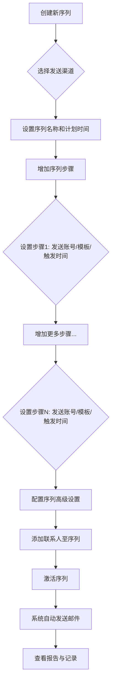

_图示：设置一个筛选特定客群的已读客户的视图_
# 📧 邮件序列：全天候自动化客户开发助手

## **第一部分：为什么外贸人需要“邮件序列”？**

作为一名外贸业务员，您是否每天都在被这些问题困扰？

*   **跟进客户太累**：好不容易找到一批潜在客户，发了第一封邮件后，还要设置无数个提醒去发第二封、第三封... 客户一多，手忙脚乱，还经常忘记，白白错失商机。
*   **发送时机总不对**：客户遍布全球，时区各不相同。您在工作时间发送，可能是客户的深夜；您半夜不睡发邮件，又耗费精力。邮件打开率因此大打折扣。
*   **开发信发多就封号**：用自己的公司邮箱大量发送开发信，发着发着就被邮箱服务商警告，甚至直接封号，严重影响正常业务沟通。
*   **骚扰同一家公司**：找到一家大公司的多个联系人，一股脑全发了同样的邮件，显得既不专业又惹人烦，甚至可能被整个公司集体拉黑。

**“邮件序列”功能，就是为了彻底解决以上所有痛点而生的。**

您可以把它想象成一个**7x24小时工作的、不知疲倦、严格守时的机器人销售**。您只需提前设定好一个包含多封邮件的“跟进计划”，它就能在未来的几天、几周内，自动、智能地帮您完成所有客户开发和跟进工作，将您从重复、繁琐的劳动中解放出来，把宝贵的精力真正用在与高质量客户的深度沟通上。

---

## **第二部分：新手上路？从这里开始！**

### **1. 快速上手清单 (Quick Start Checklist)**

跟着以下步骤，5分钟就能启动您的第一个邮件序列！

1.  [ ] **准备模板**：提前准备好至少2-3版不同内容的邮件模板。
2.  [ ] **新建序列**：起个好记的名字，并根据客户时区设置好“计划时间”。
3.  [ ] **添加步骤**：添加2-3个邮件步骤，为每一步选择不同的模板，并设定好间隔天数。
4.  [ ] **配置规则**：进入“高级设置”，**务必开启**“邮件追踪”和“有回复时将联系人标记为已完成”。
5.  [ ] **设定上限**：设置合理的“发送上限”，避免过度骚扰。
6.  [ ] **添加客户**：将您的目标联系人批量添加进来。
7.  [ ] **手动激活**：**点击右上角的灰色开关，让它变蓝！**
8.  [ ] **检查报告**：24小时后，回来查看“报告”页的数据。

### **2. 经典序列模板案例 (可以直接用！)**

*   **案例一：标准冷客户开发**
    *   **步骤1 (第1天)**: 模板A - 介绍公司和核心产品，突出1-2个核心优势。
    *   **步骤2 (第4天)**: 模板B - 分享一个成功的客户案例或展示产品如何解决行业痛点。
    *   **步骤3 (第8天)**: 模板C - 提供价值（如一份行业报告、一个免费的设计方案），并附上简短的问候，引导回复。

*   **案例二：展会后客户跟进**
    *   **步骤1 (展会后1天)**: 模板A - “很高兴在[展会名]认识您”，附上合影或提及交流过的具体内容。
    *   **步骤2 (展会后4天)**: 模板B - “关于我们聊到的[具体产品]，这是更详细的资料，希望能帮助到您”。
    *   **步骤3 (展会后8天)**: 模板C - “不知您是否有任何疑问或需要样品？期待与您进一步沟通”。

---

## **第三部分：功能详解：手把手完整教程**

### **核心流程图**



---

### **一、创建邮件序列**

首先，我们需要创建一个新的邮件序列，它将作为所有邮件发送任务的容器。

1.  **进入功能页面**
    在系统左侧菜单栏找到“邮件营销” -> “邮件序列”。
    - 系统入口：https://web.laifaxin.com/marketing/sequences

2.  **新建序列**
    点击页面右上角的“+序列”按钮，选择邮件发送渠道。

    

    *   **优质通道**：使用系统提供的邮箱地址发送。
        *   **优点**：速度快，不易封号，且每次发送的邮箱地址不同，能有效提高送达率。
        *   💡 **推荐**：适合大规模、高频率的开发邮件。
    *   **我的邮箱**：使用您自己绑定到来发信的邮箱发送。
        *   **缺点**：发送速度较慢，有被邮箱服务商封禁的风险，不适合大量发送。

3.  **设置序列基本信息**
    选择发送渠道后，在弹出的“新增序列”窗口中，进行基础设置。

    

    *   **序列名称**：为方便您自己识别，建议使用清晰的名称，例如“2024-Q3-欧洲市场开发”。
    *   **计划时间**：设置允许邮件发送的时间段。建议根据目标客户所在的时区进行设置，以提高邮件打开率。

点击“确定”后，一个空的邮件序列就创建成功了。

### **二、设置序列步骤**

接下来，我们为序列添加具体的邮件发送动作，也就是设计一个包含多封邮件的自动化流程。

1.  **添加第一个步骤**
    在序列详情页，点击“+ 增加步骤”。

    

    在“新增序列步骤”窗口中进行设置：
    *   **选择发送账号**：选择用于发送邮件的邮箱账号。若使用“优质通道”，可多选系统账号，系统会随机使用。
    *   **选择邮件模板**：选择您预先创建好的邮件模板。可多选，系统发送时会随机选择其一，以实现内容多样化。
    *   **何时开始此步骤**：
        *   `将联系人添加到序列后立即执行`：客户邮箱一旦加入此序列，立刻发送第一封邮件。
        *   `添加联系人__(分钟/小时/天)后执行`：客户邮箱加入序列后，等待指定时间再发送。

    

2.  **添加后续步骤（第二封、第三封...）**
    在已创建的步骤下方，再次点击“+ 增加步骤”，以添加跟进邮件。

    

    后续步骤的设置与第一步基本相同，但触发时间变为：
    *   **何时开始此步骤**：只能设置为 `完成上一步__天/小时后执行`。这代表在上一封邮件发送之后，再等待指定时间发送这一封。

    💡 **策略建议**：后续邮件的模板应与前一封邮件的角度不同。例如，第一封是产品介绍，第二封可以是案例分享或价值说明，从不同角度吸引客户。

    

    完成所有步骤后，您可以在“总览”标签页下看到完整的序列流程。

    

### **三、配置高级设置**

在“设置”标签页，您可以对序列进行更精细化的控制，以提升效果和避免打扰客户。


1.  **发送参数设置**
    *   **邮件追踪**：强烈建议开启，用于追踪客户的阅读、点击链接和下载附件行为。
    *   **发信昵称**：客户收件箱里显示的发件人名字，例如 "Tina from ABC Corp"。

2.  **发送上限设置**
    *   **序列24小时发送上限**：限制此序列每天的总发信量。建议设置为一个合理的数值（如10000），避免在一天内消耗完所有联系人。
    *   **单域名每24小时发送上限**：限制每天向同一家公司（同一个邮箱后缀）发送的邮件数量。建议设置为10，避免过度骚扰同一家公司的多个联系人。（此设置对Gmail等公共邮箱无效）

3.  **公司触发器**
    当同一公司的某个联系人回复邮件时，系统如何处理该公司下的其他联系人：
    *   **什么都不做**：继续按计划向该公司其他人发送邮件。
    *   **标记其他联系人为未发送**：收到回复后，立即停止向该公司其他人发送邮件。 **(推荐选项，显得更专业)**
    *   **延迟发送其他联系人**：收到回复后，暂停向该公司其他人发送邮件，等待指定时间后再继续。

4.  **已完成触发器**
    *   勾选 `当前序列有回复时，将联系人标记为已完成` 后，任何一个联系人只要回复了邮件，系统就会将其标记为“已完成”，并停止向其发送此序列的后续邮件。 **(必选项，避免骚扰已回复的客户)**

5.  **未发送触发器**
    设置哪些联系人从一开始就不应该被发送邮件，用于精准过滤：
    *   **当联系人邮箱为无效时**：自动跳过无效邮箱。
    *   **当联系人在黑名单中时**：自动跳过您已加入黑名单的联系人。
    *   **当联系人标签包含...**：自动跳过带有特定标签的联系人。例如，您可以选择“已成交客户”、“询盘客户”等标签，避免向他们发送开发信。

6.  **AI触发器**
    *   开启后，AI会智能识别可能导致退信或投诉的邮件，并将其延迟24小时后再尝试发送，有助于提升送达率。

7.  **计划时间**
    *   此处可以再次修改整个序列允许发送邮件的时间窗口。

⚠️ **重要提示**：完成所有设置后，务必点击页面右上角的“**保存**”按钮！

### **四、添加联系人并启动序列**

万事俱备，现在可以将目标客户添加进来并启动序列了。

1.  **添加联系人**
    您有两种方式添加联系人：

    *   **方式一：在序列内部添加**
        在序列页面右上角点击“添加联系人”，通过“选择标签”或“选择视图”批量导入。
        
        选择后，点击“添加联系人”即可。
        

    *   **方式二：在客户管理中添加**
        在“客户管理” -> “联系人”页面，勾选一个或多个联系人，点击上方操作栏的“序列”，然后选择“加入一个已存在的序列”。
        

2.  **激活序列**
    添加联系人后，序列默认是暂停状态，不会发送任何邮件。**您必须手动激活它。**
    点击页面右上角的 **灰色开关按钮**，使其变为 **蓝色**，以启动序列。

    

    序列启动后，系统就会根据您的设置，开始自动执行邮件发送任务。

### **五、监控与报告**

序列启动后，您可以随时回来查看执行情况和效果。

*   **邮件发送记录 (“邮件”页)**
    这里会列出每一封已发送或待发送的邮件，包含发送状态、客户是否阅读、所属步骤等详细信息。
    

*   **操作日志 (“记录”页)**
    记录了您对这个序列的所有操作，例如创建、添加步骤、添加联系人、启用序列等。
    

*   **效果报告 (“报告”页)**
    以数据看板的形式，直观展示序列的整体效果，包括发送量、送达率、打开率、回复率等关键指标。
    

*   **序列总览 (列表页)**
    在“邮件序列”的列表页面，您可以看到所有已创建的序列及其状态、进度和核心数据。
    

---

## **第四部分：常见问题与解答 (FAQ)**

*   **问：为什么我的邮件序列没有启动，一封邮件都没发出去？**
    *   **答**：请立即检查三点：1. 序列右上角的**开关是否为蓝色**？这是最常见的原因。 2. 当前时间是否在您设定的“**计划时间**”范围内？ 3. 是不是触发了“**发送上限**”或“**未发送触发器**”中的规则（如联系人在黑名单中）？

*   **问：客户已经回复我了，系统还会继续给他发邮件吗？**
    *   **答**：取决于您的设置。如果您在“高级设置” -> “已完成触发器”中勾选了“有回复时标记为已完成”，那么系统会自动停止向该客户发送后续邮件。**强烈建议所有用户都开启此项**。

*   **问：我可以修改一个正在运行中的序列吗？**
    *   **答**：可以。您可以随时点击开关暂停序列，对步骤、模板或设置进行修改，然后重新激活。修改后的规则通常会对尚未执行到该步骤的联系人生效。

*   **问：如何避免骚扰同一家公司的太多联系人？**
    *   **答**：在“高级设置”中，将“单域名每24小时发送上限”设置为一个较小的数字（如2或3）。同时，设置“公司触发器”，当有任意一人回复时，就选择“标记其他联系人为未发送”。

*   **问：在哪里看我的邮件发送效果？**
    *   **答**：在序列详情的“**报告**”标签页，可以看到送达率、打开率、回复率等宏观数据。在“**邮件**”标签页，可以查看每一封邮件的发送状态和客户的阅读、点击情况。

```