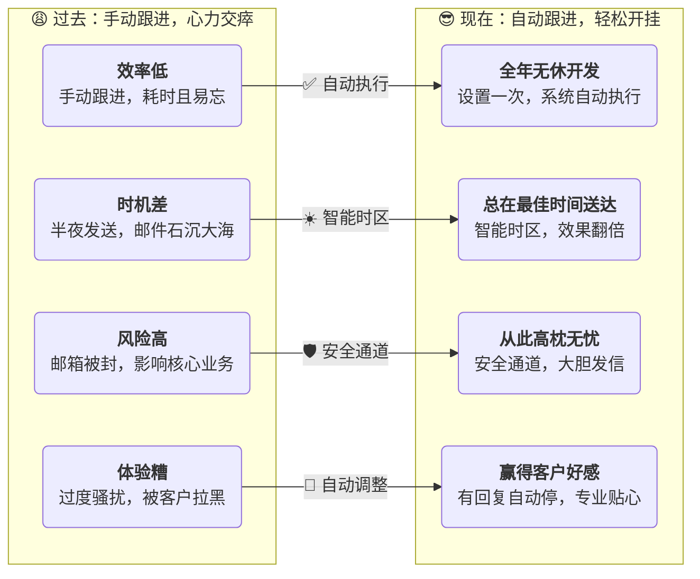

# 📧 邮件序列：从入门到精通，打造你的自动化销售引擎

你好，新朋友！准备好给你的外贸工作流来一次“开挂”般的升级了吗？

---

## **第一部分：为什么你需要一个“AI销售助理”？**

首先，忘掉“邮件序列”这个名字。把它想象成你的专属“AI销售助理”。

在认识它之前，你的客户开发工作是不是更像一场“噩梦”？

> **看到这里的对比，你是不是已经心动了？**
>
> 别急，这个强大的“开挂”神器用起来极其简单。我们为你准备了一份5分钟上手清单，让你立刻体验！

---

## **第二部分：5分钟上手，让你的第一个“助理”跑起来！**

别担心，你不需要成为技术专家。跟着下面的清单打勾，5分钟后，你的第一个自动化任务就能跑起来！

### **✅ 您的专属《快速上手清单》**

1.  [ ] **✍️ 准备弹药**：提前写好至少2-3版不同内容的邮件模板。
2.  [ ] **📅 制定计划**：新建序列，起个好记的名字，并根据客户时区设置好“工作时间”。
3.  [ ] **🔗 设计流程**：添加2-3个邮件步骤，选好模板，设定好间隔天数。
4.  [ ] **⚙️ 安装保险**：进入“高级设置”，**务必开启**“有回复时自动停止”。
5.  [ ] **👥 分配任务**：将你的目标客户批量添加进来。
6.  [ ] **🚀 按下开关**：**点击右上角的灰色开关，让它变蓝！** (最关键一步！)
7.  [ ] **📊 查看战果**：24小时后，回来看看惊人的效果吧！

### **✍️ 拿来就用的《经典跟进模板》**

> #### **案例一：标准冷客户开发**
>
> *   **第1步 (第1天)**: 模板A - 介绍公司和核心产品，突出1-2个核心优势。
> *   **第2步 (第4天)**: 模板B - 分享一个成功的客户案例或展示产品如何解决行业痛点。
> *   **第3步 (第8天)**: 模板C - 提供价值（如一份行业报告、一个免费的设计方案），并附上简短的问候，引导回复。

> #### **案例二：展会后客户跟进**
>
> *   **第1步 (展会后1天)**: 模板A - “很高兴在[展会名]认识您”，附上合影或提及交流过的具体内容。
> *   **第2步 (展会后4天)**: 模板B - “关于我们聊到的[具体产品]，这是更详细的资料，希望能帮助到您”。
> *   **第3步 (展会后8天)**: 模板C - “不知您是否有任何疑问或需要样品？期待与您进一步沟通”。

> 💡 **提示：** 这只是两个思路！你可以完全根据你的产品和客户特点，自由组合和创造属于你自己的“黄金开发序列”！

---

## **第三部分：保姆级图文教程：深入了解你的“助理”**

### **1️⃣ 创建与设计 (制定计划)**

1.  **进入功能页面**：在系统左侧菜单栏找到“邮件营销” -> “邮件序列”。
2.  **新建序列**：点击页面右上角的“+序列”按钮。
3.  **选择发送渠道**：
    *   **🚀 优质通道 (新手首选)**：用系统的邮箱发，安全、稳定、送达率高。
    *   **✉️ 我的邮箱**：用你自己的邮箱发，适合小批量、高针对性发送。
4.  **设置基本信息**：
    *   **序列名称**：方便你自己识别，例如“2024-Q4-德国五金客户开发”。
    *   **计划时间**：**极其重要！** 根据目标客户所在的时区设置，确保在对方的工作时间发送。
5.  **添加步骤 (设计流程)**：
    *   点击“+ 增加步骤”，为第一封邮件选择模板和触发时间（通常是立即执行）。
    *   再次点击“+ 增加步骤”，为后续邮件选择**不同的模板**，并设置间隔时间（如“完成上一步3天后执行”）。

### **2️⃣ 配置与启动 (安装保险并按下开关)**

1.  **配置高级设置 (安装保险)**：在“设置”标签页，我们强烈建议你：
    *   **✅ 开启“已完成触发器”**：勾选“有回复时将联系人标记为已完成”，避免打扰已回复的客户。
    *   **👍 设置“发送上限”**：将“单域名每24小时发送上限”设为2或3，避免过度骚扰同一家公司。
    *   **🏢 设置“公司触发器”**：选择“标记其他联系人为未发送”，当一人回复，则停止给其同事发信，显得更专业。
    *   **别忘了点击右上角的“保存”按钮！**
2.  **添加联系人 (分配任务)**：在序列页面右上角点击“添加联系人”，批量导入你的目标客户。
3.  **激活序列 (按下开关)**：
    > **‼️ 全篇最重要的提醒 ‼️**
    >
    > 添加联系人后，序列默认是**暂停**的。你必须**手动点击页面右上角的灰色开关按钮，让它变为蓝色**！
    >
    > **开关不变蓝，助理不干活！**

---

## **第四部分：效果追踪：我的“助理”干得怎么样？**

任务启动24小时后，你可以回来“视察”工作成果了。

*   **📈 效果报告 (“报告”页)**：这里是数据驾驶舱，用图表直观展示发送量、送达率、打开率、回复率等核心数据。
*   **📨 邮件发送记录 (“邮件”页)**：查看每一封邮件的详细状态，谁打开了，谁点击了，一目了然。
*   **🧾 操作日志 (“记录”页)**：记录了你对这个序列的所有操作，方便复盘。
*   **📋 序列总览 (列表页)**：在这里管理你所有的“助理”和他们的工作进度。

---

## **第五部分：疑难杂症：常见问题与解答 (FAQ)**

> **❓ 问：为什么我的序列没启动，一封邮件都没发出去？**
>
> **💡 答**：99%的可能是你忘了 **按那个启动开关**！去看看它是不是蓝色的。如果已经是蓝色了，再看看当前时间在不在你设定的“计划时间”内。

> **❓ 问：客户已经回复我了，系统还会继续烦他吗？**
>
> **💡 答**：如果你按照教程设置了“回复后停止”，那就不会。这是“助理”的职业素养，赶紧去检查一下吧！

> **❓ 问：我可以中途修改计划吗？**
>
> **💡 答**：当然可以！先按一下开关暂停，修改你的邮件模板或者时间，改完后点“保存”，再按一下开关重新启动就行了。

---

理论学习到此结束！

现在，最好的学习方式就是**立刻动手**。

去创建你的第一个邮件序列，哪怕只添加一个联系人，先让它跑起来。

去感受自动化为你带来的改变吧！
