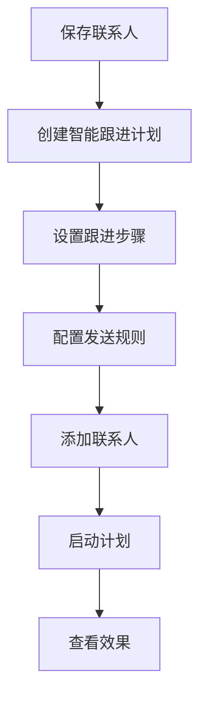
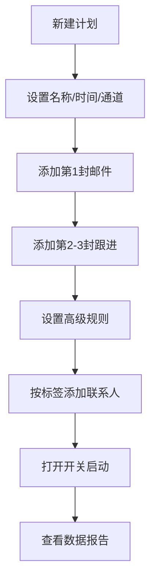
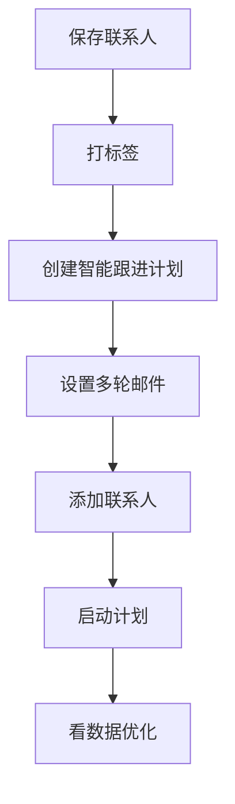

# 智能跟进计划：自动多轮开发客户

智能跟进计划，原来叫“邮件序列”。如果你以前在教程或系统里看到“邮件序列”，可以先理解为同一个功能的新名称。

它解决的是一个很常见的问题：

> 保存了一批客户邮箱以后，如何不靠手动一封封发邮件，而是让系统按计划自动、多轮、持续跟进？

你可以把智能跟进计划理解成一个自动执行的开发流程：



新手先记住一句话：

> **先保存联系人，再按标签加入智能跟进计划，最后查看发送和回复效果。**

---

## 一、适合哪些场景 {#scenarios}

智能跟进计划适合所有需要持续开发客户的场景。

| 场景 | 怎么用 |
| --- | --- |
| 展会客户开发 | 把展会名单保存成联系人后，按展会标签加入计划 |
| AI 数据库搜客 | 保存精准客户后，用计划自动多轮触达 |
| 老客户唤醒 | 给长期未联系的客户设置温和唤醒邮件 |
| 未回复客户跟进 | 第一封未回复后，系统自动发送第二封、第三封 |
| 分市场开发 | 按国家、行业、产品线创建不同计划 |

如果你只是想临时发一批邮件，可以用 [邮件群发](./email-mass-sending)。  
如果你想让系统自动多轮跟进，建议用智能跟进计划。

---

## 二、开始前准备什么 {#before-start}

创建计划前，先准备好三件事：

| 准备项 | 说明 |
| --- | --- |
| 已保存的联系人 | 客户邮箱需要先保存到联系人里 |
| 标签或视图 | 后续按标签/视图把客户加入计划 |
| 邮件模板 | 至少准备第一封开发信，建议准备 2-3 轮 |

标签非常重要。  
比如你刚保存了一批展会客户，可以给公司和联系人都打上类似这样的标签：

```text
展会-139届广交会
行业-照明
市场-欧洲
状态-待开发
```

后面添加联系人时，直接选择这个标签即可。

---

## 三、流程总览 {#workflow}



对应到实际操作，就是 5 步：

1. 创建智能跟进计划。
2. 设置计划名称、发送时间和发送通道。
3. 添加多轮跟进邮件。
4. 配置高级规则。
5. 添加联系人并启动计划。

---

## 四、创建智能跟进计划 {#create-plan}

进入后台后，打开：

```text
邮件营销 → 智能跟进计划
```

点击“新建计划”或“创建计划”。

创建时重点设置三项：

| 设置项 | 建议 |
| --- | --- |
| 计划名称 | 用“来源 + 客群 + 市场”命名 |
| 发送时间 | 尽量设置在客户当地工作时间 |
| 发送通道 | 按当前账号可用通道选择，优先选择稳定通道 |

计划名称不要随便写。  
建议写成你以后能看懂的格式：

```text
139届广交会-照明买家-欧洲
AI数据库-皮筏艇经销商-英语市场
老客户唤醒-2026Q2
```

这样后续查看效果、暂停计划、复盘回复率时，不会混乱。

---

## 五、设置跟进步骤 {#steps}

智能跟进计划的核心，是提前设置好多轮邮件。

最简单的 3 轮结构可以这样安排：

| 第几轮 | 发送时间 | 内容重点 |
| --- | --- | --- |
| 第 1 封 | 加入计划后立即发送 | 简短介绍自己和产品 |
| 第 2 封 | 3-5 天后 | 补充优势、目录、案例或价格范围 |
| 第 3 封 | 7-10 天后 | 轻量提醒，询问是否有采购计划 |

新手不要一开始就写很长的邮件。

第一封只需要说清楚三件事：

1. 你是谁。
2. 为什么联系对方。
3. 你能提供什么。

后续邮件再补充产品目录、案例、优势、认证、报价范围等信息。

---

## 六、配置高级规则 {#rules}

高级规则决定计划是否安全、克制、可持续。

建议重点检查下面几项：

| 规则 | 建议 |
| --- | --- |
| 邮件追踪 | 建议开启，用来看打开、点击、回复效果 |
| 有回复自动停止 | 建议开启，客户回复后不再继续自动跟进 |
| 发送上限 | 建议设置，避免短时间发送过多 |
| 发送时间窗口 | 建议设置在客户当地工作时间 |
| 排除规则 | 排除已成交、已退订、黑名单等客户 |

其中最重要的是：

> **客户回复后自动停止。**

这样可以避免客户已经回复了，你的后续自动邮件还继续发送，造成打扰。

---

## 七、添加联系人并启动计划 {#add-contacts}

计划创建好以后，需要把联系人加入计划。

常用方式有两种：

| 添加方式 | 适合情况 |
| --- | --- |
| 按标签添加 | 推荐，适合批量加入某一批客户 |
| 按视图添加 | 适合已经通过筛选条件整理好的客户 |

比如你前面保存展会客户时打了标签：

```text
展会-139届广交会
```

那这里就可以直接选择这个标签，把这批联系人加入智能跟进计划。

添加联系人后，还要注意最后一步：

> **打开计划开关。**

如果计划没有启动，联系人即使已经加入，也不会自动发送邮件。

---

## 八、查看效果并优化 {#report}

计划启动后，不要只等客户回复，也要看数据。

重点看这些指标：

| 数据 | 说明 | 优化方向 |
| --- | --- | --- |
| 发送量 | 实际发出了多少邮件 | 判断计划是否正常运行 |
| 打开率 | 客户是否愿意点开邮件 | 优化标题和发送时间 |
| 点击率 | 客户是否查看资料或链接 | 优化正文和资料入口 |
| 回复率 | 客户是否愿意沟通 | 优化客户精准度和邮件内容 |
| 退信率 | 邮箱是否稳定可达 | 必要时先做邮箱验证 |

如果打开率低，优先优化标题。  
如果打开率还可以但回复率低，优先优化客户精准度和邮件内容。  
如果退信率高，建议先使用 [邮箱验证](./email-verification) 或减少低质量邮箱来源。

---

## 九、智能跟进计划和邮件群发的区别 {#sequence-vs-bulk-email}

很多新手会混淆智能跟进计划和邮件群发。

可以这样理解：

| 功能 | 适合做什么 |
| --- | --- |
| 邮件群发 | 一次性触达一批客户，快速测试市场反馈 |
| 智能跟进计划 | 多轮、自动、持续开发客户 |

如果你只是想发一封开发信测试市场，用邮件群发。  
如果你想让系统自动跟进未回复客户，用智能跟进计划。

实际开发中，两者可以配合使用：

1. 先用邮件群发测试标题和客户方向。
2. 对效果不错的客户群体，建立智能跟进计划持续开发。

---

## 十、常见问题 {#faq}

### 为什么添加联系人后没有发送？

优先检查三件事：

1. 计划开关是否已经打开。
2. 当前时间是否在发送时间窗口内。
3. 是否触发了发送上限、黑名单、退订、排除规则。

### 客户回复后，后续邮件还会继续发吗？

如果开启了“有回复自动停止”，客户回复后会停止后续自动跟进。  
建议开启这个规则，避免打扰已经回复的客户。

### 计划运行中可以修改吗？

可以。  
你可以先暂停计划，修改步骤、模板或规则，再重新启动。

### 一开始要设置几轮邮件？

新手建议先设置 3 轮：

1. 第一封介绍产品和合作机会。
2. 第二封补充产品目录、案例或优势。
3. 第三封做轻量提醒。

跑通以后，再扩展到 5-6 轮。

---

## 总结 {#summary}

智能跟进计划的核心不是“群发更多邮件”，而是让客户开发变得持续、自动、可复盘。

你可以按这条流程执行：



新手不要一开始把所有规则都研究透。

先跑通一条最简单的流程：

> **保存联系人 → 打标签 → 创建计划 → 设置 3 轮邮件 → 添加联系人 → 启动计划 → 看效果**

跑通以后，再去优化标题、模板、发送时间和跟进节奏。
