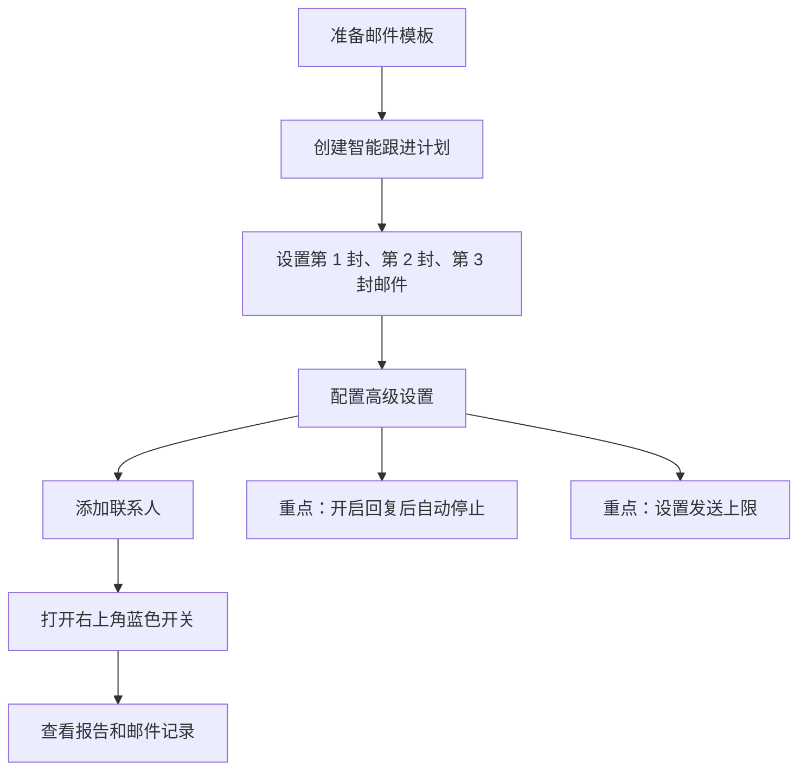
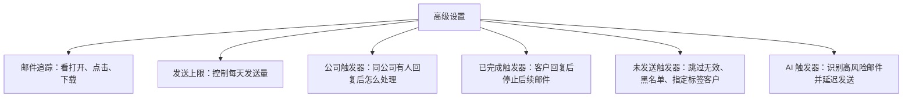

# 📧 智能跟进计划

智能跟进计划原来叫“邮件序列”。如果你在旧截图、旧教程或系统旧入口里看到“邮件序列”，可以理解为同一个功能。

它的作用很简单：你先准备好几封跟进邮件，系统会按你设置的时间间隔自动发送；客户一旦回复，系统可以自动停止后续邮件，避免继续打扰客户。

适合这些场景：

| 场景 | 怎么用 |
| --- | --- |
| 批量开发新客户 | 第一封介绍产品，后面几封持续补充案例、优势和资料 |
| 展会后跟进客户 | 展会结束后按 1 天、4 天、8 天的节奏自动跟进 |
| 唤醒老客户 | 针对长期未回复的客户，重新发送一组轻量跟进邮件 |
| 团队标准化开发 | 统一模板、统一节奏，减少业务员漏跟进 |

:::tip 截图说明
如果下面截图里仍显示“邮件序列”，请按当前后台的“智能跟进计划”入口操作，功能逻辑是一致的。
:::

## 新手先看这张图 {#quick-map}

先不用急着看每一个按钮。你只要先理解这条主线，后面的截图就很好跟：

最快上手可以按这 6 步走：

| 步骤  | 你要做什么               | 直接跳转                         |
| --- | ------------------- | ---------------------------- |
| 1   | 新建一个计划，设置名称、发送时间和通道 | [创建计划](#create-plan)         |
| 2   | 添加 2-3 个跟进步骤，绑定邮件模板 | [设置跟进步骤](#setup-steps)       |
| 3   | 开启邮件追踪、回复后自动停止、发送上限 | [配置高级设置](#advanced-settings) |
| 4   | 把联系人批量加入计划          | [添加联系人](#add-contacts)       |
| 5   | 点击右上角开关，让它变成蓝色      | [启动计划](#start-plan)          |
| 6   | 通过报告、邮件记录看发送效果      | [查看效果](#reporting)           |

## 开始前准备什么 {#before-start}

开始创建计划前，建议先准备好两样东西：

| 准备项 | 建议 |
| --- | --- |
| 联系人列表 | 先确认联系人邮箱有效，并尽量给目标客户打好标签或视图，后面可以批量加入计划 |
| 邮件模板 | 至少准备 2-3 封，不要每封都重复介绍产品，建议从“介绍产品、补充价值、轻提醒”三个角度写 |

## 一、创建计划 {#create-plan}

进入系统左侧菜单：**邮件营销 -> 智能跟进计划**。

系统入口：[https://web.laifaxin.com/marketing/sequences](https://web.laifaxin.com/marketing/sequences)

点击页面右上角的 **+计划** 按钮，选择发送渠道。

| 发送渠道 | 适合情况 |
| --- | --- |
| 🚀 优质通道 | 推荐优先使用。适合批量开发，发送更稳定，也能降低个人邮箱被限制的风险 |
| ✉️ 我的邮箱 | 适合小批量测试，发送量过大时更容易受邮箱服务商限制 |

在弹窗中填写计划基本信息：

| 字段 | 怎么填 |
| --- | --- |
| 计划名称 | 用自己能看懂的名字，例如“2026-Q2-欧洲经销商开发” |
| 计划时间 | 设置允许发送邮件的时间段，建议按目标客户所在时区设置 |

点击 **确定** 后，一个空的智能跟进计划就创建好了。接下来要往里面放邮件步骤。

## 二、设置跟进步骤 {#setup-steps}

跟进步骤可以理解为“第几天发第几封邮件”。常见做法是设置 2-3 封：

| 第几封 | 建议时间 | 内容重点 |
| --- | --- | --- |
| 第 1 封 | 联系人加入计划后立即发送 | 简短介绍你是谁、做什么、能帮客户解决什么问题 |
| 第 2 封 | 第 1 封后 3-5 天 | 补充案例、应用场景、产品优势或资料 |
| 第 3 封 | 第 2 封后 4-7 天 | 轻提醒，给客户一个低压力回复理由 |

### 添加第一封邮件

点击 **+ 增加步骤**，选择发送账号和邮件模板，并将执行时间设为 **将联系人添加到计划后立即执行**。

在 **新增跟进步骤** 窗口中重点看这 3 项：

| 设置项 | 说明 |
| --- | --- |
| 选择发送账号 | 使用“优质通道”时可以多选系统账号，系统会随机使用 |
| 选择邮件模板 | 可以多选模板，系统发送时会随机选择其一，让内容更自然 |
| 何时开始此步骤 | 第一封通常选“将联系人添加到计划后立即执行” |

### 添加第二封、第三封邮件

再次点击 **+ 增加步骤**，继续添加后续跟进邮件。

后续步骤的时间一般设置为 **完成上一步 X 天/小时后执行**。这代表上一封发出后，系统等待指定时间，再发送下一封。

:::tip 写模板的小建议
后续邮件不要只是重复第一封。第一封讲“我是谁”，第二封讲“客户为什么需要”，第三封讲“是否方便给一个反馈”。这样更像正常沟通，而不是机械轰炸。
:::

完成后，在 **总览** 标签页可以看到完整的跟进流程。

## 三、配置高级设置 {#advanced-settings}

这一步很关键。新手不要只创建步骤就直接启动，建议先把“自动停止”和“发送上限”设置好。

进入计划详情页的 **设置** 标签页：

建议优先检查这些设置：

| 设置             | 建议                               | 为什么                                |
| -------------- | -------------------------------- | ---------------------------------- |
| 邮件追踪           | 建议开启                             | 后面可以看到客户是否阅读、点击链接、下载附件             |
| 发信昵称           | 写成真实业务身份，例如 `Tina from ABC Corp` | 收件人更容易判断邮件来源                       |
| 计划 24 小时发送上限   | 建议设置一个合理上限                       | 避免一天内把联系人全部发完，也方便观察效果              |
| 单域名每 24 小时发送上限 | 建议设置较小数值，例如 2-10                 | 避免同一天给同一家公司太多人发邮件                  |
| 公司触发器          | 推荐选择“标记其他联系人为未发送”                | 同公司有人回复后，就不要继续打扰其他人                |
| 已完成触发器         | 强烈建议勾选“有回复时标记为已完成”               | 客户回复后自动停止后续邮件                      |
| 未发送触发器         | 建议跳过无效邮箱、黑名单、指定标签客户              | 避免发给不该发的人                          |
| AI 触发器         | 可以开启                             | AI 会识别可能导致退信或投诉的邮件，并延迟 24 小时后再尝试发送 |

:::warning 启动前必看
完成设置后，一定要点击页面右上角的 **保存**。没有保存，高级设置不会生效。
:::

## 四、添加联系人 {#add-contacts}

联系人可以从计划内部添加，也可以在客户管理里批量加入。

### 方式一：在计划内部添加

在计划页面右上角点击 **添加联系人**，通过 **选择标签** 或 **选择视图** 批量导入。

选择后，点击 **添加联系人** 即可。

### 方式二：在客户管理中添加

进入 **客户管理 -> 联系人**，勾选一个或多个联系人，点击上方操作栏的 **智能跟进计划**，然后选择 **加入一个已存在的计划**。

## 五、启动计划 {#start-plan}

这是最容易漏掉的一步。

添加联系人后，计划默认可能仍是暂停状态，不会自动发送邮件。你需要手动点击页面右上角的开关，让它变成 **蓝色**。

:::danger 开关不变蓝，任务不启动
如果你已经添加了联系人，但一封邮件都没发出去，第一件事就是检查右上角开关是不是蓝色。
:::

## 六、查看效果 {#reporting}

计划启动后，不要只看“有没有发出去”，还要看客户有没有打开、点击、回复。

| 页面 | 看什么 |
| --- | --- |
| 报告 | 发送量、送达率、打开率、回复率等整体效果 |
| 邮件 | 每一封邮件的发送状态、阅读、点击、所属步骤 |
| 记录 | 创建计划、添加步骤、添加联系人、启用计划等操作日志 |
| 列表页 | 所有计划的状态、进度和核心数据 |

### 报告页

报告页会用数据看板展示计划整体效果。

### 邮件页

邮件页会列出每一封已发送或待发送的邮件，以及客户是否阅读、点击。

### 记录页

记录页会保留你对这个计划做过的操作，方便排查问题。

### 列表页

回到智能跟进计划列表，可以看到所有计划的状态、进度和核心数据。

## 七、可以直接参考的跟进节奏 {#examples}

### 标准冷客户开发

| 步骤 | 时间 | 邮件重点 |
| --- | --- | --- |
| 第 1 封 | 第 1 天 | 介绍公司和核心产品，突出 1-2 个核心优势 |
| 第 2 封 | 第 4 天 | 分享客户案例、应用场景或行业痛点 |
| 第 3 封 | 第 8 天 | 提供资料、样品建议或简短提醒，引导客户回复 |

### 展会后客户跟进

| 步骤 | 时间 | 邮件重点 |
| --- | --- | --- |
| 第 1 封 | 展会后 1 天 | “很高兴在 [展会名] 认识您”，提到交流过的产品或需求 |
| 第 2 封 | 展会后 4 天 | 补充产品资料、报价方向、案例或样品信息 |
| 第 3 封 | 展会后 8 天 | 轻提醒，询问是否需要进一步资料或样品 |

## 八、常见问题 {#faq}

### 为什么添加联系人后，一封邮件都没发出去？

先检查 4 件事：

| 检查项 | 说明 |
| --- | --- |
| 右上角开关是否为蓝色 | 最常见原因，开关没打开就不会启动 |
| 当前时间是否在计划时间内 | 不在允许发送时间内，系统会等待 |
| 是否触发发送上限 | 达到 24 小时发送上限后会暂停继续发送 |
| 是否触发未发送规则 | 无效邮箱、黑名单、指定标签客户会被跳过 |

### 客户回复后，系统还会继续发后续邮件吗？

取决于你的设置。建议在 **高级设置 -> 已完成触发器** 中勾选“有回复时标记为已完成”。这样客户一旦回复，系统会自动停止给这个客户发送后续邮件。

### 我可以修改正在运行的计划吗？

可以。建议先暂停计划，修改步骤、模板或高级设置，保存后再重新启动。修改后的规则通常会对尚未执行到对应步骤的联系人生效。

### 如何避免同一家公司收到太多邮件？

在高级设置里把 **单域名每 24 小时发送上限** 设置小一点，并配置 **公司触发器**。如果同一家公司已有联系人回复，就可以标记其他联系人为未发送。

### 在哪里看邮件发送效果？

进入计划详情页的 **报告** 标签页看整体数据，进入 **邮件** 标签页看每封邮件的状态和客户行为。

---

[👉 开始创建第一个智能跟进计划](https://web.laifaxin.com/marketing/sequences)

