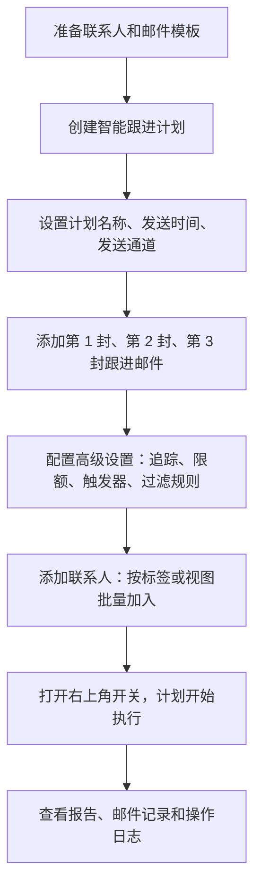
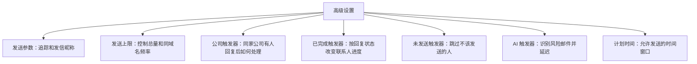

# 📧 智能跟进计划

智能跟进计划不是简单的“定时群发”。它更像一个自动执行的客户开发流程：你提前设计好跟进节奏、邮件内容、发送规则和排除条件，系统就会按计划持续触达客户，并把发送、阅读、点击、回复等结果沉淀下来。

对外贸开发来说，它最适合解决这 4 个问题：

| 常见问题 | 智能跟进计划怎么解决 |
| --- | --- |
| 客户太多，人工跟进容易漏 | 设置一次，多封邮件按间隔自动发送 |
| 不知道什么时候发更合适 | 按目标客户时区设置计划时间，避开不合适的发送时段 |
| 同家公司联系人太多，容易打扰 | 用“单域名发送上限”和“公司触发器”控制触达频率 |
| 发完不知道效果怎么样 | 通过报告和邮件记录查看送达、打开、点击、回复等数据 |

:::tip 先理解一句话
智能跟进计划 = 选一批客户 + 准备几封邮件 + 设定发送节奏 + 配置安全规则 + 打开开关自动执行。
:::

## 一、适合什么时候用 {#use-cases}

智能跟进计划适合“需要持续跟进”的客户开发场景，不适合只发一封就结束的通知类邮件。

| 场景 | 推荐用法 |
| --- | --- |
| 批量开发新客户 | 第 1 封介绍产品，第 2 封补充案例，第 3 封轻提醒 |
| 展会后客户跟进 | 展会后按 1 天、4 天、8 天的节奏持续触达 |
| 老客户唤醒 | 针对长期未回复客户，发送一组更轻量的跟进邮件 |
| 新市场测试 | 给不同区域、行业、产品线分别建立计划，方便对比效果 |
| 团队标准化开发 | 统一模板、统一节奏、统一发送规则，减少个人执行差异 |

## 二、新手先看完整流程 {#quick-map}

先看这张流程图，再看下面的截图操作，会更容易理解每一步为什么要做。

最快可以按这 6 步上手：

| 步骤 | 目标 | 直接跳转 |
| --- | --- | --- |
| 1 | 建一个清晰的计划，确定发送通道和发送时间 | [创建计划](#create-plan) |
| 2 | 设计 2-3 封自动跟进邮件 | [设置跟进步骤](#setup-steps) |
| 3 | 设置追踪、发送上限、触发器和过滤规则 | [配置高级设置](#advanced-settings) |
| 4 | 把目标联系人批量加入计划 | [添加联系人](#add-contacts) |
| 5 | 打开右上角开关，让计划真正开始执行 | [启动计划](#start-plan) |
| 6 | 看报告和邮件记录，判断效果并优化模板 | [查看效果](#reporting) |

## 三、开始前先准备好什么 {#before-start}

建议先准备好联系人和模板，再进入后台配置。这样创建计划时不会反复中断。

| 准备项 | 建议 |
| --- | --- |
| 目标联系人 | 尽量先按国家、行业、产品线、展会来源等维度打好标签或保存视图 |
| 邮件模板 | 至少准备 2-3 封，每封角度不同，不要只是重复介绍产品 |
| 发送节奏 | 新客户开发通常可以从“第 1 天、第 4 天、第 8 天”开始测试 |
| 排除规则 | 提前想清楚哪些客户不应该进入计划，例如黑名单、已成交客户、无效邮箱等 |
| 发送量 | 如果是新计划，建议先设置合理上限，观察效果后再放量 |

## 四、创建计划 {#create-plan}

进入系统左侧菜单：**邮件营销 -> 智能跟进计划**。

系统入口：[https://web.laifaxin.com/marketing/sequences](https://web.laifaxin.com/marketing/sequences)

点击页面右上角的 **+计划** 按钮，选择邮件发送渠道。

| 发送渠道 | 适合情况 | 说明 |
| --- | --- | --- |
| 🚀 优质通道 | 批量开发客户 | 推荐优先使用，发送更稳定，适合大批量客户开发 |
| ✉️ 我的邮箱 | 小批量测试或个性化开发 | 适合少量发送，发送量过大时可能受邮箱服务商限制 |

在弹窗中填写计划基本信息：

| 字段 | 怎么填 | 建议 |
| --- | --- | --- |
| 计划名称 | 用自己能看懂的名字 | 建议包含市场、客户类型、产品或活动，例如“2026-Q2-欧洲经销商开发” |
| 计划时间 | 设置允许发送邮件的时间段 | 建议按目标客户所在时区设置，尽量避开深夜和周末 |

点击 **确定** 后，一个空的智能跟进计划就创建好了。接下来要往计划里添加邮件步骤。

## 五、设置跟进步骤 {#setup-steps}

跟进步骤决定“第几封邮件在什么时候发”。一个完整的新客户开发计划，通常不建议只发一封，因为客户可能没有看到、当时没空，或者需要更多信息才会回复。

| 步骤 | 建议时间 | 内容重点 |
| --- | --- | --- |
| 第 1 封 | 联系人加入计划后立即发送 | 简短介绍你是谁、公司做什么、能帮客户解决什么问题 |
| 第 2 封 | 第 1 封后 3-5 天 | 补充案例、产品应用、客户痛点或核心优势 |
| 第 3 封 | 第 2 封后 4-7 天 | 轻提醒，提供资料、样品、报价方向或一个简单问题 |

### 添加第一封邮件

点击 **+ 增加步骤**，选择发送账号和邮件模板。

在 **新增跟进步骤** 窗口中重点配置这几项：

| 设置项 | 说明 |
| --- | --- |
| 选择发送账号 | 选择用于发送邮件的邮箱账号。若使用“优质通道”，可多选系统账号，系统会随机使用 |
| 选择邮件模板 | 选择预先创建好的邮件模板。可以多选，系统发送时会随机选择其一，让内容更自然 |
| 何时开始此步骤 | 第一封通常选择“将联系人添加到计划后立即执行” |

第一封邮件也可以设置为“添加联系人 X 分钟/小时/天后执行”。如果你希望先人工确认联系人，再开始发送，可以选择延迟执行。

### 添加第二封、第三封邮件

再次点击 **+ 增加步骤**，添加后续跟进邮件。

后续步骤的执行时间通常设置为 **完成上一步 X 天/小时后执行**。这表示上一封邮件发出后，系统等待指定时间，再发送下一封。

:::tip 模板不要只换标题
后续邮件要换角度。第一封讲“我是谁”，第二封讲“客户为什么需要”，第三封给一个轻量回复理由，例如资料、样品、报价方向或应用案例。
:::

完成后，在 **总览** 标签页可以看到完整的跟进流程。这里适合检查顺序、间隔时间、模板是否选对。

## 六、配置高级设置 {#advanced-settings}

高级设置决定这个计划是否“好用、稳定、可控”。新手最容易只设置邮件步骤，却忽略发送上限、公司触发器、未发送触发器，导致发送节奏不好控制。

进入计划详情页的 **设置** 标签页：

### 1. 发送参数设置

| 设置 | 作用 | 建议 |
| --- | --- | --- |
| 邮件追踪 | 追踪客户是否阅读、点击链接、下载附件 | 建议开启，后续才能判断模板和客户质量 |
| 发信昵称 | 客户收件箱里看到的发件人名字 | 建议写真实业务身份，例如 `Tina from ABC Corp` |

### 2. 发送上限设置

发送上限是控制风险和节奏的关键设置。

| 设置 | 作用 | 建议 |
| --- | --- | --- |
| 计划 24 小时发送上限 | 限制这个计划每天最多发送多少封 | 根据客户量和发送策略设置，避免一天内消耗完所有联系人 |
| 单域名每 24 小时发送上限 | 限制每天向同一家公司邮箱后缀发送多少封 | 建议设置较小数值，例如 2-10，避免同一家公司多人同时收到邮件 |

:::note
单域名发送上限主要用于公司域名邮箱，对 Gmail、Outlook 等公共邮箱不一定适用。
:::

### 3. 公司触发器

公司触发器用于处理“同一家公司多个联系人”的情况。当某个联系人回复后，系统可以决定是否继续触达这家公司下的其他联系人。

| 选项 | 效果 | 适合情况 |
| --- | --- | --- |
| 什么都不做 | 继续按计划向该公司其他联系人发送邮件 | 你希望多线程开发同一家公司 |
| 标记其他联系人为未发送 | 有人回复后，停止向该公司其他联系人继续发送 | 希望减少打扰，更适合较克制的开发策略 |
| 延迟发送其他联系人 | 有人回复后，暂停一段时间再继续发送 | 希望先观察回复质量，再决定是否继续开发 |

### 4. 已完成触发器

已完成触发器会影响联系人在计划里的状态。它不是所有场景都要默认开启。

| 设置 | 效果 | 建议 |
| --- | --- | --- |
| 当前计划有回复时，将联系人标记为已完成 | 联系人回复后，系统将该联系人标记为已完成，并停止这个计划里的后续步骤 | 不建议新手默认勾选。是否开启要看团队跟进策略：如果回复后由业务员人工接管，可以考虑开启；如果还需要保留后续自动动作，先不要勾选 |

### 5. 未发送触发器

未发送触发器用于提前排除不应该发送的人，避免无效发送。

| 规则 | 作用 |
| --- | --- |
| 当联系人邮箱为无效时 | 自动跳过无效邮箱 |
| 当联系人在黑名单中时 | 自动跳过已加入黑名单的联系人 |
| 当联系人标签包含指定标签时 | 跳过带有特定标签的联系人，例如已成交客户、询盘客户、不再联系等 |

### 6. AI 触发器

开启后，AI 会识别可能导致退信或投诉的邮件，并将其延迟 24 小时后再尝试发送。这类设置适合在批量发送时作为风险缓冲。

### 7. 计划时间

这里可以再次修改整个计划允许发送邮件的时间窗口。建议按目标客户所在时区设置，不要只按自己所在时区设置。

:::warning 保存设置
高级设置改完后，务必点击页面右上角的 **保存**。没有保存，规则不会生效。
:::

## 七、添加联系人 {#add-contacts}

联系人可以从计划内部添加，也可以在客户管理里批量加入。

### 方式一：在计划内部添加

在计划页面右上角点击 **添加联系人**，通过 **选择标签** 或 **选择视图** 批量导入。

选择后，点击 **添加联系人** 即可。

### 方式二：在客户管理中添加

进入 **客户管理 -> 联系人**，勾选一个或多个联系人，点击上方操作栏的 **智能跟进计划**，然后选择 **加入一个已存在的计划**。

:::tip 批量加入前先确认
建议先确认这批联系人确实适合进入同一个计划。比如同一国家、同一产品线、同一客户类型，使用同一组模板会更自然。
:::

## 八、启动计划 {#start-plan}

添加联系人后，计划不一定会立刻发送。最关键的一步是：确认右上角开关已经打开。

:::danger 开关不变蓝，任务不启动
如果已经添加联系人，但没有邮件发出，第一件事就是检查计划右上角开关是不是蓝色。
:::

点击页面右上角的灰色开关，使其变为 **蓝色**，计划才会开始按规则执行。

启动前建议再检查一遍：

| 检查项 | 为什么要看 |
| --- | --- |
| 发送通道是否正确 | 避免本来想用优质通道，却误用个人邮箱 |
| 步骤顺序和间隔是否正确 | 避免跟进过密或间隔太长 |
| 发送上限是否合理 | 避免短时间发送过量 |
| 未发送触发器是否配置 | 避免发给黑名单、无效邮箱或不该触达的客户 |
| 计划时间是否符合客户时区 | 避免邮件在客户深夜送达 |

## 九、查看效果 {#reporting}

智能跟进计划的优势不只是“自动发出去”，更重要的是后续可以通过数据判断客户质量和模板效果。

| 页面 | 能看什么 | 怎么用 |
| --- | --- | --- |
| 报告 | 发送量、送达率、打开率、回复率等整体数据 | 判断这个计划整体效果 |
| 邮件 | 每一封邮件的状态、阅读、点击、所属步骤 | 排查具体邮件是否正常发送 |
| 记录 | 创建、添加步骤、添加联系人、启用计划等操作 | 排查是谁在什么时候改了什么 |
| 列表页 | 所有计划的状态、进度和核心数据 | 对比不同计划的表现 |

### 报告页

报告页会用数据看板展示计划整体效果。建议重点看送达率、打开率、回复率。

### 邮件页

邮件页会列出每一封已发送或待发送的邮件，包含发送状态、客户是否阅读、点击、所属步骤等信息。

### 记录页

记录页会保留你对这个计划做过的操作，方便排查问题。

### 列表页

回到智能跟进计划列表，可以看到所有计划的状态、进度和核心数据。

## 十、可以直接参考的跟进节奏 {#examples}

### 标准冷客户开发

| 步骤 | 时间 | 邮件重点 |
| --- | --- | --- |
| 第 1 封 | 第 1 天 | 介绍公司和核心产品，突出 1-2 个核心优势 |
| 第 2 封 | 第 4 天 | 分享客户案例、应用场景或行业痛点 |
| 第 3 封 | 第 8 天 | 提供资料、样品建议或简短提醒，引导客户回复 |

### 展会后客户跟进

| 步骤 | 时间 | 邮件重点 |
| --- | --- | --- |
| 第 1 封 | 展会后 1 天 | “很高兴在 [展会名] 认识您”，提到交流过的产品或需求 |
| 第 2 封 | 展会后 4 天 | 补充产品资料、报价方向、案例或样品信息 |
| 第 3 封 | 展会后 8 天 | 轻提醒，询问是否需要进一步资料或样品 |

### 老客户唤醒

| 步骤 | 时间 | 邮件重点 |
| --- | --- | --- |
| 第 1 封 | 第 1 天 | 说明最近新品、库存、价格或服务变化 |
| 第 2 封 | 第 5 天 | 补充客户可能感兴趣的案例或产品资料 |
| 第 3 封 | 第 10 天 | 简短询问是否仍有相关采购计划 |

## 十一、常见问题 {#faq}

### 为什么添加联系人后，一封邮件都没发出去？

优先检查这 5 件事：

| 检查项 | 说明 |
| --- | --- |
| 右上角开关是否为蓝色 | 最常见原因，开关没打开就不会启动 |
| 当前时间是否在计划时间内 | 不在允许发送时间内，系统会等待 |
| 是否触发发送上限 | 达到 24 小时发送上限后会暂停继续发送 |
| 是否触发未发送规则 | 无效邮箱、黑名单、指定标签客户会被跳过 |
| 发送账号或通道是否可用 | 如果发送账号异常，也会影响执行 |

### 客户回复后，系统还会继续发后续邮件吗？

取决于你的高级设置。重点检查 **公司触发器** 和 **已完成触发器**：

| 设置 | 影响 |
| --- | --- |
| 公司触发器 | 影响同一家公司下其他联系人是否继续发送 |
| 已完成触发器 | 影响当前回复联系人是否被标记为已完成，以及是否继续后续步骤 |

不建议新手默认勾选“有回复时标记为已完成”。如果团队规则是“客户回复后由业务员人工接管”，可以考虑开启；如果还需要自动计划继续执行，应先确认策略再设置。

### 我可以修改正在运行的计划吗？

可以。建议先暂停计划，再修改步骤、模板或高级设置，保存后重新启动。修改后的规则通常会影响尚未执行到对应步骤的联系人。

### 如何避免同一家公司收到太多邮件？

重点设置两项：

| 设置 | 建议 |
| --- | --- |
| 单域名每 24 小时发送上限 | 设置较小数字，例如 2-10 |
| 公司触发器 | 当有联系人回复后，选择标记其他联系人为未发送，或延迟发送其他联系人 |

### 在哪里看邮件发送效果？

进入计划详情页的 **报告** 标签页看整体效果，进入 **邮件** 标签页看每封邮件的发送状态和客户行为。

## 十二、名称说明 {#name-note}

智能跟进计划原来叫“邮件序列”。如果你在旧教程、旧截图或部分入口里看到“邮件序列”，可以理解为同一个功能。当前文档统一使用新名称“智能跟进计划”。

---

[👉 开始创建第一个智能跟进计划](https://web.laifaxin.com/marketing/sequences)

