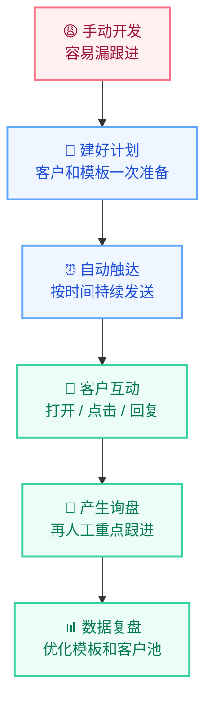
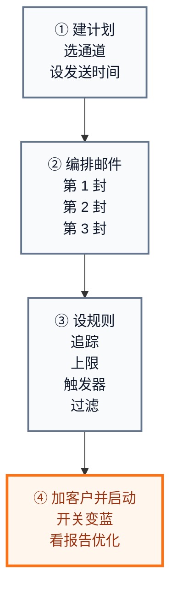
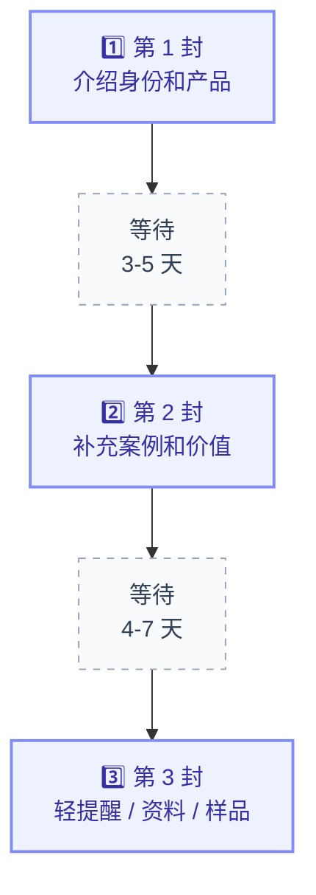
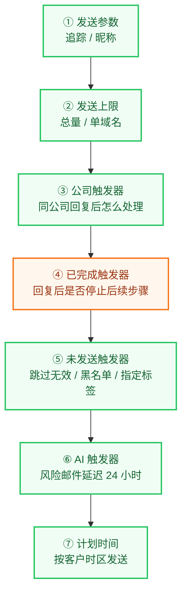

# 📧 智能跟进计划：让系统替你持续开发客户

智能跟进计划不是简单群发，而是一条自动运行的客户开发流程。你先准备客户和话术，系统按设定时间持续跟进，并记录打开、点击、回复等数据。

:::tip 核心理解
你负责准备客户和邮件内容；系统负责定时发送、控制频率、记录效果。目标是让开发不再全靠人工盯，询盘机会可以持续产生。
:::

## 先看效果：从手动追客户到自动来询盘 {#value}

| 手动开发 | 常见问题 | 智能跟进计划 |
| --- | --- | --- |
| 人工一封封发 | 客户多了容易漏 | 多封邮件自动跟进 |
| 想起来才跟 | 热度容易断 | 按固定节奏持续触达 |
| 同家公司多人一起发 | 容易打扰客户 | 用上限和触发器控频 |
| 发完就结束 | 不知道客户反应 | 看打开、点击、回复 |
| 人忙就停工 | 询盘机会不稳定 | 系统持续运行 |

| 场景 | 推荐用法 |
| --- | --- |
| 批量开发新客户 | 第 1 天介绍产品，第 4 天补充案例，第 8 天轻提醒 |
| 展会后跟进客户 | 展会后 1 天、4 天、8 天连续跟进 |
| 老客户唤醒 | 用新品、价格、库存、服务变化重新触达 |
| 新市场测试 | 按国家、行业、产品线建不同计划，对比效果 |

## 新手只记这 4 步 {#quick-map}

| 步骤 | 重点 | 跳转 |
| --- | --- | --- |
| 1️⃣ | 创建计划，选发送通道和发送时间 | [建计划](#create-plan) |
| 2️⃣ | 设置 2-3 封跟进邮件 | [编排邮件](#setup-steps) |
| 3️⃣ | 配置追踪、上限、触发器、过滤规则 | [设规则](#advanced-settings) |
| 4️⃣ | 添加联系人，打开蓝色开关，看报告 | [启动并看效果](#launch-report) |

开始前只需要准备 3 样东西：

| 准备项 | 最低要求 |
| --- | --- |
| 客户 | 已保存到联系人，最好按国家、行业、来源打好标签或视图 |
| 模板 | 至少 2-3 封，每封角度不同 |
| 策略 | 先小批量测试，再根据回复率逐步放量 |

## 建计划：先把开发任务框起来 {#create-plan}

进入 **邮件营销 -> 智能跟进计划**，或直接打开：[https://web.laifaxin.com/marketing/sequences](https://web.laifaxin.com/marketing/sequences)

点击右上角 **+计划**，选择发送渠道。

| 渠道 | 推荐场景 | 重点 |
| --- | --- | --- |
| 🚀 优质通道 | 批量开发、展会跟进、新市场测试 | 推荐优先使用，发送更稳定，更适合规模化开发 |
| ✉️ 我的邮箱 | 小批量、强个性化、少量测试 | 发送量过大时可能受邮箱服务商限制 |

填写计划名称和计划时间。

| 字段 | 建议 |
| --- | --- |
| 计划名称 | 用“时间 + 市场 + 客户类型/产品”命名，例如 `2026-Q2-欧洲经销商开发` |
| 计划时间 | 按客户所在时区设置，尽量避开客户深夜和周末 |

:::tip 命名建议
计划名称是给自己和团队复盘用的。名称越清楚，后面越容易判断哪个市场、哪类客户效果好。
:::

## 编排邮件：让系统持续跟进客户 {#setup-steps}

一个计划通常设置 2-3 封邮件。只发一封，很容易因为客户没看到、当时没空而错过机会。

| 第几封 | 发送时间 | 内容重点 |
| --- | --- | --- |
| 1️⃣ 第 1 封 | 加入计划后立即发送 | 你是谁、做什么、能解决什么问题 |
| 2️⃣ 第 2 封 | 第 1 封后 3-5 天 | 案例、应用场景、产品优势、资料 |
| 3️⃣ 第 3 封 | 第 2 封后 4-7 天 | 轻提醒，给客户一个低压力回复理由 |

点击 **+ 增加步骤** 添加第一封邮件。

| 设置项 | 怎么选 |
| --- | --- |
| 发送账号 | 使用优质通道时可以多选系统账号，系统会随机使用 |
| 邮件模板 | 可以多选模板，系统发送时随机选择其一 |
| 开始时间 | 通常选“将联系人添加到计划后立即执行”；也可以选“添加联系人 X 分钟/小时/天后执行” |

继续点击 **+ 增加步骤** 添加第二封、第三封。

后续步骤通常只能设置为 **完成上一步 X 天/小时后执行**，也就是上一封发出后，系统等待指定时间再发送下一封。

:::warning 重点
后续邮件不要只是换标题。第一封讲身份和产品，第二封讲价值和案例，第三封给资料、样品、报价方向或一个简单问题。
:::

完成后，到 **总览** 页检查顺序、间隔和模板。

## 设规则：稳定、克制、可复盘 {#advanced-settings}

进入计划详情页的 **设置** 标签页。这里决定计划能不能长期稳定跑。

| 设置模块 | 关注点 | 建议 |
| --- | --- | --- |
| 1️⃣ 📊 发送参数 | 邮件追踪、发信昵称 | 追踪建议开启；昵称用真实业务身份 |
| 2️⃣ 👍 发送上限 | 计划总量、同域名频率 | 新计划先设上限，观察后再放量 |
| 3️⃣ 🏢 公司触发器 | 同家公司有人回复后怎么处理 | 按开发策略选择继续、停止或延迟 |
| 4️⃣ ✅ 已完成触发器 | 回复后是否标记完成 | 不建议新手默认勾选，先按团队策略决定 |
| 5️⃣ 🛡️ 未发送触发器 | 哪些客户不该发 | 跳过无效邮箱、黑名单、指定标签客户 |
| 6️⃣ 🤖 AI 触发器 | 风险邮件延迟 24 小时后再尝试发送 | 批量发送时可作为风险缓冲 |
| 7️⃣ ⏰ 计划时间 | 允许发送的时间窗口 | 按客户所在时区设置 |

**发送参数**

| 设置 | 作用 |
| --- | --- |
| 邮件追踪 | 追踪阅读、点击链接、下载附件，判断客户兴趣 |
| 发信昵称 | 客户收件箱里看到的发件人名字，例如 `Tina from ABC Corp` |

**发送上限**

| 设置 | 作用 | 建议 |
| --- | --- | --- |
| 计划 24 小时发送上限 | 限制这个计划每天最多发送多少封 | 避免一天内消耗完所有联系人 |
| 单域名每 24 小时发送上限 | 限制同一家公司邮箱后缀每天收到多少封 | 建议设小一点，例如 2-10 |

:::note
单域名上限主要用于公司域名邮箱，对 Gmail、Outlook 等公共邮箱不一定适用。
:::

**公司触发器**

| 选项 | 效果 | 适合情况 |
| --- | --- | --- |
| 什么都不做 | 继续向该公司其他联系人发送 | 想多线程开发同一家公司 |
| 标记其他联系人为未发送 | 有人回复后，停止触达该公司其他联系人 | 更克制，减少打扰 |
| 延迟发送其他联系人 | 有人回复后，暂停一段时间再继续 | 先看回复质量，再决定是否继续 |

**已完成触发器**

| 设置 | 效果 | 建议 |
| --- | --- | --- |
| 当前计划有回复时，将联系人标记为已完成 | 回复后停止该联系人在本计划里的后续步骤 | 不建议新手默认勾选。若团队规则是“客户回复后人工接管”，可以考虑开启；如果仍希望系统继续执行后续动作，应先确认策略 |

**未发送触发器**

| 规则 | 作用 |
| --- | --- |
| 联系人邮箱无效 | 自动跳过，减少无效发送 |
| 联系人在黑名单中 | 自动跳过，避免误触达 |
| 联系人标签包含指定标签 | 跳过已成交、询盘、不再联系等客户 |

**AI 触发器**

开启后，AI 会识别可能导致退信或投诉的邮件，并延迟 24 小时后再尝试发送。批量开发时，它可以作为一层风险缓冲。

:::warning 保存
高级设置改完后，一定要点击右上角 **保存**。不保存，规则不会生效。
:::

## 启动并看效果：开关变蓝才会运行 {#launch-report}

联系人可以从两个地方加入计划。

| 添加方式 | 操作 |
| --- | --- |
| 1️⃣ 计划内部添加 | 在计划页面右上角点击 **添加联系人**，按标签或视图批量导入 |
| 2️⃣ 联系人列表添加 | 在 **客户管理 -> 联系人** 勾选联系人，点击 **智能跟进计划**，加入已有计划 |

添加联系人后，必须确认右上角开关已打开。

:::danger 最容易漏的一步
开关不变蓝，任务不启动。已经加了客户但没发信，先检查这里。
:::

启动前快速检查：

| 检查项 | 避免什么问题 |
| --- | --- |
| 发送通道正确 | 避免误用个人邮箱或错误通道 |
| 步骤顺序正确 | 避免邮件顺序错乱 |
| 间隔时间合理 | 避免跟进过密或太久不跟 |
| 发送上限已设置 | 避免短时间发送过量 |
| 未发送触发器已配置 | 避免发给无效、黑名单或不该触达的客户 |

计划启动后，重点看 4 个页面：

| 页面 | 看什么 | 用来判断什么 |
| --- | --- | --- |
| 报告 | 发送量、送达率、打开率、回复率 | 整体效果 |
| 邮件 | 每封邮件状态、阅读、点击、所属步骤 | 单封邮件是否正常 |
| 记录 | 创建、添加步骤、加客户、启用计划 | 操作排查 |
| 列表页 | 所有计划的状态、进度和核心数据 | 不同计划对比 |

## 可直接套用的 3 套节奏 {#examples}

| 场景 | 第 1 封 | 第 2 封 | 第 3 封 |
| --- | --- | --- | --- |
| 标准冷客户开发 | 第 1 天：介绍公司和核心产品 | 第 4 天：分享案例、场景或痛点 | 第 8 天：提供资料、样品建议或轻提醒 |
| 展会后客户跟进 | 展会后 1 天：提到展会和交流内容 | 展会后 4 天：补充产品资料或案例 | 展会后 8 天：询问是否需要样品或进一步资料 |
| 老客户唤醒 | 第 1 天：说明新品、库存、价格或服务变化 | 第 5 天：补充客户可能感兴趣的资料 | 第 10 天：询问是否仍有采购计划 |

## 常见问题 {#faq}

| 问题 | 优先检查 |
| --- | --- |
| 添加联系人后没发信 | 开关是否蓝色、是否在计划时间内、是否触发发送上限、是否触发未发送规则、发送账号是否可用 |
| 客户回复后是否继续发 | 看公司触发器和已完成触发器；不建议新手默认勾选“有回复时标记为已完成” |
| 能不能修改运行中的计划 | 可以，建议先暂停，改步骤、模板或设置，保存后再启动 |
| 如何避免同家公司收到太多邮件 | 设置单域名 24 小时发送上限，并配置公司触发器 |
| 在哪里看效果 | 报告看整体，邮件页看单封状态，记录页查操作 |

## 名称说明 {#name-note}

智能跟进计划原来叫“邮件序列”。如果你在旧教程、旧截图或部分入口里看到“邮件序列”，可以理解为同一个功能。当前文档统一使用新名称“智能跟进计划”。

---

[👉 开始创建第一个智能跟进计划](https://web.laifaxin.com/marketing/sequences)

