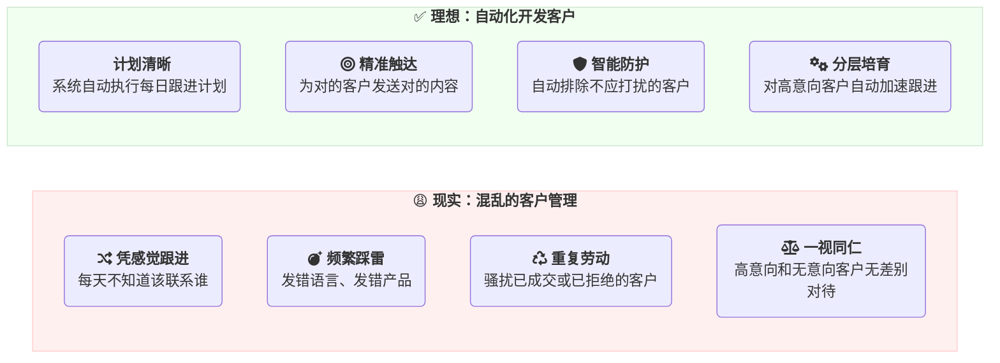
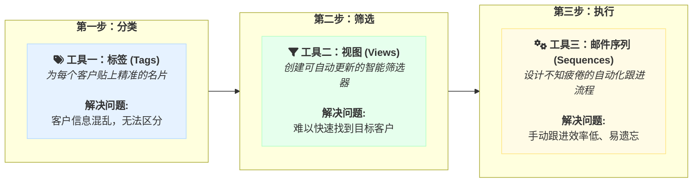
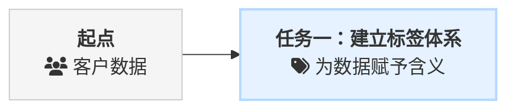
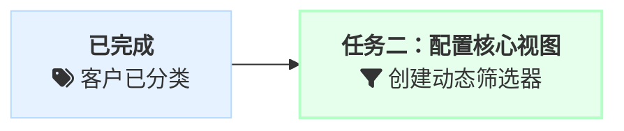
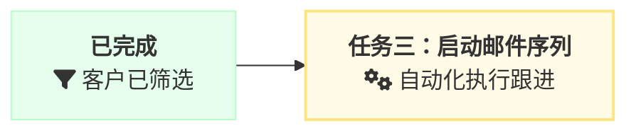

# 管理与营销：搭建自动化客户开发系统

🔗 **本文最新教程：** https://laifa.xin/zhinan/customer-management-section

:::tip 写在前面
**你的客户管理，是否也陷入了这样的困境？ 🤔**

- **🌪️ 客户越多，越混乱：** 客户资料像潮水般涌入，管理却如**一盘散沙**，分不清谁是谁。
- **😩 每天很忙，却没效果：** 感觉总是在做**重复劳动**，但有价值的询盘却寥寥无几。
- **🤷‍♂️ 机会很多，却抓不住：** 知道客户就在那里，但不知道如何**系统化、持续地**触达和转化他们。

如果这正是你的写照，那么本指南就是你的破局之道。我们将手把手带你搭建一个**能自动运转的客户开发系统**，将混乱彻底转化为生产力。
:::

---

## 一、告别混乱，让客户管理重回正轨

在开始之前，我们先来看两种截然不同的工作状态，哪一种更像你的日常？

如果你的日常更偏向左边的“混乱状态”，那么你一定深陷于以下三大困境：

### 🌟 客户管理的三大“黑洞”

- **① 🗂️ 分类的黑洞：发出去的邮件，总是不对劲**
  > 你把精心准备的德语邮件发给了美国客户，把A产品的资料发给了只对B产品感兴趣的买家。**结果：** 时间白费，机会错失。

- **② 🧠 记忆的黑洞：这个客户，我跟进过吗？**
  > 你反复骚扰已经成交的老客户，或是不小心再次联系了明确拒绝过的联系人。**结果：** 专业形象受损，客户关系告急。

- **③ 💎 机会的黑洞：高价值客户，眼睁睁流失**
  > 那个频繁打开邮件的“**热**”客户，因为没有得到及时的、更高频的跟-进，慢慢变“**冷**”。**结果：** 最大的订单机会，在你眼皮底下溜走。

---

**好消息是，这些问题并非无法解决。**

它们源于缺乏一套系统化的管理方法。本指南将为你提供这套方法，帮助你从左边的“混乱”彻底迈向右边的“有序”，搭建一个为你持续工作的自动化客户开发系统。

---

## 二、客户管理的系统化方案

要彻底摆脱混乱，你需要一套清晰的工作流程和得心应手的工具。在 **来发信** 系统中，我们为你提供了三大核心工具，它们将协同工作，帮你搭建起自动化的客户开发系统。

### 2.1、三大工具：标签、视图、邮件序列

这三大工具，构成了我们自动化营销的黄金法则：**先分类，再筛选，后执行**。

简单来说，就是先用 **标签** 告诉系统“客户是谁”，再用 **视图** 告诉系统“要找谁”，最后交给 **邮件序列** 去“如何持续联系”。

### 2.2、两大策略：客户分层与自动化

拥有了工具，我们还需要清晰的策略。根据客户的互动行为，我们将客户分为不同层级，并匹配不同的自动化跟进方案。

#### 策略一：持续唤醒“静默客户”

这套策略适用于你客户库中的绝大多数潜在客户。

| 客户类型 | 识别方法 | 跟进策略 | 自动化方案 |
| :--- | :--- | :--- | :--- |
| **🧊 静默客户 (Cold)** | 从未打开过你的邮件 | **低频、持续跟进**，保持长期曝光 | **唤醒序列** (间隔20-30天/步) |

#### 策略二：加速培育“已读客户”

这套策略聚焦于那些已经表现出兴趣的高价值目标。

| 客户类型 | 识别方法 | 跟进策略 | 自动化方案 |
| :--- | :--- | :--- | :--- |
| **🔥 已读客户 (Warm)** | 打开过你的邮件 | **高频、深度培育**，抓住兴趣窗口期 | **培育序列** (间隔7-10天/步) |
| **🏆 意向客户 (Hot)** | 已回复/询盘 | **立即转为人工跟进**，提供一对一服务 | **自动停止**并从序列中**排除** |

---

**现在，整个客户管理的蓝图已经非常清晰了。**

我们通过客户的互动行为，将他们自动划分到不同的跟进策略中，并利用邮件序列这一自动化工具，实现差异化的、不知疲倦的长期培育。

在接下来的章节中，我们将手把手教你如何配置并使用这些工具，将这套方案在你的业务中落地执行。

:::info 本章小结
- **三大核心工具**：**标签** (分类)、**视图** (筛选)、**邮件序列** (执行)，构成了自动化营销的工作流。
- **两大核心策略**：针对 **静默客户** 使用低频的“唤醒序列”，针对 **已读客户** 使用高频的“培育序列”，实现客户分层后的精准跟进。
:::

## 三、实操指南：从0到1搭建自动化营销系统

理论学习完毕，现在让我们卷起袖子，一步步将这个强大的自动化系统搭建起来。请按照以下三大任务的顺序进行操作，你将亲手构建一个属于自己的、高效运转的客户开发引擎。

---

### 任务一：基础准备 - 建立标签体系

**本任务目标：** 为所有客户打上清晰、统一的“名片”，这是后续所有自动化操作的基础。

#### 1. 创建标签分组

首先，我们需要为“名片”建立分类档案盒。
- **操作路径**：进入 **[标签管理](https://web.laifaxin.com/settings/tags)** 页面。
- **执行动作**：点击“新建分组”，依次创建以下三个核心分组：
  - `客户` (用于存放描述性标签)
  - `意向` (用于标记客户跟进状态)
  - `风险` (用于标记需要排除的客户)

#### 2. 创建客户标签

接下来，为你的主要客户群体定制“名片”模板。
- **操作路径**：在 `客户` 分组下，点击“新建标签”。
- **执行动作**：遵循“**黄金公式**” (`语言-国家-产品-角色`)，创建几个你最常用的客户标签。
  - **示例**：`英语-美国-皮筏艇-经销商`、`德语-德国-汽车配件-工厂`

#### 3. 保存客户&标签应用

现在，将客户资料入库，并为他们派发“名片”。
- **操作路径**：从 **[搜客系统](https://web.laifaxin.com/search/global-engine)** 保存或在 **[联系人管理](https://web.laifaxin.com/contacts/contacts)** 页面导入。
- **执行动作**：在保存或导入时，直接为客户选择对应的描述性标签。
  - **核心原则**：**放心大胆地一次性保存所有目标联系人**。后续的邮件序列会自动控制发送频率，无需担心骚扰问题。

---

### 任务二：自动筛选 - 设置客户视图

**本任务目标：** 创建动态的客户筛选器，让系统能够自动识别“应该联系谁”和“不该打扰谁”。

- **操作路径**：进入 **[联系人管理](https://web.laifaxin.com/contacts/contacts)** 页面，点击右上角的“创建视图”。

#### 1. 排除过滤视图 (建立“安全护栏”)

为了确保自动化营销的精准和专业，我们首先要建立“安全护栏”，自动排除不应打扰的客户。

- **视图一：`排除-意向客户`**
  - **筛选条件**：`标签` `任意包含` `询盘💬`, `寄样📦`, `成交💰`
- **视图二：`排除-风险客户`**
  - **筛选条件**：`标签` `任意包含` `同行❌`, `退订🚫`, `其他⛔`

#### 2. 目标客群视图 (锁定“营销目标”)

接下来，我们创建视图来锁定不同层级的营销目标。

- **视图三：`[All]英语-皮筏艇-经销商`** (所有潜在目标)
  - **用途**：圈定所有符合我们初步开发条件的“静默客户”群体。
  - **筛选条件**：`标签` `任意包含` `英语-美国-皮筏艇-经销商`, `英语-英国-皮筏艇-经销商`, `英语-澳大利亚-皮筏艇-经销商` ... (添加所有相关的标签)

- **视图四：`[Read]英语-皮筏艇-经销商`** (已表现出兴趣的目标)
  - **用途**：自动筛选出上述群体中，所有有过阅读行为的“已读客户”。
  - **操作**：创建此视图时，你需要设置两个筛选条件，并将它们的逻辑关系设为`并且`。
    - **条件 1**：`阅读次数` `大于` `0`
    - **条件 2**：`标签` `任意包含` `英语-美国-皮筏艇-经销商`, `英语-英国-皮筏艇-经销商`, `英语-澳大利亚-皮筏艇-经销商` ... (在这里，**手动复制并粘贴**上一个视图 `[All]英语-皮筏艇-经销商` 中所有的标签条件)

---

### 任务三：自动营销 - 开启邮件序列

**本任务目标：** 启动两个核心的自动化邮件序列，分别对“静默客户”和“已读客户”进行持续、差异化的跟进。

- **操作路径**：进入 **[邮件序列](https://web.laifaxin.com/marketing/sequences)** 页面。

#### 1. 启动“静默客户唤醒序列” (低频)

- **第1步：创建并设置序列**
  - **命名**：`静默客户唤醒 (英语-皮筏艇-经销商)`
  - **设置步骤**：
    - **步骤 1**: 选择模板组 (A1, A2, A3...)，`立即执行`。
    - **步骤 2**: 选择模板组 (B1, B2, B3...)，`完成上一步 30 天后执行`。
    - **步骤 3**: 选择模板组 (C1, C2, C3...)，`完成上一步 30 天后执行`。
- **第2步：配置关键控速规则**
  - 进入序列的“**设置**”页面，找到“**发送上限设置**”。
  - **执行**：将“**单域名每24小时发送上限**”设置为 **5** 或 **3**。
  - **核心价值**：**这是实现自动控速、避免骚扰的关键**。设置后，系统将智能控制对同一家公司的邮件发送频率。

- **第3步：添加收件人与设置排除**
  - **添加收件人**：返回“总览”页，点击“添加联系人”，选择 `视图` » `[All]英语-皮筏艇-经销商`。
  - **设置排除**：进入“设置”页面的“未发送触发器”。**因为当前序列的排除功能是基于【标签】进行筛选的**，所以我们需要在这里手动选择所有 `意向` 和 `风险` 分组下的具体标签进行排除。
    - **新功能展望**：<mark>即将上线的版本将支持直接排除“视图”，届时你只需排除 `排除-意向客户` 和 `排除-风险客户` 两个视图，操作将更加便捷。</mark>

- **第4步：激活序列**
  - 点击页面右上角的灰色开关，使其变为**蓝色**。

#### 2. 启动“已读客户培育序列” (高频)

- **第1步：创建并设置序列**
  - **命名**：`已读客户培育 (英语-皮筏艇-经销商)`
  - **设置步骤**：
    - **步骤 1**: 选择模板组 (D1, D2, D3...)，`立即执行`。
    - **步骤 2**: 选择模板组 (E1, E2, E3...)，`完成上一步 10 天后执行`。
- **第2步：配置关键控速规则**
  - 同样，将“**单域名每24小时发送上限**”设置为 **5** 或 **3**。
- **第3步：添加收件人与设置排除**
  - **添加收件人**：点击“添加联系人”，选择 `视图` » `[Read]英语-皮筏艇-经销商`。
  - **设置排除**：同样，添加 `意向` 和 `风险` 分组下的所有标签。
- **第4步：激活序列**
  - 点击开关，启动你的高潜力客户自动培育流程！

**恭喜你！** 你已经成功搭建了一个可以自动区分客户“冷暖”，并采取不同策略进行持续跟进的自动化营销系统。

**现在，你的系统将这样自动运转：**
1.  所有新的皮筏艇经销商，都会被自动加入到低频的“**唤醒序列**”中。
2.  一旦有人打开邮件，`[Read]`视图就会立刻**自动捕获**他。
3.  他会被自动加入到高频的“**培育序列**”中，接受更密集的跟进。
4.  如果他中途回复或成交，系统会**自动停止**对他的所有自动化邮件。

现在，系统将7x24小时为你工作，而你只需专注于那些真正产生意向的客户。

---

## 第四章：你的自动化系统：从启动到精通

恭喜你，已经完成了自动化系统的核心搭建！在实际运行中，你可能会遇到一些疑问。本章将为你深度解惑，并提供一条清晰的成长路径，助你将这套系统的威力发挥到极致。

### 1. 深度解惑 (FAQ)

我们整理了用户最常遇到的问题，并按照“**核心概念**”、“**操作技巧**”和“**策略应用**”进行分类，以便你快速找到答案。

#### **核心概念**

- **❓ 问：这套新方法和以前的“批次管理”有什么本质区别？**
  > **答：** 这是从“**手动挡**”到“**自动挡**”的升级，核心区别在于**自动化程度**和**管理思维**。
  > - **旧方法的局限：** “批次标签” (如 `营销01`) 依赖你每天**手动**筛选和发送，工作重复、繁琐且容易出错。
  > - **新方法的优势：** **邮件序列** 让你只需设置一次规则（例如“每隔30天发送一步”），系统就会在未来几年里**自动**、精准地执行。你的角色从“**执行者**”变成了“**策略制定者**”，效率和准确性都得到了质的飞跃。

- **❓ 问：“视图”和“标签”在排除客户时有什么区别？**
  > **答：** 这是一个非常重要的问题。**在当前版本中，邮件序列的“未发送触发器”仅支持通过【标签】进行排除。**
  > - **当前操作 (排除标签)：** 你需要在序列设置中，手动勾选所有需要排除的标签（如 `询盘💬`, `同行❌` 等）。
  - **未来展望 (排除视图)：** 即将上线的版本将支持直接排除【视图】。届时，你只需排除一个 `排除-意向客户` 视图即可，操作会更便捷。因为视图是动态的，任何时候你给客户打上新的意向标签，他都会自动被排除，无需再修改序列设置。

- **❓ 问：`info@` 或 `sales@` 这类邮箱还有发送的价值吗？**
  > **答：** **非常有价值**。尤其对于中小型企业，这类通用邮箱很可能就是老板或关键决策人自己在管理。我们不建议你排除它们。更重要的是，在 **来发信** 系统中，这类邮箱通常属于**免计费类型**，发送它们不会消耗你的额度，可以放心大胆地纳入你的营销计划中。

#### **操作技巧**

- **❓ 问：搜客系统里的“域名提取上限”还有用吗？**
  > **答：** **有用，但它的角色变了。**
  > - **过去的作用：** 它是控制发送频率的主要手段，所以需要复杂的“分批保存”。
  > - **现在的作用：** 它主要用于**初步的数据筛选**。例如，如果你认为一家公司的前10个邮箱价值最高，可以先设置上限为10进行保存。但对于**发送控速**，我们现在完全依赖邮件序列中更强大的“**单域名发送上限**”功能，无需再进行繁琐的分批保存。

- **❓ 问：一次性提取过多邮箱有什么后果？**
  > **答：** 如果**不使用邮件序列的控速功能**，一次性向同一家公司发送大量邮件，最直接的后果是**邮件送达率严重下降**。对方的邮件服务器很可能将你的行为识别为垃圾邮件攻击，从而拦截你的邮件，甚至损害你发信邮箱的信誉。因此，**强烈建议所有批量发送都通过设置了“单域名发送上限”的邮件序列来执行**。

- **❓ 问：保存联系人时，系统是如何计费和去重的？**
  > **答：** 系统遵循“**首次、唯一**”的计费原则，并能智能去重。
  > - **计费规则：** 只有当你首次保存一个**唯一且非免费**的邮箱地址到联系人中时，才会消耗1点额度。
  > - **智能去重：**
  >   1.  如果你多次保存同一批搜索结果，系统**不会**重复保存已存在的联系人。
  >   2.  如果你删除了某个联系人，之后再次保存他，系统也**不会**重复计费。

- **❓ 问：如果我新增了一个客户标签，需要更新哪些地方？**
  > **答：** **这是一个非常重要的维护习惯，主要涉及两个地方：**
  > - **1. 更新视图：** 如果你新增了一个客户标签 `英语-加拿大-皮筏艇-经销商`，你需要手动编辑 `[All]英语-皮筏艇-经销商` 和 `[Read]英语-皮筏艇-经销商` 这两个视图，将这个新标签添加到筛选条件中。
  > - **2. 更新序列 (如有必要)：** 如果你创建了一个新的风险或意向标签，你需要检查并更新所有邮件序列中的“未发送触发器”，确保新标签也被添加到了排除列表中。

#### **策略应用**

- **❓ 问：客户阅读邮件后，会同时收到“唤醒”和“培育”两个序列的邮件吗？**
  > **答：** **是的，可能会，但这正是策略的一部分。**
  > - **当前机制：** 客户阅读后，会被`[Read]`视图捕获并加入“培育序列”，但系统**不会**自动将他从“唤醒序列”中移除。
  > - **策略核心 (“信息覆盖”)：** 你需要确保“培育序列”的内容比“唤醒序列”**更深入、更有价值**。可以把它想象成：客户一直在接收“普通广告”（唤醒序列），一旦他表现出兴趣（阅读），你立即开始向他推送“VIP专属推荐”（培育序列）。即使他偶尔还会收到普通广告，但更有吸引力的VIP内容会占据他的主要注意力。
  > - **未来展望：** <mark>我们计划在未来版本中增加“有阅读时自动暂停/移出序列”的触发器，届时你将拥有更灵活的控制权。</mark>

- **❓ 问：客户回复我之后，系统会自动处理吗？**
  > **答：** 是的，系统有**双重保险**来确保专业性。
  > - **第一重保险 (序列内)：** 在邮件序列的“设置”中，务必开启“**有回复时自动停止**”。这会立即停止该客户在此序列中的后续步骤。
  > - **第二重保险 (全局)：** 当你将该客户标记为 `询盘💬` 等意向标签后，由于我们在序列中设置了排除这些标签，他将**不会**再收到任何后续的自动化开发邮件。此时，你应该将他转为**一对一的人工跟进**。

- **❓ 问：我可以为不同产品线创建多套自动化系统吗？**
  > **答：** 不仅可以，而且**强烈推荐**！
  > - **策略：** 你可以复制我们这套“**标签分组 → 核心视图 → 双序列**”的模式，为你的每一个核心产品线都搭建一套独立的自动化系统。
  > - **优势：** 这样可以确保你发给“皮筏艇”客户的内容，都是关于水上运动的成功案例；而发给“工程设备”客户的，则是相关的行业解决方案。**内容越精准，转化率越高。**

### 2. 你的自动化系统启动清单

掌握了理论，现在就开始行动吧！按照以下清单，将知识转化为实实在在的成果。

#### **第一阶段：启动你的自动化引擎 (预计用时：1-2小时)**

**🎯 目标：让你的第一个自动化开发任务成功运行起来，并熟悉整个流程。**

1.  [ ] **创建标签库：** 按照“黄金公式”，为你最重要的1-2个客户群体创建完整的描述性标签。
2.  [ ] **建立“安全护栏”：** 在系统中配置好 `排除-意向客户` 和 `排除-风险客户` 这两个核心视图。
3.  [ ] **启动“唤醒”引擎：**
    - 创建“静默客户唤醒序列”，设置好多步长周期的跟进邮件。
    - **务必在“设置”中配置好“单域名发送上限”**。
    - 在“未发送触发器”中，**手动勾选所有意向和风险标签**进行排除。
    - 选择对应的`[All]`视图，添加联系人并**激活序列**。
4.  [ ] **启动“培育”引擎：**
    - 创建“已读客户培育序列”，设置好多步短周期的跟进邮件。
    - 同样设置好控速和排除规则。
    - 选择对应的`[Read]`视图，添加联系人并**激活序列**。
5.  [ ] **验证与检查：** 每周花5分钟，检查一下`[Read]`视图中的客户数量是否在增长，这是衡量你邮件内容吸引力的一个重要指标。

#### **第二阶段：优化与迭代 (持续进行)**

**🎯 目标：通过数据分析和策略迭代，将系统的询盘转化率提升20% (示例目标)。**

- [ ] **细分客户群体：** 尝试为不同国家、不同规模的客户创建更精细的标签和视图，并为他们设计略有差异的邮件序列。
- [ ] **A/B测试邮件模板：** 在邮件序列的同一步骤中，选择多个不同的邮件模板，系统会自动进行A/B测试。定期查看报告，找出效果最好的模板并进行优化。
- [ ] **优化序列步骤：** 分析序列报告，思考：是不是某个步骤的间隔时间太长或太短？是否需要在某个步骤后增加一个更有价值的内容（如案例、测评）？
- [ ] **探索更多场景：** 尝试设计更多样化的序列，例如：
    - **展会客户跟进序列**
    - **官网询盘客户培育序列**
    - **老客户激活与关怀序列**

### 3. 知识体系导航 (相关阅读)

本指南是你搭建自动化系统的“总设计图”。在实际操作中，你可能需要查阅更详细的“零件说明书”。以下核心指南将为你提供深度支持：

- 📚 **[标签与视图：精细化管理的基础](docs/zhinan/contacts-tags-views.md)**
  > **当你需要...** 深入理解标签和视图的每一个高级筛选技巧时，查阅它。
- 📚 **[邮件序列：7x24小时客户开发助手](email-sequence-guide.md)**
  > **当你需要...** 学习邮件序列的A/B测试、高级触发器等进阶玩法时，查阅它。
- 📚 **[客户画像构建指南](customer-profiling-section.md)**
  > **当你需要...** 重新梳理你的目标市场，定义客户标签的“黄金公式”时，从这里开始。

🔗 **本文永久链接：** https://laifa.xin/zhinan/customer-management-section