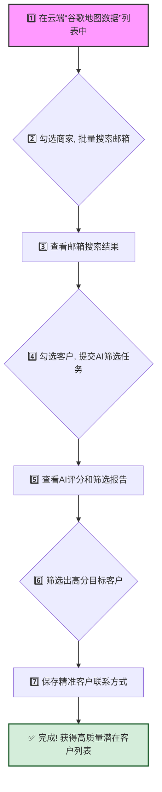

做外贸的你，是否也面临这样的困境？

从谷歌地图上找到了成千上万的潜在客户，感觉拥有了一座金矿。但真正开始筛选时，才发现这是一场噩梦：

*   **数据量大，但精准度低：** 很多商家根本不是你的目标客户。
*   **人工筛选，耗时耗力：** 逐个点开网站，费力地寻找产品信息，判断是否匹配，一天下来身心俱疲，却没筛选出几个有效客户。
*   **时间浪费在“筛选”，而非“沟通”：** 80%的精力花在了无效的筛选工作上，真正用于开发和跟进的时间少之又少。

我们都渴望能把时间花在刀刃上，与真正有潜力的客户建立联系。这篇文档将向你展示一种全新的工作流，利用AI技术，将你从繁琐、低效的筛选工作中解放出来，让你专注于真正能创造价值的事情。

---

### **核心流程一览**

在开始之前，我们先通过一个流程图，快速了解整个操作的核心步骤。这将帮助你建立一个清晰的整体概念。

> **前置说明：** 本篇文档的操作始于已将谷歌地图商家数据同步至云端。如果您尚未完成此步骤，请参照 **[《同步谷歌地图商家数据至云端统一管理》](https://www.laifa.xin/chajian/cloud-synchronize-merchants-and-centralized-data-management)** 将插件采集的数据同步至云端“谷歌地图数据”列表中。

---

## **二、第一步：批量搜索邮箱，为AI筛选做准备**

AI筛选的第一步，是确保我们拥有可以联系到这些商家的有效途径——邮箱。

在云端的“**谷歌地图数据**”页面，您会看到所有通过插件采集并同步过来的商家列表。

1.  **选择目标：** 勾选您想要进行筛选的商家。您可以选择一部分，也可以全选。
2.  **提交任务：** 点击“**搜索邮箱**”按钮，系统将开始为这些商家批量查找邮箱。这一步会自动去除重复数据和没有网站的商家，为后续的AI分析提供干净、有效的数据基础。

提交后，您可以在“**批量搜客任务**”页面看到任务的执行进度。例如，提交了1万家，系统去重并排除了无效数据后，剩余5619家进入下一步处理。

## **三、第二步：启动AI筛选，让机器为您“阅读”网站**

当邮箱搜索任务完成后，激动人心的时刻到来了。我们将利用AI来深度分析每一个商家的网站，判断其与您的业务匹配度。

1.  **查看结果：** 在任务列表中，点击“**结果**”，进入已找到邮箱的客户列表。

    

2.  **提交AI筛选：** 在结果列表中，勾选您希望AI分析的客户（同样可以全选或部分选择），然后点击“**AI筛选**”。

3.  **设置筛选标准：** 在弹出的窗口中，您需要设置好您的“**产品档案**”和“**匹配模式**”。这一步至关重要，它是在告诉AI：“我的产品是什么？什么样的客户才是我想要的？”。设置越清晰，AI的筛选结果就越精准。

    

提交后，AI便会像一个不知疲倦的资深业务员，开始逐一“访问”这些客户的网站，并根据您的标准进行深度分析和评估。

## **四、第三步：解读AI报告，轻松锁定目标客户**

筛选完成后，您将得到一份清晰、直观的AI分析报告。它不再是冰冷的数据，而是充满洞察的决策依据。

*   **AI评分与一句话概括：**
    系统会为每个商家打出一个0-100的“**AI评分**”，分数越高，代表匹配度越高。更贴心的是，AI还会给出一句精炼的“**一句话概括**”，直接告诉您它为什么给出这个分数。这让您一眼就能判断客户的价值。

    

*   **查看详细报告：**
    如果您对某个高分客户感兴趣，可以点击“**查看详细报告**”。报告会从六个维度（如业务相关性、企业规模、市场定位等）进行详细解读，并清晰地列出“**匹配点**”和“**风险点**”。这不仅让您知道“他是不是”，还让您了解“他为什么是”，为后续的开发信撰写提供了宝贵的切入点。

    

## **五、第四步：保存联系人，完成高质量客户列表**

现在，您已经拥有了一份经过AI精炼的、高质量的潜在客户列表。最后一步，就是将他们整理出来，准备开始您的营销开发。

1.  **筛选高分客户：** 在结果列表中，使用筛选功能，轻松筛选出您认为有价值的客户，例如，筛选出所有“**AI评分**”大于60分的商家。瞬间，您的潜在客户列表就从成千上万条缩减到了几十或几百条最核心的目标。

    

2.  **保存邮箱：** 勾选这些筛选出来的高分客户，点击“**保存联系人**”。系统会弹出窗口，让您选择需要保存的邮箱类型。

    

至此，您已经成功将一份庞大、混杂的原始数据，转化成了一份小而精、高价值的精准客户列表。接下来，您可以充满信心地去撰写开发信，因为您联系的每一位客户，都是经过AI验证的、与您业务高度匹配的潜在合作伙伴。

告别无效的重复劳动，把宝贵的时间和精力，投入到与客户的深度沟通中去吧！