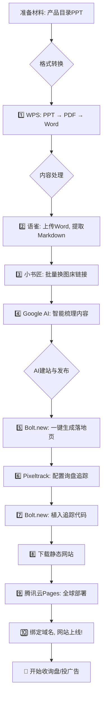

# 🚀 不卖课！手把手教你10分钟上线收询盘的网站！

## 【灵魂三问】

还在为**投广告没效果**而烧钱心疼？
还在为**搞SEO没流量**而苦熬岁月？
还在被那些**三天两夜19800**，教的却是皮毛的“大师课”搞得身心俱疲？

**醒醒吧，我的外贸朋友们！AI时代，游戏规则已经彻底改变！**

忘了那些复杂的SEO理论，忘了SEMrush，忘了无休止的外链建设。今天，我将带你用一套全新的AI工作流，直击获客的本质。

**核心目标：** 把你手头现成的产品目录（PPT/PDF/表格），在**10分钟内**，变成一个专业的、能收询盘、能投广告、全球加速的高转化落地页。

**我向你保证：**
*   **不卖课！不卖课！不卖课！** 这是纯粹的技术分享。
*   **不扯淡！不务虚！不造词！** （那个什么“坦ke页”，不过是某些讲师包装出来的韭菜词）。
*   **只要你懂你的产品，哪怕文案功底为0，也能轻松上手。**

这篇文章只是一个开始。未来，我们还会分享如何用AI写广告词、做精准投放。想跟上节奏？**在评论区回复“我要加群”**，加入我们的外贸增长实战社群，一起用技术碾压同行。

---

## **一、流程概览：10分钟搞定，就这几步**

为了让你心中有数，我把整个过程画成了一张图，跟着走就行。



---

## 二、开始准备：你的“神兵利器”

1.  **魔法上网（美国IP）**：硬性要求，访问`https://aistudio.google.com/`必备。
2.  **个人域名**：建议在`cloudflare.com`购买，用PayPal或外币卡支付。
3.  **WPS超级会员**：为了高质量的文档转换，这笔小投资绝对值。
4.  **AI工具账号**（均为免费注册）：
    *   **Google AI Studio**: `https://aistudio.google.com/`
    *   **Bolt.new**: `https://bolt.new/`

**这套打法的核心优势，再说一遍：**
无需服务器，无需写代码，自带全球CDN加速和免费SSL证书。**10分钟，从0到1，拥有一个能打的询盘网站！**

---

## 三、实战开始：从PPT到询盘网站

我们今天的案例，就是要把下面这个62M的产品PPT，变成一个在线的、能收询盘的落地页。


### 步骤1：文件格式转换 (WPS)

用WPS打开PPT，先另存为PDF。


接着，再用WPS的“PDF转Word”功能。
**（为什么不直接PPT转Word？我试了，格式会乱成一锅粥，图片也可能丢失。这条路是我的血泪经验！）**


### 步骤2：上传语雀，获取Markdown

注册并登录语雀 (`https://www.yuque.com/`)，随便找个知识库，选择“导入”。


选择我们刚刚转换好的Word文档。


导入后，你会看到一个排版混乱的文档，别慌，这完全在计划之中。


现在，复制这篇文档的浏览器地址，在链接末尾加上 `/markdown`，然后回车。
原链接：`https://www.yuque.com/qiudiss/lqafye/xhvd4kxgygg5fkwe`
Markdown链接：`https://www.yuque.com/qiudiss/lqafye/xhvd4kxgygg5fkwe/markdown`

你会看到满屏的代码，这就是我们需要的“原料”，**Ctrl+A全选，Ctrl+C复制**。


### 步骤3：批量处理图片链接 (小书匠)

语雀的图片链接有“防盗链”，直接用在其他网站上会裂开。必须替换掉。
*下载地址：`https://soft.xiaoshujiang.com/download/` (如果下载困难，**进群我直接发你安装包**)*

打开小书匠，把刚刚复制的Markdown代码粘贴进去。然后使用它的图床转换功能，一键替换成你自己的图床链接。（**注**：图床配置对新手有门槛，需要一些学习成本，你可以在小书匠官网查看文档，或者**直接加群交流，我们有更简单的方案**。）


### 步骤4：AI梳理内容(AI Studio)

处理完图片后，内容依然是“毛坯房”。现在轮到AI精装修了。
打开 `https://aistudio.google.com/`，用下面的Prompt，让AI帮我们把杂乱的文字整理成有逻辑的网站文案。

**Prompt:**
```
帮我把以下文档梳理的有条理，要条理清晰，便于我后续搞落地页，内容最终整理输出为markdown代码块（便于我复制粘贴）。
1. 结合上下文要完善图片描述
2. 要结构清晰
---
[此处粘贴从小书匠处理后复制的Markdown全文]
```


大约一分钟，AI就会输出结构清晰、描述完善的Markdown内容。**请务必快速浏览一遍，检查产品核心信息是否准确。**


### 步骤5：AI生成落地页 (Bolt)

最激动人心的时刻！我们将用AI一句话建站。
**请务必通过我的专属邀请链接注册，你我都能获得更多的免费额度。你获得的额度越多，我能做的测试和教程就越多，这是一个正向循环，我们一起薅羊毛，一起成长！**
**专属链接：`https://bolt.new/?rid=oa0sug`**

进入Bolt后，给AI下达建站指令：

**Prompt:**
```
帮我制作落地页
1.英文的
2.要有导航：便于点击快速跳转
3.要有表单：客户能提交询盘
4.公司资料：暂时没有，请帮我虚拟
5.产品信息
[此处贴入上文梳理的产品信息]
```


点击生成，AI开始为你打工...


过程中如果出现红色错误提示，别慌，直接点击“Attempt Fix”，AI会自己修复。**你只需要会点鼠标就行。**


直到右侧预览区能正常显示网页，就说明生成完毕了。


觉得颜色太暗？直接告诉AI：“`我感觉这个颜色不好看,我想换个亮一点的，大气一点的`”


新版本看起来专业多了！


AI甚至还贴心地设计了产品分类切换的功能，交互体验很棒！


### 步骤6：让询盘表单“活”起来

现在网站底部的表单还只是个摆设，无法接收询盘。我们需要 `https://pixeltrack.laifa.xin/` 这个系统来盘活它。它能帮你收询盘，还能发邮件通知你。


注册登录后，点击“创建广告”。


在创建页面，注意：
1.  **上传图片**：客户提交表单后会看到这张图。你可以上传公司二维码、WhatsApp二维码等。
2.  **设置追踪字段**：确保这里的字段和我们落地页表单的字段一一对应。我们的表单有“公司名称”，这里默认没有，可以在“自定义字段配置”里，把`自定义字段1（c1）`设置为公司名称。


创建成功后，我们可以先测试一下。点击“测试追踪”。


在新页面点击“执行追踪测试”。


回到广告详情页，你会在“询盘记录”里看到一条测试数据。


同时，你的邮箱也会收到通知。


测试无误！现在，在广告详情的“追踪代码”部分，复制那个以 `.png` 结尾的**追踪图片链接**。


### **步骤7：植入追踪代码**

**这一步是核心技术点，相对复杂，仔细看！** 如果搞不定，欢迎**在评论区留言“我要加群”**，进群手把手教你。

我们需要告诉AI，当用户提交表单后，加载上面这个带参数的图片。

**Prompt:**
```
客户提交表单后，在当前页面展示这个图片：https://pixeltrack-worker.laifa.xin/track/SGfj-786.png
图片要带上对应的参数，参数分别对应：邮箱（e）、电话（p）、姓名（n）、留言（m）、公司名称（c1）
```


回到Bolt页面，点击右上角的“Inspector”按钮，然后鼠标移动到询盘表单区域并点击选中。在左侧输入框中，粘贴我们准备好的Prompt，让AI执行修改。


修改完成后，我们在页面上填写真实信息进行测试。


几乎是瞬间，Pixeltrack后台就收到了这条询盘，完美！


### **步骤8：下载静态网站**

网站功能一切正常，现在我们要把它部署到自己的域名下。
在Bolt页面右上角，先点击“Publish”。发布成功后，点击顶部的三个点，选择“Export” -> “Download”。


你会得到一个`project-bolt-xxx.zip`的压缩包。解压后，找到里面的`dist`文件夹，这才是我们网站的本体。


将这个`dist`文件夹单独压缩成一个新的ZIP包，待会儿上传用。


### **步骤9：发布到云端 (腾讯云Pages)**

这里我们使用腾讯云的Webify（也叫EdgeOne Pages）进行免费部署。
访问：`https://console.cloud.tencent.com/edgeone/pages`

点击“新建应用”，选择“直接上传”。


填写项目信息：
*   **项目名称**：自定义，如 `my-glass-site`。
*   **加速区域**：如果你的域名没备案，**务必选择“全球（不含中国大陆）”**。
*   **上传文件**：选择我们刚刚打包好的`dist.zip`。
*   点击“开始部署”。


部署过程很快，大约10秒。


当状态显示“成功”，就可以通过腾讯云提供的临时域名预览了。


### **步骤10：绑定自己的域名**

预览没问题后，我们来绑定自己的域名，比如 `glass.laifa.xin`。
在项目设置中，点击“添加自定义域名”，输入你的域名，**记得勾选“自动申请免费证书”**！


系统会提示你添加一条CNAME解析记录。到你的域名服务商后台（如Cloudflare）完成此操作。如果不会，可以点击“设置指引”，或者**直接加群问我**。


添加解析后，回来点击“验证”，有时会提示不正确，这是因为DNS解析需要时间生效，**耐心等待5-10分钟再试**。


当“DNS设置”显示“已设置”，说明解析已生效。此时“证书状态”可能还在“部署中”，再稍等片刻。


大约1分钟后，证书生效，你的域名就可以通过HTTPS正常访问了！


---

## **四、如何更新和迭代？**

想修改页面内容？太简单了！
回到Bolt，点击“Inspector”选中要修改的模块，然后用大白话告诉AI你的新要求。


修改满意后，重复**步骤8到10**的流程：重新下载静态包，然后在腾讯云Pages的“构建部署”中选择“新建部署”，上传新版本即可完成网站更新。


---

## **五、这只是一个开始**

今天，你亲手用AI完成了一个过去可能需要花费数千元甚至上万元才能搞定的项目。你省下的不仅是钱，更是宝贵的时间和被割韭菜的风险。

这个落地页，就是你进行Google Ads、Facebook Ads、EDM营销的“超级武器”。它谷歌会收录，可以做SEO；它结构清晰，适合做SEM。

**一个人的摸索注定是低效的，一群人的共创才能走得更远。**

这套流程里，你可能还会在**图床配置、Prompt优化、询盘追踪**等细节上遇到问题。
更重要的是，网站建好后，**如何写出高转化的广告词？如何低成本测出爆款广告？如何搭建AI获客的完整体系？**

这些，都是我们**【外贸AI增长实战社群】**正在深入探讨和实践的。

**在文章下方评论“我要加群”，我会亲自拉你进群！**

没有“大师”，没有“精英”，只有一群和你一样，想用AI实实在在搞钱的外贸人。期待你的加入，我们一起，用技术改变命运。