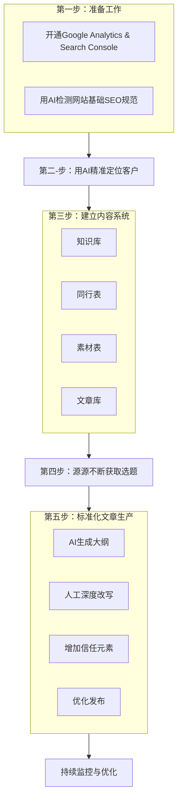

# **还在为独立站SEO焦虑？这套新手可执行的打法，让你彻底告别被割韭菜！**

做外贸的你，是不是也正经历这样的绝望？

花大价钱建好的独立站，上线几个月，除了自己，谁也没看过。找的SEO代运营，收了你几万块，最后只甩给你一堆所谓的“高流量”关键词，然后告诉你：“内容得你自己写。”

买SEO课程，5000块起步，听得云里雾里，一堆术语、一堆工具，还没开始干，就先被劝退了。更可气的是，按照他们的方法，花钱搞了外链，花时间写了文章，网站流量是有了点，但询盘一个没有！为什么？因为引来的全是C端流量，根本不精准！

钱花了，精力投了，结果却是在原地打转。这种无力感和焦虑，我懂。

今天，这篇文章就是为你而写。我们不谈虚的，不讲复杂的理论，只给你一套**看得懂、能执行、见效快**的“人话版”SEO打法。

我们先来看一张流程图，这是我们接下来要详细拆解的核心路径。


**本篇只是一个开始。** 能看懂上面的图吗？是不是感觉很直观？这套打法，就是要把SEO这件事，从一个“玄学”，变成一个有迹可循、人人可上手的“科学”。

如果你已经厌倦了被割韭菜，渴望真正为自己的独立站做出效果，请一定花10分钟耐心读完。

## **一、破除迷信：新手做SEO最该避开的三个坑**

在开始“干”之前，我们必须先从思想上“祛魅”，把那些让你浪费时间、消磨信心的大坑给填平。

**1. 关于工具陷阱：Ahrefs/SEMrush 对新手 = 开飞机送外卖**
很多课程会让你一上来就研究各种复杂的关键词工具。但对一个新站、一个SEO新手来说，这些工具的学习成本极高，数据维度复杂，很容易让你陷入“完美陷阱”。你花大量时间研究出来的词，很可能带不来任何精准的B端客户。**记住，工具只是辅助，核心是内容。**

**2. 关于外链陷阱：新站前6个月追求外链 ≈ 往沙漠里种树**
外链当然重要，但不是现在！在Google越来越强调E-E-A-T（经验、专业、权威、可信）的今天，你的网站需要先用优质内容证明自己的价值。没有好内容，花钱买来的垃圾外链只会拖累你的网站。**记住，1篇能真正解决客户问题的深度好文，胜过100条垃圾外链。**

**3. 关于更新陷阱：与其日更3篇流水账，不如每周打磨1篇精品**
“要保持高频更新”，这句话本身没错，但很多人理解错了。高频不等于无脑复制粘贴。停下来多思考，客户到底想看什么？什么内容对他们有价值？低质量的堆砌，不仅浪费你自己的时间，更是在消耗Google对你网站的信任。

破除了这些迷信，我们才能轻装上阵。正如外贸圈大佬亿姐（Catharine.Wu）的那句名言：**干就完了！**

接下来，我们就一步步拆解，到底该如何“干”。

## **二、新手可执行的SEO落地路线图**

#### **第一步：准备工作，磨刀不误砍柴工**

1.  **开通两大神器**：确保你的网站已经正确安装并开通了 **Google Analytics (GA4)** 和 **Google Search Console (GSC)**。前者看流量数据，后者看搜索表现，这是你监控一切效果的基础。
2.  **网站基础体检**：你的网站技术层面有没有硬伤？比如加载速度、移动端适配等。不懂技术没关系，打开你的网站，右键“查看网页源代码”，把所有代码复制下来，直接丢给AI。

    你可以使用下面这个指令模板：
    ```
    你是一位专业的SEO技术专家，请帮我分析以下网站源代码，是否存在影响Google收录和排名的基础性SEO问题，并给出具体的、新手也能看懂的修改建议。
    [这里粘贴你的网站源代码]
    ```

#### **第二步：用AI，读懂你的客户**

SEO的核心，是写出“客户想搜、会搜”的内容。可最大的痛点是：我根本不知道客户是谁？他们会搜什么？

别担心，AI来帮你。尤其是对于新品、新项目的同学，这个方法能让你瞬间拥有“市场洞察力”。

推荐使用 **Gemini 1.5 Pro**（可以通过 aistudio.google.com 使用，切换到美国IP基本免费）。

**指令模板：获取客户画像**
```
我是一家[你的行业，例如：工业阀门]制造商，我的核心产品是[你的产品，例如：耐腐蚀球阀]，主要应用在[产品应用领域，例如：化工、海洋工程]等领域。请你作为一名资深的市场分析专家，帮我分析：
1. 我的潜在B端客户群体有哪些？请至少列出3-5个不同的客户画像（例如：采购经理、项目工程师、工厂老板等）。
2. 针对每一个客户画像，分析他们的核心痛点、关注点，以及他们在采购决策中最看重什么？
3. 他们在寻找解决方案时，可能会在Google上搜索哪些关键词或问题？请提供长尾关键词和口语化的问题。
```
通过这个指令，你得到的不再是冰冷的关键词，而是活生生的、带着痛点和需求的客户画像。这些，就是你未来所有内容的灵感源泉。

#### **第三步：建立你的“内容生产系统”**

高效的执行，离不开一个有序的系统。我们不依赖复杂的软件，一张“飞书多维表格”（或类似的在线表格工具）就足够了。你需要建立以下几张关键表格：

1.  **知识库**：这是你所有内容的核心。把公司的所有资料，包括产品规格书、技术优势、成功案例、公司介绍、行业报告等，全部整理到这里。这是AI为你生成个性化、独一无二内容的基础。
2.  **同行表**：监控你的直接竞争对手。列出他们的网址，特别是他们的`sitemap.xml`链接（一般是 `域名/sitemap.xml`）。
3.  **采集表**：这是一个自动化的信息入口。后续我们将探讨如何自动化监控同行网站的Sitemap，一旦有新文章发布，链接就自动、去重地添加到这张表里。
4.  **素材/选题表**：所有通过同行分析、AI洞察得来的好点子、好主题，都记录在这里。
5.  **文章库**：所有最终发布的文章链接，以及对应的主题、关键词、发布日期等，都记录在此，方便复盘。

这个系统，就是你未来内容创作的“指挥中心”。

#### **第四步：让AI帮你源源不断地找选题**

知道了客户是谁，如何持续找到他们关心的好内容？答案是：**向同行“借鉴”**。

1.  **监控同行更新**：手动操作的话，可以定期使用Google搜索指令 `site:competitor.com`，并筛选时间为“过去一周”或“过去一月”，查看他们更新了什么。
2.  **AI提炼要点**：当你发现一篇同行的高价值文章后，不要直接抄袭。把文章链接丢给AI，让它帮你提炼。

    **指令模板：AI提炼文章要点**
    ```
    你是一名行业内容分析师。请仔细阅读以下文章，并为我提炼出：
    1. 这篇文章的核心要点和主要观点。
    2. 文章的目标读者是谁？解决了读者的什么问题？
    3. 文章的整体结构和逻辑是怎样的？
    4. 列出文章中使用的核心关键词。

    文章链接：[粘贴同行文章链接]
    ```
    通过这个方法，你能快速“榨干”一篇好文章的精华，并把它变成你【素材/选题表】中的一条记录。

#### **第五步：标准化文章生产流程**

现在，我们有了客户画像、有了选题，可以开始写文章了。为了保证效率和质量，我们采用“AI辅助 + 人工精修”的标准化流程。

**第1步：AI生成大纲和写作指引**
从你的【选题表】中选定一个主题，然后让AI为你搭建骨架。

**指令模板：AI生成文章初稿/大纲**
```
你是一位顶级的B2B内容营销专家，也是我们公司的产品专家。请根据以下信息，为我生成一篇专业的博客文章大纲。

我的产品/公司知识库要点：
[从你的【知识库】中，复制几段最相关的产品优势、客户案例或技术参数]

文章主题：[例如：如何为化工厂选择合适的耐腐蚀阀门]
目标读者：[例如：化工厂的项目工程师]
核心关键词：[例如：耐腐蚀阀门，化工阀门选择，盐酸环境阀门]

要求：
1. 生成一个清晰、有逻辑的文章大纲，包含引言、主体段落（3-5个）、结论。
2. 在每个主体段落的要点下，明确指出我应该在这里写什么内容，给出写作建议和方向。
3. 巧妙地建议我在哪些地方可以植入我的产品优势和客户案例（从上方的知识库要点中选取），让内容显得真实、可信，而不是生硬的广告。
4. 在合适的位置，自然地嵌入我提供的核心关键词。
```

**第2步：人工深度改写**
AI给你的只是骨架。你的任务是，结合你的专业知识和经验，往里面填充血肉。用你自己的语言、你自己的案例、你自己的思考，把文章丰富起来。这一步，是让你的文章从“合格”走向“优秀”的关键。

**第3步：增加可信度**
在文章中加入图表、数据引用、客户的真实评价截图、产品实拍图或视频。这些元素能极大地增强文章的专业性和可信度。

**第4. 优化与发布**
确保标题足够吸引人，段落清晰，配图得当。最重要的是，在文章末尾加上一个明确的**“行为召唤 (Call to Action)”**，比如“立即联系我们获取详细报价”或“下载完整版产品手册”。

## 三、让我们一起抱团，告别焦虑

看到这里，你是否觉得，独立站SEO其实并没有那么遥不可及？

是的，它不需要你成为技术大神，也不需要你投入万金。它需要的，是一套正确的思维方式，一个清晰的执行系统，和最重要的——**现在就开始行动的决心**。

在当前外贸环境整体下行的大背景下，我们每一个外贸人都在负重前行。焦虑和迷茫是真实的，但单打独斗只会让我们更深地陷入泥潭。

我创建这篇文章和这个方法论的初衷，就是为了帮助更多像你我一样，渴望靠自己做出成绩，却苦于无门的外贸人。**我们不卖课，不要钱，只想把最纯粹、最实用的干货分享出来，帮助更多的外-贸-人-做-好-外-贸！**

在我们的社群里，**已经有数百位小伙伴**跟着这套打法取得了不错的结果，并且正在深入探讨如何玩转 **AI + SEM + SEO**，一起见证AI的魅力。

如果你觉得这篇文章对你有启发，如果你也想加入一个真正“讲人话、干实事”的圈子，和大家一起交流、一起成长，彻底摆脱被割韭菜的命运：

1.  **请为这篇文章点个“赞”和“在看”。**
2.  **把它“转发”给你身边同样需要的朋友。**
3.  **在评论区留言：“我要加群”**，我会尽快邀请你加入我们的外贸人实战交流群。

让我们一起，用行动代替焦虑，用效果粉碎质疑。干，就完了！