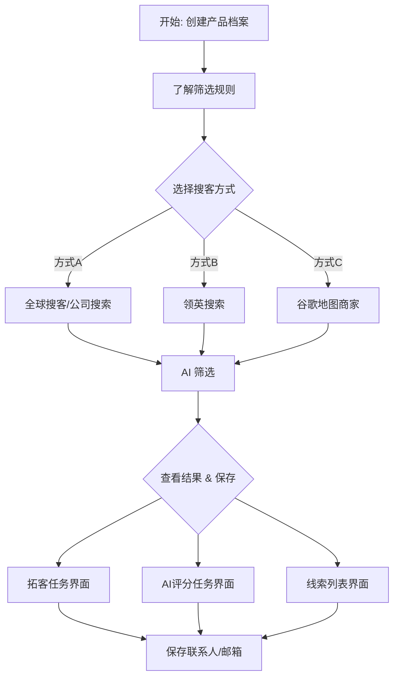

# ✨AI筛选：精准➕锁定高价值客户

> 📝 **核心摘要**：告别盲目搜索。通过建立 **[产品档案]**，利用 **[AI 智能评分]** 自动过滤无效线索，帮您快速锁定 **[60分+ 高价值客户]**，大幅提升获客效率。

## 一、创建你的产品档案

> ℹ️ **背景**：这是 AI 帮您找客户的“基准”。AI 会根据您填写的内容，判断客户是否匹配。

请遵循以下两个原则：
1.  **专款专用**：一个产品对应一个档案，请分开创建。
2.  **抓大放小**：填写 **文字简洁** 即可。过于琐碎的描述反而会误伤潜在客户。

> 💡 **提示**：您也可以先跳过，等进行筛选操作时再创建。

## 二、了解核心功能与筛选规则

### 1. 线索中心：您的客户管理中台
这里是所有线索的汇聚地，主要包含四个模块：
*   **a. 线索列表**：您的私有“客户池”。搜索并经 AI 筛选后的客户，汇总于此，方便统一管理。
*   **b. 拓客任务**：任务看板。展示来自 **公司域名、公司名称、全球搜客、精准买家** 的搜索任务结果。
*   **c. AI 评分任务**：质检中心。所有 AI 评分任务集中在此，可查看详细的评分报告。
*   **d. 线索转化**：成果库。记录从列表和任务中保存下来的最终客户。

### 2. 标签管理：同步数据的关键
> ⚠️ **注意**：为了让数据顺利同步到“线索列表”，请务必设置标签。

*   **场景 ①**：使用公司域名、全球搜客等创建任务时，设置同步标签。
*   **场景 ②**：所有 AI 筛选的结果，设置同步标签。

### 3. AI 筛选规则设置
在启动 AI 筛选前，您需要确认以下 5 点：

1.  **筛选标准**：选择要匹配哪一个产品档案？
2.  **扫描范围**：选择 **智能扫描** 或 **全面扫描**。
3.  **排除规则**：设置哪些情况跳过筛选（节省点数）。
    
4.  **保存线索**：勾选 `结果同步到线索列表`，并选择 **标签** 及后续操作。
5.  **点数预估**：系统会预估消耗，最终以实际扣除为准。
    

## 三、创建搜索任务并进行 AI 筛选

> ℹ️ **逻辑**：先搜索获取数据，再用 AI 筛选优劣。
> 根据您的搜客方式，结果会出现在不同位置，请对号入座：

### 类型 A：拓客任务（全球搜客/公司搜索等）
*   **适用场景**：公司域名、公司名称、全球搜客、精准买家。
*   **结果位置**：`` `线索中心` `` -> `` `拓客任务` ``

**第一步：创建搜客任务**
以 **全球搜客引擎** 为例：
🔗 **参考文档**：[谷歌搜索学习文档](https://mp.weixin.qq.com/s/UDnYvM8rcq6c3a5nxg3x6Q?scene=1&click_id=1)

如果是 **公司域名/名称/精准买家**，操作参考下图：

**第二步：查看结果并 AI 筛选**
1.  任务完成后，点击 `` `结果` `` 查看列表。
    
2.  勾选目标客户，设置筛选条件。
    

> 💡 **省钱小技巧**：建议先进行 **手动筛选**，排除明显不匹配的，再用 AI 筛选。
> 🔗 **参考文档**：[手动筛选设置参考](./common-filter-conditions-for-search-customers)

---

### 类型 B：领英搜索
*   **适用场景**：领英渠道开发。
*   **结果位置**：当前视图。

> 💡 **建议**：使用 **高级模式**。流程：提取关键词 -> 创建筛选 -> 视图 AI 筛选。
> 🔗 **参考文档**：[领英搜索文档（直接看高级模式）](./linkedin-customer-search)

1.  **视图筛选**：设置视图条件，先在本地汇总目标客群。
    
2.  **AI 筛选**：勾选视图中要筛选的客户，设置 AI 条件并提交。
    

---

### 类型 C：谷歌地图商家
*   **适用场景**：基于地理位置的商家搜索。
*   **结果位置**：`` `批量搜客任务` ``

这里有两种操作方式：

#### 方式 ①：先搜邮箱，再 AI 筛选
1.  在“谷歌地图数据列表”勾选客户，点击 `` `搜索邮箱` ``。
    
2.  进入 `` `批量搜客任务` `` 查看任务，点击 `` `结果` ``。
    
3.  选择客户，提交 AI 进行匹配度筛选。
    

#### 方式 ②：先手动筛选视图，再 AI 筛选
1.  在“谷歌地图数据”页面，通过视图进行简单筛选。
2.  勾选客户，点击右上角 `` `AI 筛选` ``，设置条件直接提交。
    

## 四、查看筛选结果并保存邮箱

> ℹ️ **背景**：AI 分析完成后，您可以通过以下三个入口查看结果并保存高价值线索。

### 入口 A：线索中心 - 拓客任务
1.  点击 `` `拓客任务` `` 页签，点击对应任务的 `` `结果` ``。
    
2.  **关键步骤**：点击列表上方的 **AI 评分**，建议筛选 **60分以上** 的客户。
    
3.  勾选客户，点击 `` `保存联系人` ``。
    

---

### 入口 B：线索中心 - AI 分析任务

**1. 筛选并保存**
点击 `` `评分任务` `` 页签 -> 点击 `` `结果` ``。同样建议筛选 **AI 评分 60分以上** 的客户进行保存。

**2. 查看分析报告**
点击任务的 `` `报告` `` 按钮，查看客户与产品的匹配度分布。

**3. 查看单个客户详情**
在结果列表中，点击 **AI 洞察** 列的 `` `查看详细报告` ``。

弹窗将展示该用户的具体评分维度。

---

### 入口 C：线索中心 - 线索列表
> ⚠️ **前提**：AI 分析结果必须已设置“同步到线索列表”才能在此查看。

1.  未同步的客户只能在任务里看，同步后可在 `` `线索列表` `` 查看。
    
2.  创建视图并设置条件进行管理。
    
3.  选择筛选后的客户，点击 `` `保存联系人` ``。
    

---

### 💡 关于保存设置的建议
在保存界面，您可以设置：
*   保存对象：公司 / 联系人。
*   标签：为公司和联系人打上对应标签。
*   数量限制：每家公司保存多少邮箱？
*   **职位设置**：⚠️ **不建议选择特定职位**，这可能导致保存下来的数据非常少。

## 🚀 下一步行动

恭喜您掌握了 AI 精准获客的流程！建议立即：
*   创建一个核心产品的 **产品档案**。
*   尝试运行一次 **全球搜客** 任务，体验 AI 评分的准确性。

---

## 四、拓展与资源 {#expansion-and-resources}

### 常见问题 (FAQ) {#faq}

- **❓ AI 评分的点数如何计算？**
  - > - 答：每次对一个客户进行 AI 筛选都会消耗点数。**智能扫描** 速度快、消耗少，适合初步筛选；**全面扫描** 更深入，但消耗更多。最终扣除以实际执行为准。有关详细信息，请参阅您的 📚[配额管理](./quota-management)。
- **❓ 为什么我的 AI 评分普遍偏低？**
  - > - 答：这通常与 **产品档案** 的设置有关。请检查您的产品描述是否过于复杂或模糊。一个清晰、简洁的档案是获得高分的关键。此外，初始搜索的线索质量也会影响最终评分。
- **❓ “智能扫描”和“全面扫描”该如何选择？**
  - > - 答：建议先使用 **智能扫描** 进行大规模的初步过滤，找出潜在匹配的客户。然后，对于评分较高或您特别感兴趣的客户，可以再使用 **全面扫描** 进行深度分析，以获取更全面的匹配信息。
- **❓ AI 筛选过的客户需要手动保存吗？**
  - > - 答：是的。AI 筛选只是一个评分过程，并不会自动保存客户。您需要在 **拓客任务**、**AI 评分任务** 或 **线索列表** 中，根据评分（如筛选 >60分）手动勾选并 **保存联系人**。

### 学习建议 {#learning-suggestions}

- 1️⃣ **优化产品档案**：这是所有AI筛选工作的基础。花时间创建一个精准、核心的 **产品档案**，它直接决定了筛选的准确度。
- 2️⃣ **小批量测试**：在进行大规模筛选前，先用一小部分数据（例如 20-50条）进行测试。这能帮助您验证产品档案的有效性，并及时调整策略，避免浪费点数。
- 3️⃣ **先手动，后智能**：在启动 AI 筛选前，先利用系统提供的常规筛选条件（如地区、行业等）进行一轮手动筛选。这可以剔除大量明显不相关的线索，让 AI 更专注于有价值的目标。
- 4️⃣ **分析评分报告**：不要只关注高分客户。花时间查看 **AI 洞察** 中的详细报告，理解为什么某些客户得分高或低。这能为您优化产品档案和市场策略提供宝贵见解。

### 相关阅读 {#related-reading}

- 📚[全球搜客引擎](./global-search-engine)：学习如何利用全球搜客获取海量初步线索，为 AI 筛选提供数据基础。
- 📚[领英客户搜索](./linkedin-customer-search)：深入了解如何结合领英搜索与 AI 筛选，精准开发高质量的 B2B 客户。
- 📚[谷歌地图商家筛选](../chajian/ai-filter-google-maps-business)：掌握利用 AI 技术筛选谷歌地图商家，特别适用于有地域性特征的业务。
- 📚[客户标签与视图](./contacts-tags-views)：学习如何利用标签和视图高效管理和跟进您通过 AI 筛选出的高价值客户。

🔗 **本文永久链接：** https://laifa.xin/zhinan/ai-customer-screening-guide

