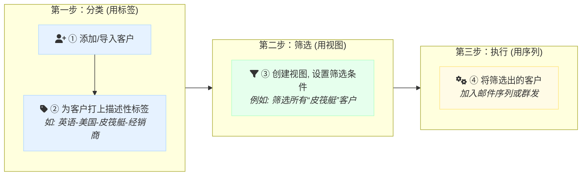

# 🏷️ 标签与视图：轻松管好客户，精准做营销 {#getting-started-with-tags-and-views}


:::tip 告别混乱：两大核心管理工具

当客户列表越来越长，管理变得一团糟？别担心，**标签 (Tags)** 和 **视图 (Views)** 就是帮你化繁为简的两大核心工具。

| 核心工具 | 一句话概括 | 应用示例 |
| :--- | :--- | :--- |
| 🏷️ **标签 (Tags)** | **为客户贴上“名片”**，描述客户是谁。 | `德语-德国-皮筏艇-经销商` |
| 👀 **视图 (Views)** | **创建“智能筛选器”**，筛选你想找的人。| "所有德国的经销商" |

> **简单来说，它们的黄金法则是：**
>
> - **标签** 回答：“**他是谁？**”
> - **视图** 回答：“**我要找谁？**”

掌握这两个工具，你就能把客户管理得井井有条，从而将更多宝贵精力，聚焦于**拿下订单**。
:::

### 核心工作流程图

为了让你快速上手，我们先来看一张图，了解一下标签、视图和邮件序列是如何协同工作的：



---

## 🏷️ 第一部分：玩转客户标签 (为客户精准画像) {#mastering-contact-tags}

> 一个好的标签，应该像一张内容丰富的名片，让你一眼就能看懂客户！

:::warning 核心方法

- 标签的作用是描述客户的静态属性，比如他是哪个国家的、做什么产品的。
- 持续的、自动化的营销任务，则交给更强大的 📚[邮件序列](./email-sequence-guide) 功能来完成。
:::

### 1️⃣ 标签的“黄金公式” {#the-golden-formula-for-tags}

我们强烈建议你用统一的格式来创建标签，这样既规范又便于筛选。

**推荐公式：`语言 - 国家 - 产品/行业 - 供应链角色`**

| 序号 | 你的业务 | 客户群体 | 🏷️ 推荐标签 |
| :--: | :---: | :---: | :---: |
| 1️⃣ | CNC机加工 | 德国汽车工厂 | `德语-德国-汽车配件-工厂` |
| 2️⃣ | 皮筏艇 | 美国水上用品经销商 | `英语-美国-皮筏艇-经销商` |
| 3️⃣ | 工程设备 | 巴西工程设备进口商 | `葡语-巴西-工程设备-进口商` |

**这样做的好处是什么？**

- **精准发信**：看到 `德语` 标签，你就知道要用德语邮件模板去沟通。
- **市场细分**：想给所有美国的客户发一封节日祝福？筛选包含 `美国` 的标签即可。
- **内容定制**：想给所有 `经销商` 推送新的代理政策？筛选 `经销商` 标签即可。

### 2️⃣ 标签分组：客户、意向、风险 {#tag-groups}

为了让管理更清晰，我们将所有标签归入三个核心分组：

| 序号 | 标签分组 | 用途说明 | 标签示例 |
| :--: | :---: | :--- | :--- |
| 1️⃣ | **<span style={{color: '#8e44ad'}}>客户</span>** | 👉 **核心分组**，描述客户的重要属性。按“上述公式”创建的标签都放在这。 | `英语-美国-工程设备-进口商` |
| 2️⃣ | **<span style={{color: '#8e44ad'}}>意向</span>** | 👉 用于标记客户的 **跟进状态**，判断客户的“温度”。 | `询盘💬`, `寄样📦`, `成交💰` |
| 3️⃣ | **<span style={{color: '#8e44ad'}}>风险</span>** | 👉 用于标记那些 **需要排除** 的联系人，避免无效骚扰。 | `同行❌`, `退订🚫`, `其他⛔` |


_图示：在系统中建立“客户”、“意向”、“风险”三大核心分组_

:::note[标签与分组结构示例]

```
🏷️标签 与 📁分组
├── 📁 客户 (描述客户是谁)
│   ├── 🏷️ 德语-德国-皮筏艇-经销商
│   ├── 🏷️ 英语-美国-工程设备-进口商
│   └── ... (其他描述性标签)
├── 📁 意向 (标记跟进状态)
│   ├── 🏷️ 询盘💬
│   ├── 🏷️ 寄样📦
│   └── 🏷️ 成交💰
├── 📁 风险 (标记需要排除的人)
│   ├── 🏷️ 同行❌
│   ├── 🏷️ 退订🚫
│   └── 🏷️ 其他⛔
```
:::

### 3️⃣ 如何创建和管理标签 {#creating-and-managing-tags}

- **创建标签**：
  - **方法一**：在 [联系人管理](https://web.laifaxin.com/contacts/contacts) 页面，找到 <span style={{color: '#3578e5'}}>标签筛选</span> 功能，点击 <span style={{color: '#3578e5'}}>【新建】</span>。
  - **方法二**：在 📚[标签管理](https://web.laifaxin.com/settings/tags) 页面，可以统一创建和管理所有 **<span style={{color: '#8e44ad'}}>标签</span>** 与 **<span style={{color: '#8e44ad'}}>标签分组</span>** 。


_图示：在联系人列表中新建标签_

- **管理标签**：
  - 在 📚[标签管理](https://web.laifaxin.com/settings/tags) 页面，你可以对已创建的标签进行编辑、移动、统计或删除，让你的标签库时刻保持整洁。


_图示：在标签管理中心进行常用操作_

---

## 👀 第二部分：用好联系人视图 (智能筛选目标客户) {#using-contact-views}

:::warning 核心价值

如果说标签是静态的“名片”，那么 **<span style={{color: '#8e44ad'}}>视图</span>** 就是动态的“筛选器”。它最大的用途是帮你 **快速找到一批人**，或者在群发时 **快速排除一批人**。一次设置，永久复用！
:::

### 1️⃣ 如何新建和管理视图 {#creating-and-managing-views}

- **新建视图**：进入 [联系人管理](https://web.laifaxin.com/contacts/contacts) 页面，点击右上角的 <span style={{color: '#3578e5'}}>【创建视图】</span>。
- **管理视图**：创建后，你可以将常用视图 **固定** 在列表上方，方便随时点击切换。也可以拖动排序，将最重要的视图设为默认。


_图示：管理你的联系人视图_

### 2️⃣ 设置视图的筛选条件 {#setting-view-filters}

这是视图最核心的功能。你可以设置一个或多个条件来筛选客户。

- **理解“并且/或者”逻辑**：
  - **并且 (AND)**：客户必须 **同时满足所有条件** 才会被筛选出来。（条件更严，结果更少）
  - **或者 (OR)**：客户只要 **满足任意一个条件** 就会被筛选出来。（条件更宽，结果更多）


_图示：设置多个筛选条件并选择逻辑关系_

### 3️⃣ 几个超实用的视图案例 {#practical-view-examples}

我们为你准备了几个开箱即用的视图，你可以直接跟着设置。

---

#### ① **<span style={{color: '#8e44ad'}}>意向客户排除视图</span>** {#intent-view}

- **🎯 用途**：在发送开发信时，自动排除掉这些已经有进展的客户，避免打扰，显得我们更专业。
- **⚙️ 设置方法**：
  - **条件**：`标签` `任意包含` <u><span style={{color: '#e67c00'}}>💬询盘</span></u>、<u><span style={{color: '#e67c00'}}>📦寄样</span></u>、<u><span style={{color: '#e67c00'}}>💰成交</span></u>。
  - **逻辑**：`或者`


_图示：设置一个用于排除意向客户的视图_

---

#### ② **<span style={{color: '#8e44ad'}}>风险客户排除视图</span>** {#risk-view}

- **🎯 用途**：在群发时排除掉这些有风险的客户，保护你的发件箱信誉，避免浪费额度。
- **⚙️ 设置方法**：
  - **条件**：`标签` `任意包含` <u><span style={{color: '#e67c00'}}>❌同行</span></u>、<u><span style={{color: '#e67c00'}}>🚫退订</span></u>、<u><span style={{color: '#e67c00'}}>⛔其他</span></u>。
  - **逻辑**：`或者`


_图示：设置一个用于排除风险客户的视图_

---

#### ③ **<span style={{color: '#8e44ad'}}>不发邮箱排除视图</span>** {#no-send-view}

- **🎯 用途**：自动筛选出那些我们通常不希望营销的邮箱，比如国内邮箱、职能邮箱等，提升邮件营销的精准度。
- **⚙️ 设置方法**：这个视图条件比较多，但非常有用！
  - `邮箱` `开头是` `hr@;noreply@;marketing@;jobs@;customerservice@`
  - `邮箱` `结尾是` `qq.com;163.com;aliyun.com;263.com;88.com;188.com`
  - `邮箱` `结尾是` `.cn;.tw;.hk;.in`
  - `邮箱` `包含` `.gov;.org;.edu`
  - **逻辑**：`或者` (只要满足其中一个条件，就把它圈出来排除)


_图示：设置一个用于排除非目标邮箱的视图_

---

#### ④ **<span style={{color: '#8e44ad'}}>已读客户跟进视图</span>** {#read-contacts-view}

- **🎯 用途**：筛选出特定群体对我们产品感兴趣的“温”客户，对他们进行更高频的跟进。
- **⚙️ 设置方法**：
  - **条件一**：`阅读次数` `大于` `0` （阅读次数大于0，说明是有阅读的）
  - **条件二**：`标签` `任意包含` `英语-美国-工程设备-经销商` `天
  - **逻辑**：`并且`


_图示：设置一个筛选特定客群的已读客户的视图_

---

## 🚀 第三部分：实战演练 (把理论用起来) {#practical-application}

理论都懂了，我们来模拟一个真实的业务场景吧！

**🎯 你的目标：**
> 启动一个邮件序列，向所有 **英语区域皮筏艇经销商** 自动、持续地发送开发信。

**✅ 操作步骤：**

1.  **第一步：确认标签**
    - 确保你已经为目标客户打上了正确的标签，例如 `英语-美国-皮筏艇-经销商`、 `英语-英国-皮筏艇-经销商`、 `英语-澳大利亚-皮筏艇-经销商`。

2.  **第二步：创建目标客户视图**
    - 新建一个视图，命名为“英语-皮筏艇-经销商”。
    - 设置筛选条件：`标签` `任意包含`  `英语-美国-皮筏艇-经销商`、`英语-英国-皮筏艇-经销商`、`英语-澳大利亚-皮筏艇-经销商`。
    - 保存视图。现在，所有符合条件的客户都被你圈出来了。


_图示：设置一个筛选英语区域的皮筏艇经销商的视图_

3.  **第三步：设置邮件序列**
    - 进入 📚[邮件序列](./email-sequence-guide) 功能，新建一个序列。
    - 在“序列”中，点击**添加联系人** 选择我们刚刚创建的视图 **“英语-皮筏艇-经销商”**。


_图示：在**邮件序列**中，点击“添加联系人”，选择”英语-皮筏艇-经销商“视图完成添加_

**🎉 恭喜你！**
现在，系统会自动地、有规律地向你的目标客户发送开发信，同时又智能地避开了那些已经有进展或有风险的客户。整个过程精准、高效、自动化！

---

## 📚 第四部分：拓展与资源 {#extensions-and-resources}

### 1️⃣ 常见问题 (FAQ) {#faq}

- **❓ 为什么标签里不建议加具体的日期，比如`0711`？**
  > 答：因为标签的核心是描述客户“是谁”，而不是“何时联系”。具体的发送时机和跟进节奏，应该交给 📚[邮件序列](./email-sequence-guide) 来自动化管理。这样做能让你的标签系统永远保持简洁、清晰。

- **❓ info@ 或 sales@ 这类邮箱还有发的价值吗？**
  > 答：**非常有价值！** 尤其对于中小型企业，这类邮箱很可能就是老板或关键决策人自己在管理。我们不建议你排除它们。而且，在 👉 [**<span style={{color: '#e67c00'}}>来发信</span>**](https://laifaxin.com) 系统中，这类邮箱是不占用你的计费额度的，可以放心发送。

- **❓ 周末或者节假日要不要发邮件？**
  > 答：这取决于你客户的工作习惯。你可以使用 📚[邮件群发](./email-mass-sending) 或 📚[邮件序列](./email-sequence-guide) 里的 **<span style={{color: '#8e44ad'}}>定时发送</span>** 或 **<span style={{color: '#8e44ad'}}>发送窗口</span>** 功能，把邮件安排在客户当地的上班时间发送，效果会更好。

### 2️⃣ 学习建议 {#learning-suggestions}

刚开始接触这套体系时，你可能会觉得有点复杂，别担心，这是一个很正常的过程！

我们建议你 **不要追求一步到位**。可以先从建立“黄金公式”标签开始，为你现有的客户打上描述性标签。等你慢慢熟练了，再逐步创建各种实用的视图。你会发现，客户管理真的可以变得越来越轻松，越来越有条理。

### 3️⃣ 相关阅读 {#related-reading}

- 📚[邮件序列](./email-sequence-guide)
  > 学习如何设置自动化邮件，让系统帮你持续跟进客户，解放你的双手。
- 📚[邮件群发](./email-mass-sending)
  > 了解如何配合我们今天学的 **<span style={{color: '#8e44ad'}}>客户视图</span>**，进行一次性的精准邮件群发。
- 📚[标签管理](./tag-management)
  > 如果你想深入了解如何创建和管理 **<span style={{color: '#8e44ad'}}>标签分组</span>**，可以阅读这篇文章。

🔗 **本文永久链接：** https://laifa.xin/zhinan/contacts-tags-views
