# 管理与营销：自动化开发外贸客户

:::tip 写在前面
**你的管理与营销客户，是否也陷入了这样的困境？ 🤔**

- **🌪️ 客户越多，越混乱：** 客户资料像潮水般涌入，管理却如**一盘散沙**，分不清谁是谁。
- **😩 每天很忙，却没效果：** 感觉总是在做**重复劳动**，但有价值的询盘却寥寥无几。
- **🤷‍♂️ 机会很多，却抓不住：** 客户就在那，如何**系统化、持续地**触达和转化他们？

如果这正是你的写照，那么本指南会是你的破局之道。我们手把手带你搭建一个**能自动运转的客户开发系统**，将混乱转为生产力。
:::

---

## 一、告别混乱，让营销重回正轨

- 在开始之前，我们先来看两种截然不同的工作状态，哪一种更像你的日常？

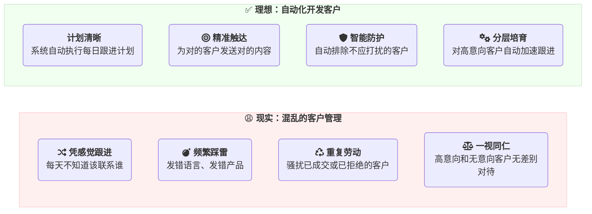

- 如果你的日常更偏向“混乱状态”，那么你一定深陷以下三大困境：

### 🌟 客户管理三大“黑洞”

| 管理黑洞(Pain Point)                   | 具体场景 (Scenario)                                                                              |
| :--------------------------------- | :------------------------------------------------------------------------------------------- |
| **① 🗂️ 分类的黑洞** <i>邮件发不对人</i> | 把精心准备的德语邮件发给美国客户，或把A产品资料发给只对B感兴趣的买家。（**时间白费，机会错失**）  |
| **② 🧠 记忆的黑洞** <i>跟进状态混乱</i>  | 反复骚扰已成交的老客户，或再次联系已明确拒绝的联系人。（**专业形象受损，客户关系告急**）       |
| **③ 💎 机会的黑洞** <i>优质客户流失</i>  | 频繁打开邮件的“热”客户，因未得到及时、更高频的跟进，慢慢变“冷”。（**最大订单机会，眼睁睁溜走**） |

---

**好消息是，这些并非无法解决。** 接下来将为你提供系统的管理与营销方法，帮你从“混乱”迈向“有序”。

---

## 二、客户管理的系统化方案

> 在 [**来发信**](https://www.laifaxin.com/) 系统中，我们为你提供了**三大核心工具**和**两大策略**，它们将帮你搭建起自动化的客户开发系统。

### 2.1、三大工具：标签、视图、邮件序列

> 这三大工具，构成了我们自动化营销的标准流程：**先分类，再筛选，后执行**。

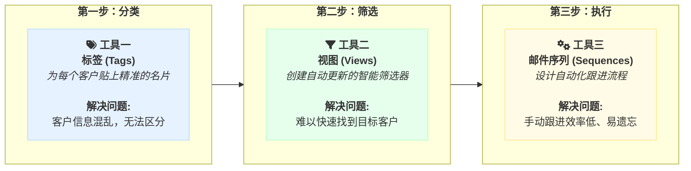

> 简单来说，就是：用 [**标签**](./contacts-tags-views#mastering-contact-tags)告诉系统“客户是谁”，用 [**视图**](./contacts-tags-views#using-contact-views) 告诉系统“要找谁”，用 [**邮件序列**](./email-sequence-guide) 去“持续联系”。

### 2.2、两大策略：客户分层与自动化

> 工具是基础，但策略才是关键。下面这张**客户转化路径图**，就是你未来工作的核心流程：

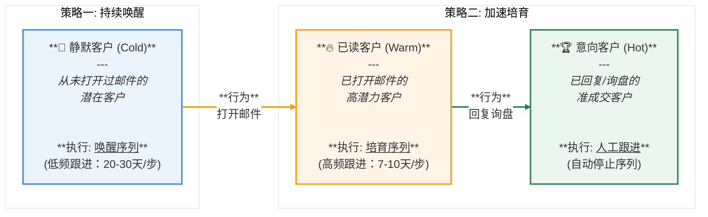

**这套自动化系统为你带来了什么？**

- **✅ 智能分流，自动筛选：** 系统会根据客户“阅读”、“回复”行为，将他们引导到对应转化路径。
- **✅ 资源聚焦，精准打击：** 低成本的“唤醒序列”负责营销潜客，你可聚焦在已被筛选出的“已读”和“意向”客户上。
- **✅ 人机协作，无缝衔接：** 收到“询盘”后，流程会自动停止，你可一对一跟进，确保每个机会都能被牢牢抓住。

在接下来的章节中，我们将教你如何搭建并启动这两套“自动化流程”。

:::info 本章小结
- **三大核心工具**：**标签** (分类)、**视图** (筛选)、**邮件序列** (执行)，构成了自动化营销的工作流。
- **两大核心策略**：针对 **静默客户** 使用低频的“唤醒序列”，针对 **已读客户** 使用高频的“培育序列”，实现客户分层后的精准跟进。
:::

## 三、实操指南：从0到1搭建自动化营销系统

> 我们按照以下 **3️⃣大任务** 的顺序进行操作，你将亲手构建一个属于自己的、高效运转的客户开发系统。

---

### 1️⃣ 基础准备 - 建立标签体系

**🎯 任务目标：** 为客户打上清晰、统一的“标识”，这是后续自动化的基础。整个过程分为三个核心步骤：

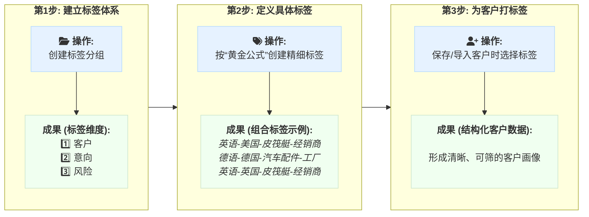

---

#### **具体操作分解**

**1. 创建标签分组 (建立标签体系)**
- 进入[**标签管理**](https://web.laifaxin.com/settings/tags) 页面，参照 [📚标签分组：客户、意向、风险](./contacts-tags-views#tag-groups)进行新建。

**2. 创建客户标签 (定义具体标签)**
- 在 `客户` 分组下，遵循“**公式**” (`语言-国家-产品-角色`)，参照 [📚如何创建和管理标签](./contacts-tags-views#creating-and-managing-tags)创建标签。

**3. 保存客户 & 标签应用 (为客户打标签)**
- 从 **[搜客系统](https://web.laifaxin.com/search/global-engine)** 保存或在 **[联系人管理](https://web.laifaxin.com/contacts/contacts)** 页面导入，为客户选择对应的客群标签。

---

### 2️⃣ 自动筛选 - 设置客户视图

**🎯 任务目标：** 参照[📚新建视图](./contacts-tags-views#creating-and-managing-views)在[联系人](https://web.laifaxin.com/contacts/contacts)页面创建动态**筛选视图** ，让系统能自动识别“**😄应联系谁**”和“😭**不要打扰谁**”。

#### 1. 排除过滤视图

> 为了确保自动化营销的精准和专业，我们首先要**排除不应打扰的客户**。

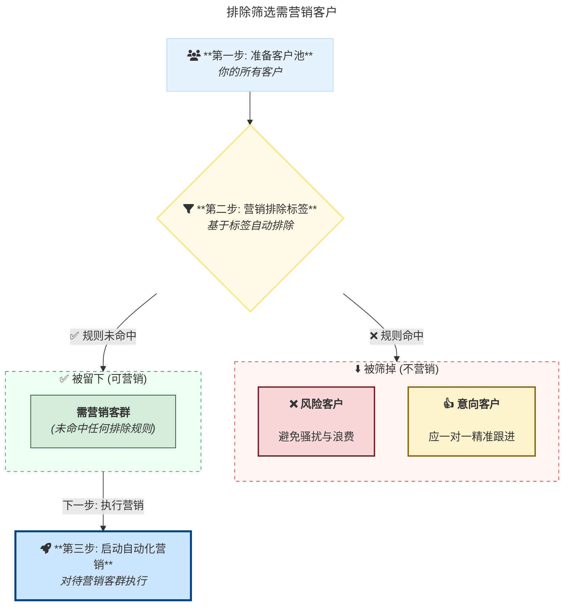

> - 参照[📚**视图示例**](./contacts-tags-views#practical-view-examples)分别创建“[📚意向客户](./contacts-tags-views#intent-view)”与“[📚风险客户](./contacts-tags-views#risk-view)”两个视图

#### 2. 构建分层视图

> - 创建两个视图——`[All]` 和 `[Read]`——来识别处于不同阶段的客户。

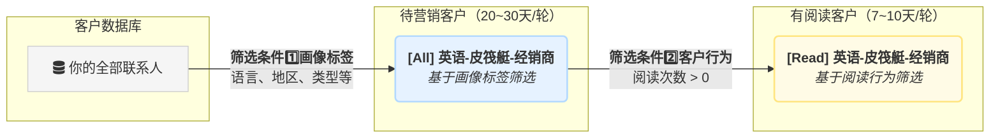

> - **筛选逻辑**：通过**标签**汇总符合条件的客户，形成`[All]`视图，在`[All]`的基础上，通过阅读行为筛选形成`[Read]` 视图。

---

**▶︎ 第一个视图：创建 `[All]` 视图，汇总潜在目标**

- **🎯 目标：** 从客户池中，筛选出符合特定产品/市场画像的潜在客户，作为“**静默客户唤醒序列**”的收件人来源。
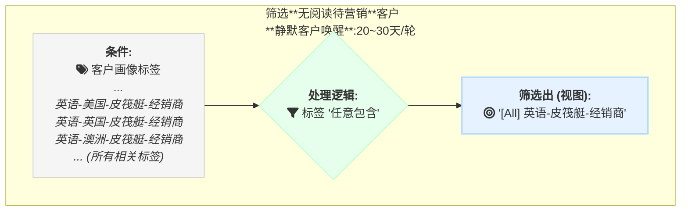
*   📋 参照[📚设置视图条件](./contacts-tags-views#setting-view-filters)，新建`[All]英语-皮筏艇-经销商`，并添加相关标签(`英语-美国-皮筏艇-经销商`...)

---

**▶︎ 第二个视图：创建 `[Read]` 视图，筛选阅读客户**

- **🎯 目标：** 在上一步基础上，筛选出**有阅读**的高价值客户，作为“**已读客户培育序列**”的收件人来源。

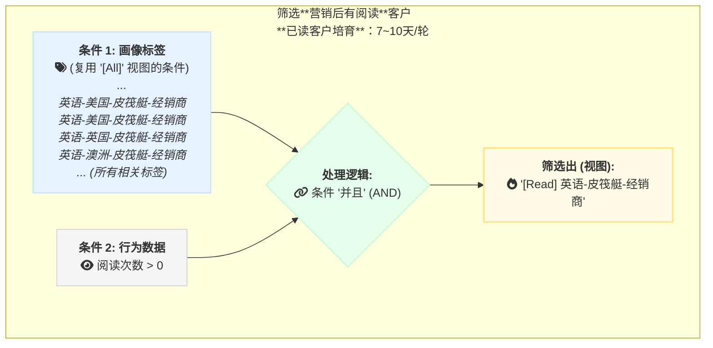
*   📋 参照[📚设置视图条件](./contacts-tags-views#setting-view-filters)，新建`[Read]英语-皮筏艇-经销商`，关联标签同时要求`阅读次数` `大于` `0`

---

### 3️⃣ 自动营销 - 开启邮件序列

**🎯 任务目标：** 参照[📚邮件序列](./email-sequence-guide) 启动两个营销邮件序列，对“静默客户”和“已读客户”进行持续营销。（**入口**：[邮件序列](https://web.laifaxin.com/marketing/sequences)）

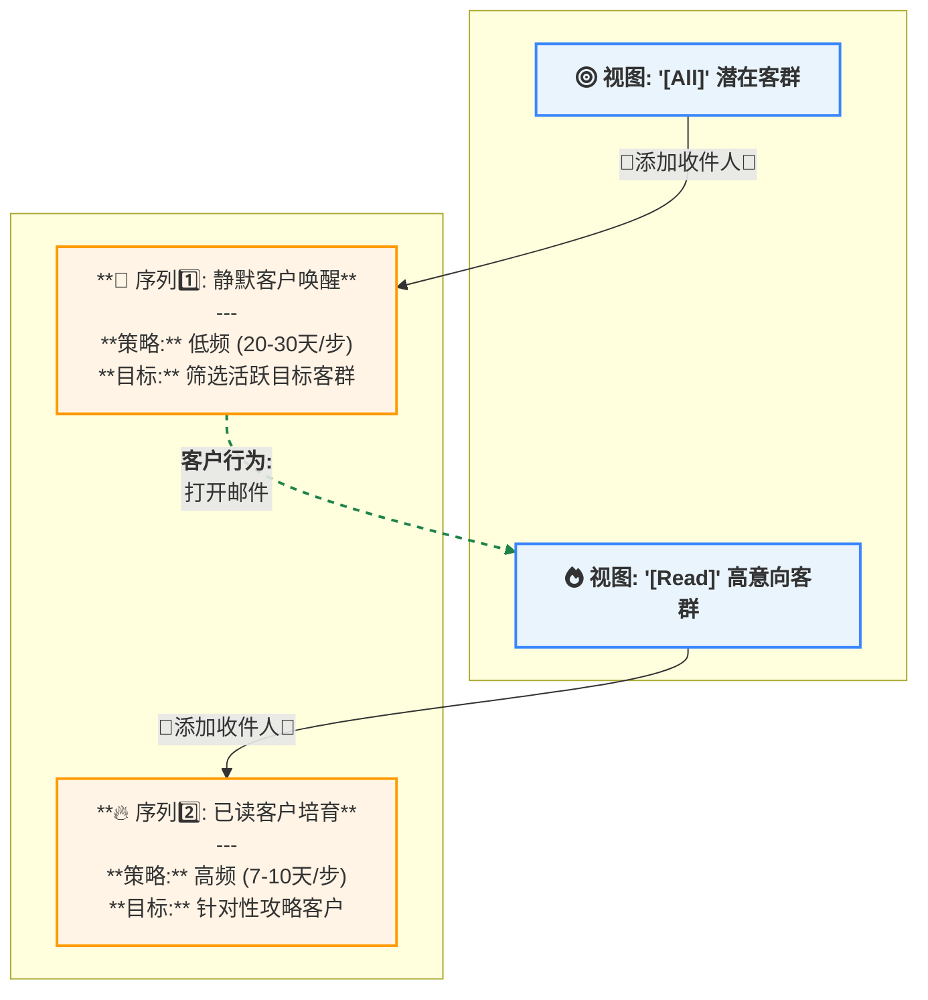
- `[All]` 视图客户被加入**唤醒序列**后，当客户**阅读邮件**会进入`[Read]`视图，加入高频**培育序列**，实现客户分层与加速跟进。

---

#### 1. 启动“静默客户唤醒序列” (低频)

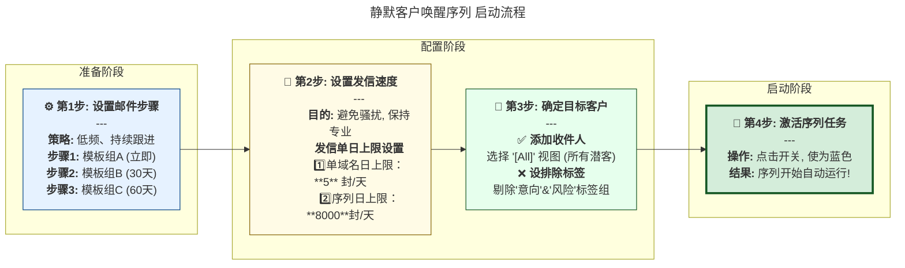

**⚙️ 第1步：创建营销流程**
- **命名**：`静默客户唤醒 (英语-皮筏艇-经销商)`
- **设置步骤**：
  - **步骤 1**: 选择模板组 (A1, A2, A3...)，`立即执行`。
  - **步骤 2**: 选择模板组 (B1, B2, B3...)，`完成上一步 30 天后执行`。
  - **步骤 3**: 选择模板组 (C1, C2, C3...)，`完成上一步 30 天后执行`。

**🚦 第2步：配置控速规则**
- 进入序列的“**设置**”页面，找到“**发送上限设置**”。
- **执行**：
	- **1️⃣** 将“**单域名每24小时发送上限**”设置为 **5** 或 **3**。
	- **2️⃣** 将“**此序列每24小时发送上限**”设置为 **10000** 封
- **目的**：**实现自动控速、避免骚扰、提升送达**。确保对任何一家公司都保持专业、克制的沟通频率。

**👥 第3步：关联收件人并设置“安全护栏”**
- **添加收件人**：返回“总览”页，点击“添加联系人”，选择 `视图` » `[All]英语-皮筏艇-经销商`。
- **设置排除**：进入“设置”页面的“未发送触发器”，手动选择所有 `意向` 和 `风险` 分组下的具体标签进行排除。

> 💡**提示：关于排除**
> - 当前版本排除是基于【标签】进行的。因此，你需要手动选择`意向` 和 `风险` 标签分组下的所有标签。
> -  <mark>即将上线的版本将支持直接排除“视图”，届时你只需排除 **意向** 和 **风险** 两个视图，操作将更加便捷。</mark>

**🚀 第4步：激活序列**
- 点击页面右上角的灰色开关，使其变为**蓝色**，你的第一个自动化引擎正式启动！

---

#### 2. 启动“已读客户培育序列” (高频)

**⚙️ 第1步：创建并设计流程**
- **命名**：`已读客户培育 (英语-皮筏艇-经销商)`
- **设置步骤**：
  - **步骤 1**: 选择模板组 (D1, D2, D3...)，`立即执行`。
  - **步骤 2**: 选择模板组 (E1, E2, E3...)，`完成上一步 10 天后执行`。

**🚦 第2步：配置控速规则**
- 同样，将“**单域名每24小时发送上限**”设置为 **5** 或 **3**。

**👥 第3步：添加收件人&设置排除
- **添加收件人**：点击“添加联系人”，选择 `视图` » `[Read]英语-皮筏艇-经销商`。
- **设置排除**：同样，添加 `意向` 和 `风险` 分组下的所有标签。

**🚀 第4步：激活序列**
- 点击开关，启动你的高潜力客户自动培育流程！

---

**🎉 恭喜你！系统已搭建完成！**

从这一刻起，你不再是一个人在战斗。你拥有了一个 7x24 小时不间断工作的**智能销售助理**。它将：

-   **🎯 精准识别机会**：从海量客户中自动发现那些对你感兴趣的“潜力股”。
-   **🧠 差异化跟进**：像一位经验丰富的销售，对冷淡的客户保持耐心，对热情的客户加速追击。
-   **🤝 无缝人机协作**：当客户表现出意向时，它会停止营销，让你精准切入，完成临门一脚。

**你的客户自动化营销转化将这样运转：**

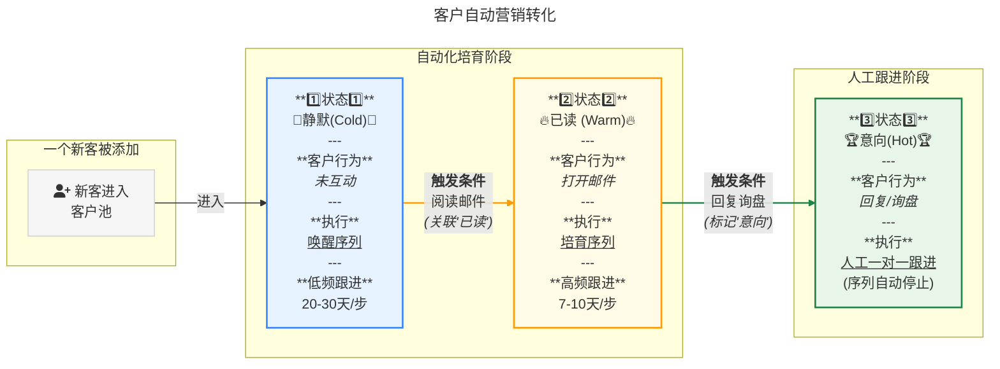

现在，你可以把重复性的工作交给系统，你只需聚焦于那些已被筛选出的高价值“意向客户”上，实现高效转化。

---

## 四、从启动到精通：让系统为你创造价值

恭喜你，已经完成了自动化系统的核心搭建！现在，让我们从“知道”走向“做到”，将这套强大的系统真正融入你的日常工作，并持续优化，让它成为你源源不断的商机来源。

### 1. 常见问题清单 (FAQ)

我们整理了新手最关心的几个问题，帮你扫清最后的障碍。

<strong>❓ 核心区别：这套方法和以前的“批次管理”有何不同？</strong>

> **答：** 这是从“**手动挡**”到“**自动挡**”的思维升级。
> - **旧方法 (手动挡):** 依赖你每天**手动**筛选和发送，工作重复、繁琐且易出错。
> - **新方法 (自动挡):** 你只需设置一次规则，系统就会在未来几年里**自动**、精准地执行。你的角色从“**执行者**”变成了“**策略制定者**”。

<strong>❓ 关键操作：新增客户标签后，需要更新哪些地方？</strong>

> **答：** 这是一个非常重要的维护习惯，主要涉及两个地方：
> 1.  **更新视图：** 如果新增了客户画像标签 (如 `英语-加拿大-皮筏艇-经销商`)，需要手动编辑 `[All]` 和 `[Read]` 视图，将新标签加入筛选条件。
> 2.  **更新序列排除规则：** 如果新增了意向或风险标签，需要检查并更新所有邮件序列的“排除规则”，确保新标签也被添加。

<strong>❓ 策略疑问：客户阅读后，会同时收到两个序列的邮件吗？</strong>

> **答：** **是的，可能会，但这正是策略的一部分 (“信息覆盖”)。**
> - **当前机制：** 客户阅读后会加入“培育序列”，但系统**不会**自动将他从“唤醒序列”中移除。
> - **策略核心：** 你需要确保“培育序列”的内容**更深入、更有价值**。可以把它想象成：客户一直在接收“普通广告”（唤醒），一旦他表现出兴趣，你立即开始推送“VIP专属推荐”（培育）。更有吸引力的VIP内容会占据他的主要注意力。
> - **未来展望：** <mark>我们计划在未来版本中增加“有阅读时自动暂停/移出序列”的触发器，届时你将拥有更灵活的控制权。</mark>

<strong>❓ 策略疑问：客户回复后，系统会自动停止骚扰吗？</strong>

> **答：** 是的，系统有**双重保险**来确保专业性。
> 1.  **序列内保险：** 开启“**有回复时自动停止**”，会立即停止该客户在此序列中的后续步骤。
> 2.  **全局保险：** 当你将客户标记为 `询盘💬` 等意向标签后，由于序列设置了排除这些标签，他将**不会**再收到任何自动化开发邮件。此时，应转为**一对一的人工跟进**。

<strong>❓ 扩展应用：我可以为不同产品线创建多套系统吗？</strong>

> **答：** 不仅可以，而且**强烈推荐**！
> 你可以复制这套“**标签 → 视图 → 双序列**”的模式，为每个核心产品线都搭建独立的自动化系统。**内容越精准，转化率越高。**

---

### 2. 你的自动化系统启动清单

理论学习完毕，现在就动手实践吧！按照以下清单，将知识转化为实实在在的成果。

```mermaid
graph TD
	subgraph "第二阶段: 优化 (持续进行)"
        E["<b>1. 细分客群</b><br><i>(创建更精细的视图与序列)</i>"] --> F["<b>2. A/B测试模板</b><br><i>(找出最优邮件内容)</i>"];
        F --> G["<b>3. 优化序列步骤</b><br><i>(调整间隔与内容)</i>"];
        G --> H["<b>4. 探索更多场景</b><br><i>(如展会/官网客户跟进)</i>"];
    end

    subgraph "第一阶段: 启动 (1-2小时)"
        A["<b>1. 创建标签库</b><br><i>(为核心客户画像打标签)</i>"] --> B["<b>2. 设置排除项</b><br><i>(配置意向/风险排除视图)</i>"];
        B --> C["<b>3. 启动双序列</b><br><i>(配置唤醒 & 培育序列)</i>"];
        C --> D["<b>4. 验证与检查</b><br><i>(每周检查[Read]视图增长)</i>"];
    end


    style A fill:#e6f2ff,stroke:#b3d9ff
    style B fill:#e6f2ff,stroke:#b3d9ff
    style C fill:#e6f2ff,stroke:#b3d9ff
    style D fill:#e6f2ff,stroke:#b3d9ff
    style E fill:#e6ffed,stroke:#b3ffc6
    style F fill:#e6ffed,stroke:#b3ffc6
    style G fill:#e6ffed,stroke:#b3ffc6
    style H fill:#e6ffed,stroke:#b3ffc6
```

#### **第一阶段：启动你的自动化引擎 (预计用时：1-2小时)**
**🎯 目标：让你的第一个自动化开发任务成功运行起来。**

1.  [ ] **创建标签库：** 为你最重要的1-2个客户群体创建完整的描述性标签。
2.  [ ] **设置排除项：** 配置好 `意向` 和 `风险` 这两个核心排除视图。
3.  [ ] **启动“双序列”引擎：**
    - 创建“唤醒序列”和“培育序列”。
    - **务必在“设置”中配置好“单域名发送上限”**。
    - 在“排除规则”中，**手动勾选所有意向和风险标签**。
    - 分别关联 `[All]` 和 `[Read]` 视图，并**激活序列**。
4.  [ ] **验证与检查：** 每周花5分钟，检查 `[Read]` 视图的客户数量是否在增长。

#### **第二阶段：优化与迭代 (持续进行)**
**🎯 目标：通过数据分析和策略迭代，持续提升询盘转化率。**

- [ ] **细分客户群体：** 为不同国家、规模的客户创建更精细的视图和序列。
- [ ] **A/B测试邮件模板：** 利用序列的A/B测试功能，找出效果最好的邮件。
- [ ] **优化序列步骤：** 分析报告，调整跟进的节奏和内容。
- [ ] **探索更多场景：** 设计展会客户跟进、老客户激活等更多样化的序列。

---

### 3. 知识体系导航

本指南是你的“总设计图”。在实际操作中，你可能需要查阅更详细的“零件说明书”。

- 📚 **[标签与视图：精细化管理的基础](./contacts-tags-views)**
  > 深入理解标签和视图的高级筛选技巧。
- 📚 **[邮件序列：7x24小时客户开发助手](./email-sequence-guide)**
  > 学习邮件序列的A/B测试、高级触发器等进阶玩法。
- 📚 **[客户画像构建指南](./customer-profiling-section)**
  > 重新梳理目标市场，定义客户标签的“黄金公式”。

🔗 **本文永久链接：** https://laifa.xin/zhinan/customer-management-section
