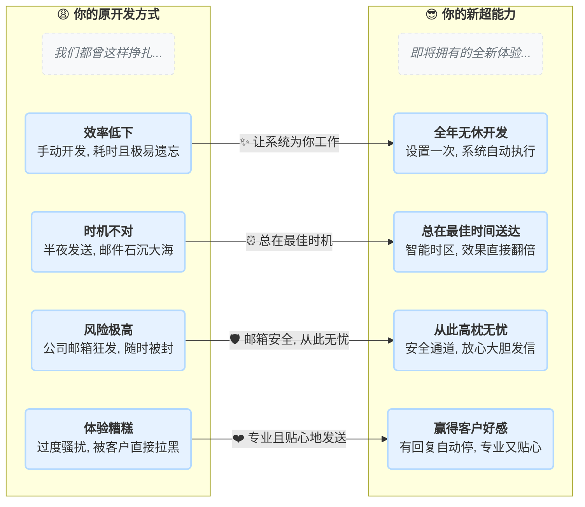
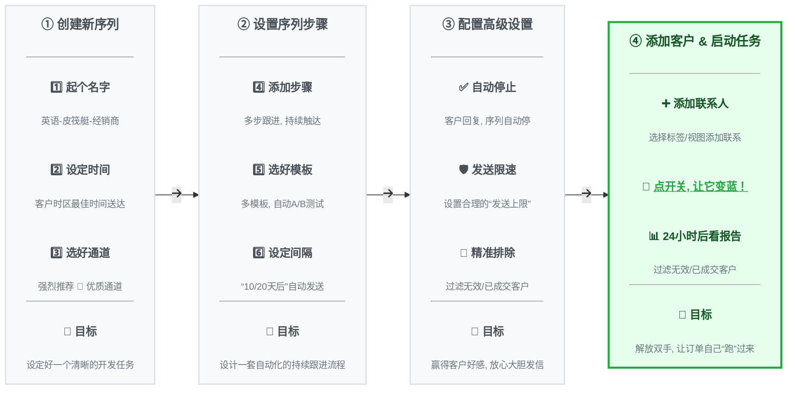

# 📧 邮件序列：7*24小时客户开发助手

**👉 准备好给你的外贸工作流来一次“开挂”般的升级了吗？**

## 一：🚀 解放双手，告别无效的外贸开发

首先，忘掉“邮件序列”这个名字。把它想象成你的专属且主动的贴心“销售助理”。

> **看到这里的对比，你是不是已经心动了？**
>
> 别急，这个强大的“开挂”神器用起来极其简单。我们为你准备了一份5分钟上手清单，让你立刻体验！

## 二：📚 保姆级图文教程：从零到精通

### **✅ 第一步：心中有数 (5分钟上手清单)**

在开始操作前，先用这张清单快速了解我们的“四步计划”。

1.  [ ] **🎨 设计蓝图**：创建序列，起个好名字，设定好发送时间。
2.  [ ] **🗓️ 编排剧本**：添加2-3个邮件步骤，选好模板，设定间隔天数。
3.  [ ] **🛡️ 设置规则**：进入“高级设置”，务必开启“邮件追踪”、“有回复时自动停止”和“发送上限”。
4.  [ ] **🚀 启动引擎**：添加客户，**点击开关让它变蓝**，然后坐等查看报告！

### **🗺️ 第二步：看图说话 (核心流程概览)**

---

### **🛠️ 第三步：动手实操 (详细图文分解)**

#### **1️⃣ 创建邮件序列**

1.  **进入功能页面**
    在系统左侧菜单栏找到“邮件营销” -> “邮件序列”。
    - 系统入口：https://web.laifaxin.com/marketing/sequences

2.  **新建序列**
    点击页面右上角的“+序列”按钮，选择邮件发送渠道。
    *   **🚀 优质通道**：强烈推荐！速度快，不易封号，能有效提高送达率。
    *   **✉️ 我的邮箱**：适合小批量发送，有被邮箱服务商封禁的风险。

    

3.  **设置序列基本信息**
    在弹窗中，起一个清晰的**序列名称**（如“2024-Q3-欧洲市场开发”），并根据客户时区设置好**计划时间**。

    

    *   **序列名称**：为方便您自己识别，建议使用清晰的名称，例如“2024-Q3-欧洲市场开发”。
    *   **计划时间**：设置允许邮件发送的时间段。建议根据目标客户所在的时区进行设置，以提高邮件打开率。

点击“确定”后，一个空的邮件序列就创建成功了。

#### **2️⃣ 设置序列步骤**

1.  **添加第一个步骤**
    点击“+ 增加步骤”，选择**发送账号**和**邮件模板**，并将执行时间设为 `将联系人添加到序列后立即执行`。

    

    在“新增序列步骤”窗口中进行设置：
    *   **选择发送账号**：选择用于发送邮件的邮箱账号。若使用“优质通道”，可多选系统账号，系统会随机使用。
    *   **选择邮件模板**：选择您预先创建好的邮件模板。可多选，系统发送时会随机选择其一，以实现内容多样化。
    *   **何时开始此步骤**：
        *   `将联系人添加到序列后立即执行`：客户邮箱一旦加入此序列，立刻发送第一封邮件。
        *   `添加联系人__(分钟/小时/天)后执行`：客户邮箱加入序列后，等待指定时间再发送。

    

2.  **添加后续步骤（第二封、第三封...）**
    再次点击“+ 增加步骤”，添加第二封、第三封跟进邮件。后续步骤的执行时间只能设为 `完成上一步__天/小时后执行`。
    

    后续步骤的设置与第一步基本相同，但触发时间变为：
    *   **何时开始此步骤**：只能设置为 `完成上一步__天/小时后执行`。这代表在上一封邮件发送之后，再等待指定时间发送这一封。

    > 💡 **策略建议**：后续邮件的模板应与前一封邮件的角度不同。例如，第一封是产品介绍，第二封可以是案例分享或价值说明，从不同角度吸引客户。

    

    完成后，您可以在“总览”标签页下看到完整的序列流程。

    

#### **3️⃣ 配置高级设置**

在“设置”标签页，您可以对序列进行更精细化的控制，以提升效果和避免打扰客户。

*   **📊 发送参数设置**
    *   **邮件追踪**：强烈建议开启，用于追踪客户的阅读、点击链接和下载附件行为。
    *   **发信昵称**：客户收件箱里显示的发件人名字，例如 "Tina from ABC Corp"。

*   **👍 发送上限设置 (强烈建议)**
    *   **序列24小时发送上限**：限制此序列每天的总发信量。建议设置为一个合理的数值（如10000），避免在一天内消耗完所有联系人。
    *   **单域名每24小时发送上限**：限制每天向同一家公司（同一个邮箱后缀）发送的邮件数量。建议设置为10，避免过度骚扰同一家公司的多个联系人。（此设置对Gmail等公共邮箱无效）

*   **🏢 公司触发器**
    当同一公司的某个联系人回复邮件时，系统如何处理该公司下的其他联系人：
    *   **什么都不做**：继续按计划向该公司其他人发送邮件。
    *   **标记其他联系人为未发送**：收到回复后，立即停止向该公司其他人发送邮件。 **(推荐选项，显得更专业)**
    *   **延迟发送其他联系人**：收到回复后，暂停向该公司其他人发送邮件，等待指定时间后再继续。

*   **✅ 已完成触发器 (必选项)**
    *   勾选 `当前序列有回复时，将联系人标记为已完成` 后，任何一个联系人只要回复了邮件，系统就会将其标记为“已完成”，并停止向其发送此序列的后续邮件。 **(避免骚扰已回复的客户)**

*   **🛡️ 未发送触发器**
    设置哪些联系人从一开始就不应该被发送邮件，用于精准过滤：
    *   **当联系人邮箱为无效时**：自动跳过无效邮箱。
    *   **当联系人在黑名单中时**：自动跳过您已加入黑名单的联系人。
    *   **当联系人标签包含...**：自动跳过带有特定标签的联系人。例如，您可以选择“已成交客户”、“询盘客户”等标签，避免向他们发送开发信。

*   **🤖 AI触发器**
    *   开启后，AI会智能识别可能导致退信或投诉的邮件，并将其延迟24小时后再尝试发送，有助于提升送达率。

*   **⏰ 计划时间**
    *   此处可以再次修改整个序列允许发送邮件的时间窗口。

> ⚠️ **重要提示**：完成所有设置后，务必点击页面右上角的“**保存**”按钮！

#### **4️⃣ 添加联系人并启动序列**

1.  **添加联系人**
    您有两种方式添加联系人：

    *   **方式一：在序列内部添加**
        在序列页面右上角点击“添加联系人”，通过“选择标签”或“选择视图”批量导入。
        
        选择后，点击“添加联系人”即可。
        

    *   **方式二：在客户管理中添加**
        在“客户管理” -> “联系人”页面，勾选一个或多个联系人，点击上方操作栏的“序列”，然后选择“加入一个已存在的序列”。
        

2.  **激活序列**
    > **‼️ 最重要的一步：手动激活 ‼️**
    >
    > 添加联系人后，序列默认是暂停状态，不会发送任何邮件。**您必须手动激活它。**
    >
    > 点击页面右上角的 **灰色开关按钮**，使其变为 **蓝色**，以启动序列。
    >
    > **开关不变蓝，任务不启动！**

    

#### **5️⃣ 监控与报告**

*   **📈 效果报告 (“报告”页)**
    以数据看板的形式，直观展示序列的整体效果，包括发送量、送达率、打开率、回复率等关键指标。
    

*   **📨 邮件发送记录 (“邮件”页)**
    这里会列出每一封已发送或待发送的邮件，包含发送状态、客户是否阅读、所属步骤等详细信息。
    

*   **🧾 操作日志 (“记录”页)**
    记录了您对这个序列的所有操作，例如创建、添加步骤、添加联系人、启用序列等。
    

*   **📋 序列总览 (列表页)**
    在“邮件序列”的列表页面，您可以看到所有已创建的序列及其状态、进度和核心数据。
    

### **✍️ 第四步：灵感启发 (经典序列模板)**

> #### **案例一：标准冷客户开发**
>
> *   **第1步 (第1天)**: 模板A - 介绍公司和核心产品，突出1-2个核心优势。
> *   **第2步 (第4天)**: 模板B - 分享一个成功的客户案例或展示产品如何解决行业痛点。
> *   **第3步 (第8天)**: 模板C - 提供价值（如一份行业报告），并附上简短的问候，引导回复。

> #### **案例二：展会后客户跟进**
>
> *   **第1步 (展会后1天)**: 模板A - “很高兴在[展会名]认识您”，附上合影或提及交流过的具体内容。
> *   **第2步 (展会后4天)**: 模板B - “关于我们聊到的[具体产品]，这是更详细的资料”。
> *   **第3步 (展会后8天)**: 模板C - “不知您是否有任何疑问或需要样品？”

---

## 四：🤔 常见问题与解答 (FAQ)

> **❓ 问：为什么我的邮件序列，在我添加联系人后，一封邮件都没发出去？**

>
> **💡 答**：请立即检查三点：1. 序列右上角的**开关是否为蓝色**？这是最常见的原因。 2. 当前时间是否在您设定的“**计划时间**”范围内？ 3. 是不是触发了“**发送上限**”或“**未发送触发器**”中的规则（如联系人在黑名单中）？

> **❓ 问：客户已经回复我了，系统还会继续给他发邮件吗？**
>
> **💡 答**：取决于您的设置。如果您在“高级设置” -> “已完成触发器”中勾选了“有回复时标记为已完成”，那么系统会自动停止向该客户发送后续邮件。**强烈建议所有用户都开启此项**。

> **❓ 问：我可以修改一个正在运行中的序列吗？**
>
> **💡 答**：可以。您可以随时点击开关暂停序列，对步骤、模板或设置进行修改，然后重新激活。修改后的规则通常会对尚未执行到该步骤的联系人生效。

> **❓ 问：如何避免骚扰同一家公司的太多联系人？**
>
> **💡 答**：在“高级设置”中，将“单域名每24小时发送上限”设置为一个较小的数字（如2或3）。同时，设置“公司触发器”，当有任意一人回复时，就选择“标记其他联系人为未发送”。

> **❓ 问：在哪里看我的邮件发送效果？**
>
> **💡 答**：在序列详情的“**报告**”标签页，可以看到送达率、打开率、回复率等宏观数据。在“**邮件**”标签页，可以查看每一封邮件的发送状态和客户的阅读、点击情况。

---

[👉现在就开始创建您的第一个邮件序列，体验自动化营销的强大威力吧！👈](https://web.laifaxin.com/marketing/sequences)

