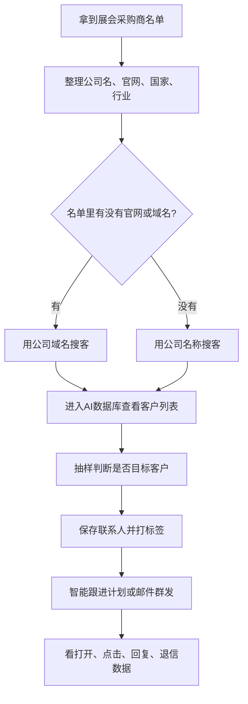
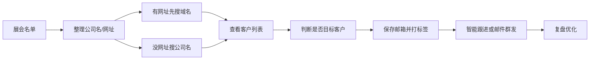

# 展会采购商批量开发

拿到展会采购商名单以后，很多新手第一反应是：是不是可以直接群发开发信？

先不要急。展会名单只是原始线索，里面可能有采购商、参展商、服务商、媒体、协会，也可能有已经失效的网站和邮箱。真正有效的做法，是先把名单变成一批可以筛选、可以保存、可以持续跟进的客户。

这篇教程只解决一个问题：

> **手里有一份展会名单，如何用公司名或公司域名批量找到客户邮箱，并快速开始营销？**

你只需要先记住这条主线：

```text
展会名单 → 整理公司名/网址 → 批量搜客 → 查看客户列表 → 判断是否目标客户 → 保存邮箱 → 邮件营销
```

这篇教程会按真实操作顺序讲：

1. 📋 先整理展会名单，看里面有没有公司名和网址。
2. 🔍 有网址就用公司域名搜客，没有网址就用公司名称搜客。
3. 📊 搜完后进入 AI 数据库客户列表，快速看公司介绍。
4. ✅ 大概判断是不是目标客户，80% 以上匹配就可以批量保存。
5. 📧 最后用智能跟进计划或邮件群发开始批量营销。

如果你还没跑通过来发信的完整流程，建议先看 [10 分钟速通来发信](./quick-start-laifaxin-10min)，再回到这篇处理展会名单。

---

## 一、先看懂整体流程 {#workflow}

展会名单开发不是一个单独动作，而是一条连续流程。



_图示：上面的流程图可以按步骤理解。支持 Mermaid 点击时，也可以直接点击节点跳到对应章节。_

:::tip 新手先记住

如果名单里有官网，优先用 **公司域名搜客**。  
如果名单里没有官网，只有公司名，就用 **公司名称搜客**。

:::

---

## 二、准备展会名单 {#prepare-data}

展会名单通常长这样：有公司名称、国家、网址、电话、邮箱、行业等信息。


_图示：展会采购商或参展商数据通常会按行业、展区或名单来源分组。_

打开表格后，先看有没有这两列：

- **公司名称**：用于公司名称搜客。
- **Website / 官网 / 网址**：用于公司域名搜客。


_图示：这份表格里已经有公司名、网站、邮箱、电话等字段，最适合先用网站批量搜索。_

建议你至少整理出下面几列：

| 字段 | 是否必须 | 用途 |
| --- | --- | --- |
| 公司名 | 必须 | 没有官网时，用公司名搜索客户 |
| 公司官网/域名 | 强烈建议 | 有官网时，用域名搜索邮箱更准确 |
| 国家/地区 | 建议 | 后续按市场筛选和分批营销 |
| 行业/产品 | 建议 | 判断客户是否匹配你的产品 |
| 展会名称 | 建议 | 保存时打标签，方便复盘来源 |
| 备注 | 可选 | 辅助判断客户来源和优先级 |

整理时只做两件事：

1. **把公司名整理干净**  
   删除序号、乱码、无关说明，只保留公司主体名称。

2. **把网址整理成一列**  
   例如 `example.com` 或 `https://www.example.com`，不要把多个网址塞在一个单元格里。

:::warning 不要直接群发原始名单

原始展会名单里经常会混入无关公司和失效信息。  
先搜索、筛选、保存，再营销，回复率和安全性都会更好。

:::

---

## 三、先判断用哪种搜客方式 {#choose-search-method}

看表格里有没有官网或域名，然后按下面规则选择：

| 你手里的数据 | 推荐方式 | 为什么 |
| --- | --- | --- |
| 有官网/域名 | [公司域名搜客](./customer-website-search) | 准确率更高，适合批量找企业邮箱 |
| 只有公司名 | [公司名称搜客](./company-name-search) | 适合展会名单、采购商目录、企业名录 |
| 公司名和官网都有 | 先用官网，再用公司名补充 | 先保证准确率，再提高覆盖率 |
| 数据很杂 | 先清洗，再分批提交 | 避免浪费搜索额度 |

最简单的判断：

- ✅ 有 `website`、`url`、`官网` 这一列：先用公司域名搜客。
- ✅ 只有 `company name`、`公司名称` 这一列：用公司名称搜客。
- ✅ 两列都有：先搜域名，再用公司名补搜没有结果的客户。

---

## 四、用公司域名批量搜索客户 {#domain-search}

如果你的表格里有官网，优先走这一步。

进入来发信的 [公司域名搜客](https://web.laifaxin.com/search/domain-search)，切换到“公司域名”输入方式。


_图示：进入公司域名搜客后，选择“公司域名”，把网站列表批量粘贴进去。_

然后回到表格，复制 `website` 这一列的网址，粘贴到输入框。系统会自动识别可搜索的数据条数。


_图示：复制网站列后，系统自动识别到 1649 条网址。确认无误后，点击“创建任务”。_

操作步骤可以按这个顺序走：

1. 打开展会表格。
2. 复制 `website`、`url`、`官网` 这一列。
3. 进入 [公司域名搜客](https://web.laifaxin.com/search/domain-search)。
4. 选择“公司域名”。
5. 粘贴网址列表。
6. 确认识别数量。
7. 点击“创建任务”。

:::tip 什么时候用域名搜客

只要表格里有官网，就优先用域名搜客。  
它比单纯公司名更明确，搜索出来的邮箱通常更贴近这家公司。

:::

---

## 五、没有官网时，用公司名称搜索 {#company-name-search}

有些展会名单没有官网，只有公司名称。这种情况就用公司名称搜客。

在批量搜索里切换到“公司名称”，把表格里的公司名称整列复制进去。


_图示：没有官网时，可以直接复制公司名称列，系统识别到 3348 条公司名后即可创建任务。_

操作步骤：

1. 复制公司名称这一列。
2. 进入 [公司名称搜客](./company-name-search)。
3. 粘贴公司名列表。
4. 如果有国家字段，后续筛选时一起参考。
5. 创建任务。
6. 等待系统根据公司名匹配官网、邮箱和联系人。

:::warning 公司名搜索要注意

公司名越完整，搜索越准确。  
如果公司名太短、重名太多、带有乱码或无关说明，建议先清洗再提交。

:::

---

## 六、查看 AI 数据库客户列表 {#check-task}

任务创建后，系统会进入客户结果列表。现在重点不是盯着邮箱数量，而是先看这些公司是不是你的目标客户。

如果你是从任务页进入，也可以在 [批量搜索任务](https://web.laifaxin.com/search/multiple-search) 页面找到刚创建的任务，点击“结果”进入客户列表。


_图示：如果停留在批量搜索任务页，可以点击“结果”进入客户列表。_

进入客户列表后，重点看每家公司上方的公司名称、网站和简介。简介会告诉你这家公司大概是做什么的，一眼扫过去就能判断它是不是你的目标客户。

可以参考 [AI 数据库获客全流程 SOP](./refine-search-all) 里的结果列表查看方式：先看公司描述，再决定是否保存或继续筛选。


_图示：进入结果列表后，先快速浏览公司名称、网站和简介，判断这批名单是否大体精准。_

如果列表里的公司看起来不太准，先回头检查：

- 网址是不是过期了
- 官网是不是打不开
- 公司名是不是写错了
- 是否混入了协会、媒体、服务商等无关数据

---

## 七、判断是不是目标客户 {#filter-leads}

展会名单一般比较精准，不需要一条条精细判断。筛选的目的只有一个：看这批公司大概是不是你的目标客户。

建议先快速抽样浏览：

1. 看前几页客户。
2. 看中间几页客户。
3. 再看后面几页客户。
4. 重点看公司简介，判断它是不是你要开发的客户。

| 抽样结果 | 建议动作 |
| --- | --- |
| 80% 以上都是目标客户 | 直接全选保存 |
| 大部分是目标客户，但夹杂少量不相关公司 | 可以保存，后续用标签和营销结果继续优化 |
| 明显不确定，人工看不出来 | 用 [AI筛选功能](./ai-customer-screening-guide) 快速判断 |
| 数据量很少 | 人工浏览一遍即可 |
| 明显不是目标客户 | 不要保存，先检查名单来源或搜索方式 |

:::tip 不要过度筛选

展会名单本身通常已经带有行业筛选，很多情况下会比较准。

如果你抽样看下来，80% 以上都是目标客户，就可以直接保存，不需要为了少量杂质浪费太多时间。

:::

---

## 八、保存联系人并打标签 {#save-and-tag}

确认这批公司大体是目标客户后，就可以保存邮箱到联系人。

保存前可以先看 [保存客户邮箱](./save-customer-emails)，了解保存入口和保存记录。

这里不用担心“没有邮箱的公司怎么办”。保存联系人是批量提取邮箱的动作，没有可保存邮箱的公司自然不会进入联系人。

保存时一定要打标签。标签不是为了好看，而是为了后面能快速筛选、群发和复盘。

推荐这样打：

| 标签类型 | 示例 |
| --- | --- |
| 来源 | `来源-展会采购商名单` |
| 展会 | `展会-139届广交会` |
| 行业 | `行业-照明` |
| 市场 | `市场-欧洲` |
| 状态 | `状态-待开发` |
| 批次 | `批次-第一轮保存客户` |

这样后续你可以快速筛选：

- 某个展会的全部客户
- 某个行业的展会客户
- 某个市场里还没开发的客户
- 第一轮发送后未回复的客户

如果你还不熟悉标签管理，可以继续看 [标签与视图](./contacts-tags-views)。

---

## 九、开始快速营销 {#marketing}

保存联系人后，就可以开始批量营销。展会采购商名单适合做海量开发，不建议再按客户质量分成很多层级，容易拖慢动作。

推荐直接用两种方式：

| 营销方式 | 适合情况 |
| --- | --- |
| [邮件序列 / 智能跟进计划](./email-sequence-guide) | 推荐优先使用，适合自动多轮跟进 |
| [邮件群发](./email-mass-sending) | 适合快速触达一批客户，验证市场反馈 |

如果你想长期开发这批展会客户，优先用智能跟进计划；如果你想快速测试标题、产品方向和回复情况，可以先用邮件群发跑一轮。

建议第一封邮件不要太复杂，只做一件事：让客户知道你是谁、为什么联系他、你能提供什么。

---

## 十、开发信模板参考 {#email-templates}

### 模板一：说明展会来源

```text
Subject: Cooperation opportunity after [Exhibition Name]

Hi [Name],

We found your company from [Exhibition Name] and noticed that you are active in [industry/product category].

We are a supplier of [your product], working with importers and distributors in [market].

May I send you our latest catalog for reference?

Best regards,
[Your Name]
```

这个模板适合已经确认行业相关的客户。  
重点是告诉客户：你不是随机群发，而是基于展会名单和行业匹配联系他。

### 模板二：先询问采购需求

```text
Subject: Are you sourcing [product] this year?

Hi [Name],

I noticed your company in the [Exhibition Name] buyer list.

Are you currently sourcing [product] or looking for new suppliers in this category?

If yes, I can share our latest catalog and price range.

Best regards,
[Your Name]
```

这个模板适合你还不确定对方是否正在采购的客户。  
第一封邮件先问需求，不急着发大量产品介绍，客户回复压力会更低。

---

## 十一、看数据，优化下一轮 {#review-data}

邮件发出去以后，要看数据复盘。

| 数据 | 说明 | 优化方向 |
| --- | --- | --- |
| 邮箱搜索成功率 | 原始名单能搜到多少邮箱 | 判断名单质量 |
| 有效邮箱占比 | 搜到的邮箱里有多少可用 | 必要时先做邮箱验证 |
| 打开率 | 客户是否愿意点开邮件 | 优化标题和发送时间 |
| 点击率 | 客户是否查看产品资料 | 优化正文和链接 |
| 回复率 | 客户是否有兴趣沟通 | 优化客户筛选和邮件切入点 |
| 退信率 | 邮箱是否稳定可达 | 控制发送风险 |

如果打开率低，优先优化标题和发送时间。  
如果打开率还可以但回复率低，优先优化客户筛选和邮件内容。  
如果退信率高，先做 [邮箱验证](./email-verification)，再继续放量。

---

## 相关功能跳转 {#related-features}

| 你要做什么 | 使用功能 |
| --- | --- |
| 用公司官网批量找邮箱 | [公司域名搜客](./customer-website-search) |
| 只有公司名，没有官网 | [公司名称搜客](./company-name-search) |
| 查看批量搜索进度和结果 | [批量搜索客户](./bulk-search-task) |
| 从搜索结果里挑出有效客户 | [筛选搜索结果](./filter-search-results) |
| 保存客户邮箱到联系人 | [保存客户邮箱](./save-customer-emails) |
| 给展会客户分组管理 | [标签与视图](./contacts-tags-views) |
| 开始批量发送开发信 | [邮件群发](./email-mass-sending) |
| 设置多轮自动跟进 | [邮件序列 / 智能跟进计划](./email-sequence-guide) |

---

## 总结 {#summary}

展会采购商名单的价值，不在于表格里有多少公司，而在于你能不能把它转成可触达、可筛选、可跟进的客户资源。

新手可以按这个顺序做：



先处理最干净、最精准的一批客户，跑通搜索和营销流程。  
等标题、模板、发送节奏验证有效后，再逐步扩大到更多展会名单和更多市场。
