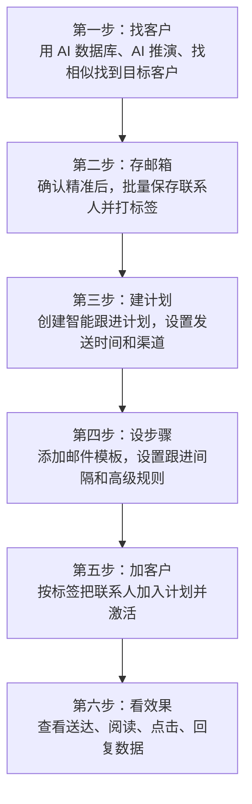
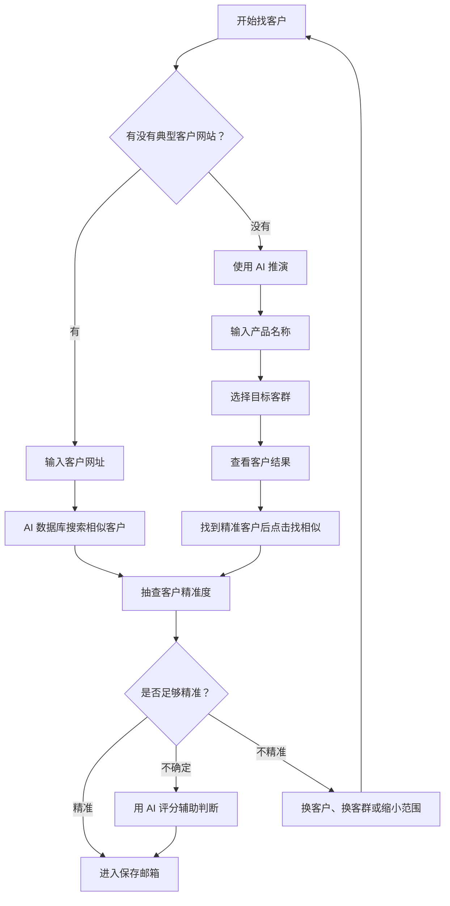
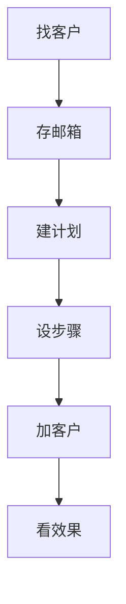

# 10 分钟速通来发信

如果你是第一次使用来发信，不知道应该先做什么，可以先记住一句话：

> **先找客户，再存邮箱，最后用智能跟进计划自动开发。**

这篇教程会带你快速跑通一条完整流程：

- 找到一批目标客户
- 判断客户是否精准
- 保存客户邮箱
- 创建自动跟进计划
- 把客户加入计划
- 查看发送和回复效果

---

## 流程总览

:::tip 速通重点

新手不要一上来研究所有功能。先跑通这 6 步：

**找客户 → 存邮箱 → 建计划 → 设步骤 → 加客户 → 看效果**

跑通以后，再去优化客户精准度、邮件模板和跟进节奏。

:::

---

## 一、找客户

找客户分两种情况：

1. **你有一个典型客户**
2. **你还没有任何客户**

先看这张图，理解两种情况分别怎么走。

---

### 1. 有客户：用一个客户找一批客户

如果你手里已经有一个典型客户网站，比如：

> `saturnrafts.com`

可以直接用它来找相似客户。

进入 [AI 数据库 - 来发信](https://web.laifaxin.com/search/refine-search)，在搜索框中输入客户网址，点击搜索。

系统会根据这个网站的内容，匹配出大量相似企业。

搜索结果很多时，不要急着全部保存。建议先跳到后面的页面抽样检查。

比如跳到第 997 页，如果发现有一部分结果已经不精准，就说明越靠后的数据相关性会下降。

这时可以往前看，比如跳到第 500 页。如果第 500 页大部分仍然是目标客户，就可以优先保存前 500 页。

:::tip 判断标准

如果当前页面 **70% 以上都是目标客户**，这批数据就可以考虑保存。

如果当前页面已经明显不准，就往前翻，找到一个更稳妥的保存范围。

:::

---

### 2. 没客户：用 AI 推演找客群

如果你还没有任何种子客户，可以使用 **AI 推演**。

进入 [AI 数据库 - 来发信](https://web.laifaxin.com/search/refine-search)，点击搜索框上方的 **AI 推演**。

在弹窗中输入你的产品，例如：

> 皮筏艇

然后点击 **AI 智能生成**。

系统会一次生成 4 个目标客户群体，并给出推荐理由。

你可以根据自己的产品，判断哪个客群更适合开发。确认后，点击对应客群后的 **立即查看**。

系统会自动填入客群关键词并开始搜索。

如果你在结果中看到很精准的客户，可以点击 **找相似**，继续扩展出更多同类型客户。

---

### 3. AI 评分：不确定时再用

AI 评分可以根据你的产品，判断当前企业是不是潜在客户。

使用前需要先设置你的产品。设置后，系统会结合企业信息，给出匹配判断。

但要注意：

> **AI 评分会消耗点数，每评分 1 个客户消耗 1 点。**

所以新手不建议一上来全量评分。更推荐这样用：

| 情况 | 建议 |
|---|---|
| 前几页客户明显精准 | 不用评分，直接抽查后保存 |
| 当前页面不确定 | 随机选几个客户做 AI 评分 |
| 大部分评分都匹配 | 可以保存这一段数据 |
| 大部分评分都不匹配 | 换客户、换客群或缩小范围 |

:::tip 省点数建议

通过 **找相似** 得到的结果，前面的客户通常比较精准。

你可以先人工抽查页面。只要当前页面大部分都是目标客户，就不必每个客户都做 AI 评分。

:::

---

## 二、存邮箱

找到客户并确认精准度后，下一步是保存邮箱。

这里以前 500 页为例：

- 每页 10 条
- 500 页约等于 5000 条客户

在搜索结果中，先随机勾选 1 个客户，然后点击上方的 **高级**。

选择 **选择前 [200] 条数据**，把 `200` 改成 `5000`，再点击 **保存联系人**。

保存联系人时，建议这样设置：

| 设置项 | 建议 |
|---|---|
| 公司标签 | 按客户群体命名，例如 `水上运动用品零售商` |
| 联系人标签 | 和公司标签保持一致 |
| 邮箱类型 | 有效、未知 |
| 保存数量 | 5 |
| 高级选项 | 新手可以先不调整 |

:::warning 重点

**一定要打标签。**

标签不是为了好看，而是为了后面能快速把这批客户加入智能跟进计划。

比如你保存时打了 `水上运动用品零售商` 标签，后面添加客户时，就可以直接选择这个标签。

:::

设置完成后，点击 **确认转化**，系统会开始保存联系人。

保存任务提交后，可以在页面右上角查看进度。

也可以进入 [客户保存记录 - 来发信](https://web.laifaxin.com/search/saved-tasks)，查看所有保存任务。

任务完成后，进入 [联系人 - 来发信](https://web.laifaxin.com/contacts/contacts)。

通过刚才设置的标签，就可以筛选出已经保存的联系人。

到这里，你已经完成了前半段：

> **找到客户，并把客户邮箱保存到了联系人。**

---

## 三、建计划

客户保存好以后，就可以开始发开发信。

来发信有两种常见发信方式：

| 发信方式 | 适合场景 |
|---|---|
| 普通群发 | 临时发一批邮件 |
| 智能跟进计划 | 长期、多轮、自动开发客户 |

新手更建议使用 **智能跟进计划**。

因为外贸开发通常不是发 1 封邮件就结束，而是需要持续跟进。你可以提前设置多轮邮件，让系统自动按时间发送。

例如：

- 第 1 轮：客户加入计划后立即发送
- 第 2 轮：30 天后发送
- 第 3 轮：再过 30 天发送
- 连续设置 12 轮，覆盖未来 1 年

---

### 1. 新建计划

进入 [智能跟进计划 - 来发信](https://web.laifaxin.com/marketing/sequences)，点击 **+ 新建计划**。

选择发送渠道时，建议优先选择 **优质发送通道**。

| 发送渠道 | 说明 |
|---|---|
| 优质发送通道 | 适合大量发信，稳定性更好 |
| 我的邮箱 | 使用自己的邮箱发送，适合小批量，但有封号风险 |

接着设置计划名称和计划时间。

- **计划名称**：给自己看的，建议写清楚客户群体
- **计划时间**：按目标客户所在时区设置，尽量安排在客户工作时间内

例如：

> 水上运动用品零售商-自动跟进计划

点击 **确定** 后，进入计划的 **跟进流程** 页面。

点击 **+ 添加第一个跟进步骤**。

---

## 四、设步骤

添加跟进步骤时，主要设置 3 个内容：

1. 发送账户
2. 邮件模板
3. 开始时间

---

### 1. 设置第一轮邮件

**发送账户** 就是发信邮箱。

如果你使用的是优质发送通道，选择 1 个账户即可，系统会按规则分配发送资源。

**邮件模板** 就是客户收到的邮件内容。建议提前准备多个模板，系统发送时可以随机选择，方便测试不同模板效果。

如果你还不知道怎么写多轮开发信，可以参考：

[高阶进阶篇：AI 自动生成多轮开发信序列 | 来发信](https://www.laifa.xin/share/email/ai-generate-multi-round-cold-email-sequences)

**开始时间** 建议第一轮选择：

> 将联系人添加到计划后立即执行

注意：实际发送还会受到 **计划时间** 限制。如果当前时间不在计划允许发送的时间内，系统会等到计划时间内再发送。

设置完成后，点击 **确定**。

---

### 2. 添加后续邮件

点击 **步骤 1** 下方的 **+ 添加跟进步骤**，继续添加第二轮、第三轮邮件。

后续步骤和第一轮类似，区别是开始时间一般设置为：

> 上一步完成后若干天执行

例如：

| 轮次 | 建议时间 |
|---|---|
| 第 1 轮 | 加入计划后立即发送 |
| 第 2 轮 | 第 1 轮发送后 30 天 |
| 第 3 轮 | 第 2 轮发送后 30 天 |
| 后续轮次 | 继续按 30 天间隔设置 |

:::tip 新手建议

一开始不需要设置得太复杂。

你可以先设置 3 轮邮件，跑通流程后，再扩展到 6 轮或 12 轮。

:::

---

### 3. 设置高级规则

跟进步骤设置好后，点击计划顶部的 **高级规则**。

这里建议重点设置 5 项：

| 设置项 | 建议 |
|---|---|
| 邮件追踪 | 建议开启，方便查看阅读、点击、回复 |
| 发信昵称 | 一定要设置，可以填写你的英文名 |
| 回信邮箱 | 不建议设置，可能增加拦截风险 |
| 发送上限 | 单个计划单日建议不超过 10000 封 |
| 单域名上限 | 同一家公司每天建议不超过 3 封 |

:::warning 重点

新手最容易忽略的是 **发信昵称** 和 **发送上限**。

- 发信昵称不设置，客户看到的发件人可能不够自然。
- 发送上限不控制，容易造成同一批客户被过度触达。

:::

---

## 五、加客户

计划和步骤都设置好后，就可以把联系人加入计划。

建议先激活计划，然后点击 **添加客户**，选择 **选择标签**。

因为前面保存联系人时已经打了标签，所以这里直接选择对应标签即可。

在弹窗中选择要加入计划的联系人标签。

系统会显示该标签下有多少联系人。确认无误后，点击 **确认添加**。

添加完成后，进入 **客户列表**，可以看到已经加入计划的联系人。

到这里，自动开发流程已经搭建完成：

> **联系人加入计划后，系统会按你设置的时间和步骤自动发送邮件。**

---

## 六、看效果

邮件发出后，要学会看数据。

在计划的 **跟进流程** 页面，可以看到每个步骤的数据：

- 跟进中
- 送达
- 退信
- 阅读
- 点击
- 回复

这些数据可以帮助你判断：

| 数据 | 说明 |
|---|---|
| 退信高 | 邮箱质量可能需要优化 |
| 阅读低 | 标题、发送时间或客户精准度可能有问题 |
| 点击高 | 客户对内容感兴趣 |
| 回复高 | 客户群体和邮件内容都比较匹配 |

如果客户回复了邮件，可以进入 [电子邮件 - 来发信](https://web.laifaxin.com/mails/list) 查看。

系统会通过 AI 对邮件做简单分类，方便你优先处理重要回复。

---

## 最后总结

新手使用来发信，不要把流程想复杂。

先按这条路线跑通：

每一步只抓一个重点：

| 步骤 | 重点 |
|---|---|
| 找客户 | 有客户用网址搜相似，没客户用 AI 推演 |
| 判断精准度 | 先人工抽查，不确定时再用 AI 评分 |
| 存邮箱 | 确认精准后再保存，并一定要打标签 |
| 建计划 | 用智能跟进计划做长期开发 |
| 设步骤 | 先设置 3 轮，跑通后再增加 |
| 加客户 | 按标签整批加入计划 |
| 看效果 | 重点看送达、阅读、回复 |

只要完成这套流程，你就不再是零散地找客户、手动发邮件，而是建立了一条可以持续运行的客户开发流程。
