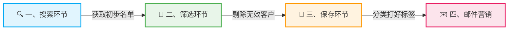
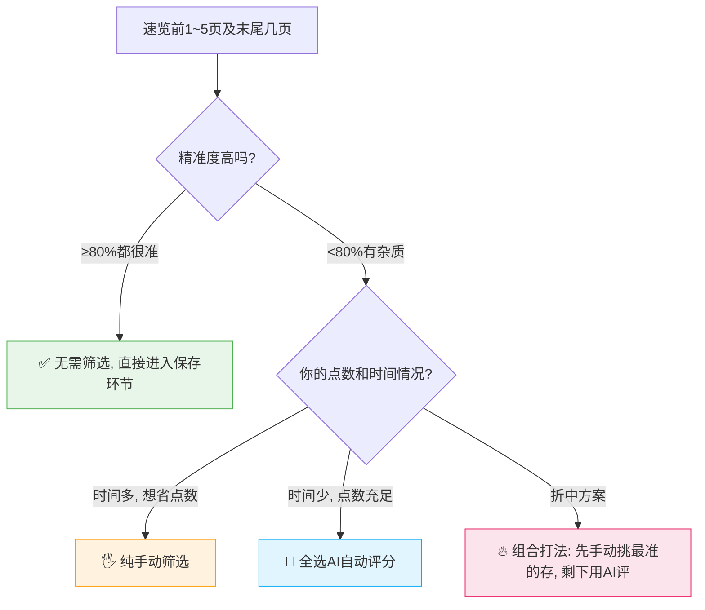
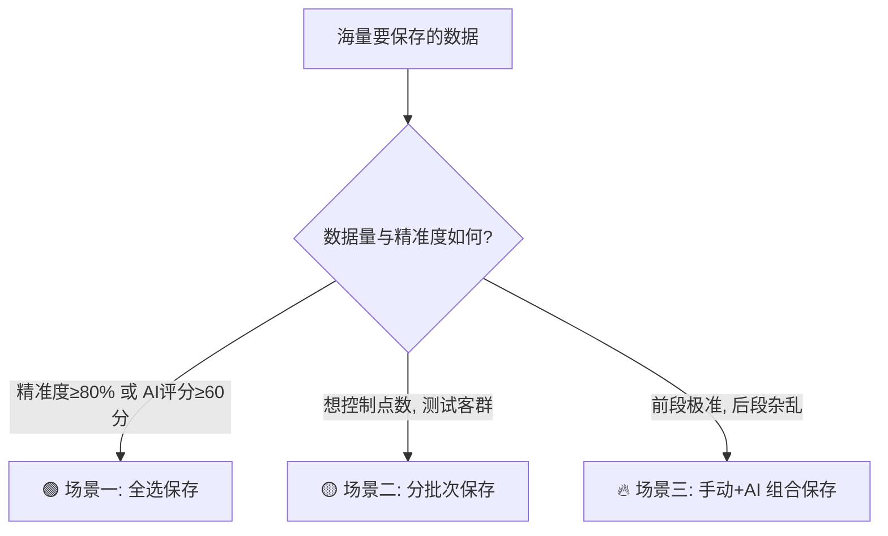
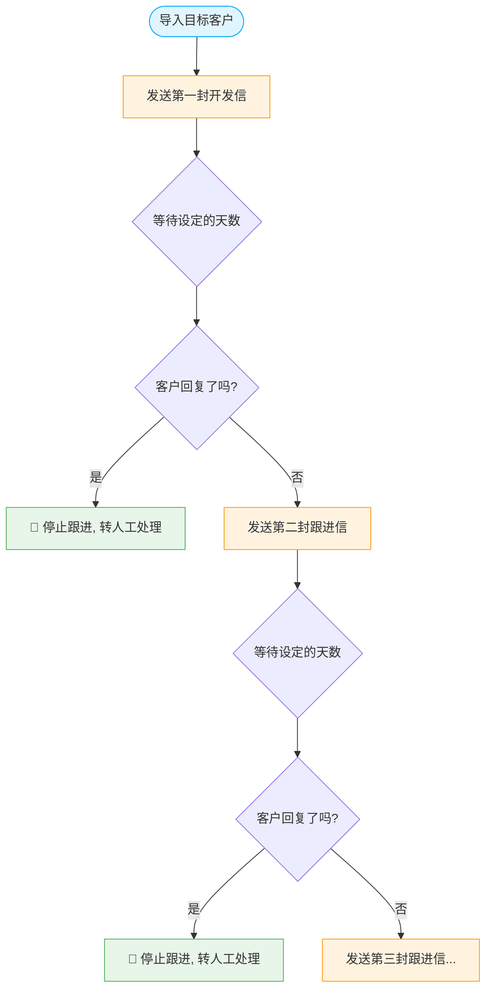

# 🚀 AI数据库获客全流程 SOP
**核心心法：搜索（找对人） ➔ 筛选（去杂质） ➔ 保存（打标签） ➔ 营销（自动化）**

为了让您快速建立全局观，请先看下方获客标准流程图。整个获客过程就像一个漏斗，层层递进，帮您把茫茫人海中的线索，提纯为真实的客户询盘：



> 💻 **操作界面准备：** 搜客引擎 ➔ AI数据库 ➔ 企业库👇（建议手动刷新界面，确保更新到系统最新版）

> 🔗 **核心入口：企业数据库快捷链接**
>[https://web.laifaxin.com/search/refine-search](https://web.laifaxin.com/search/refine-search)


---

## 🔍 一、搜索环节：如何精准捞取目标客户？
> ⚠️ **避坑指南：** 搜索后预览结果时，翻页速度不要过快，也不要频繁点击，请给系统一点加载数据的时间。

**🔰 新手破冰指南：我该用哪种搜索方式？**
*   **有对标客户网址** ➔ 用【方式一】（最准最快，直接抄作业）
*   **只有产品词，不知道怎么搜** ➔ 用【方式二】（让系统AI帮你推演客群）
*   **搜出来结果太泛** ➔ 用【方式三】（提取精准描述词，二次提纯）

### 方式一：输入精准的客户网站/域名搜索（⭐强烈推荐）
一秒上手，又准又快！只要是你的目标客户、合作过的老客户、或者给你发过询盘的客户网址，都可以直接扔进去搜。

*   **演示案例：**
    *   ① 我的产品：帽子
    *   ② 目标客群：促销礼品与企业周边分销商
    *   ③ 目标客户网站：[www.4imprint.com](https://www.google.com/url?sa=E&q=http%3A%2F%2Fwww.4imprint.com)


### 方式二：智能推演选后，选择客群搜索
不知道怎么定关键词？没关系，让系统AI帮你找！
**操作路径：** ① 点击搜索框 ➔ ② 选择智能推演买家 ➔ ③ 输入产品创建 ➔ ④ 选择客群查看

**1️⃣ 第一步：** 点击搜索框，选择"智能推演买家"后的“立即选择”
   

**2️⃣ 第二步：** 在弹出的输入框中输入你的产品名称，并点击"AI智能生成"


**3️⃣ 第三步：** 选择符合你预期的客群，并点击“立即查看”


**4️⃣ 第四步：** 在查看客群的页面，可以点击具体页码进行跳转，或者是跳转到指定的页数


### 方式三：提取目标客户的精准描述词搜索
当自己手里没有太多目标客户网站，或者用常规词搜索出来的结果比较杂乱时，可以用此方式“提纯”。

**1️⃣ 第一步：** 搜索目标客户网站，提取描述词并翻译成英文（用任意一款AI工具即可👇）


**2️⃣ 第二步：** 打开企业库，粘贴描述词后搜索


> 🔥 **核心技巧（极其重要）：**
> 不管用哪一种搜索方式，只要在结果中发现**一个**极其精准的客户，立刻点击系统右侧的 **“找相似”** 功能，就能像滚雪球一样，快速裂变出一大批同类精准客户！


---

## 🎯 二、筛选环节：如何剔除无效数据？
不管哪一种搜索方式，搜索出结果后，**千万不要直接全选保存**！先预览并筛选，确保客户精准，才能保证后续发邮件的回复率，避免域名被封。

**🔰 新手筛选决策逻辑图：**
请根据您的实际情况（精准度、时间、点数）选择最适合的筛选路径：


> 💡 **核心技巧：** 为什么要速览头尾？通过抽查前几页和最后几页，能最快判断整个数据库的精准度，从而决定用哪种筛选策略。

### 1. 理清大前提：是否区分国家/地区？
*   **不区分国家（常规打法）：** 一般情况下，可以不区分国家地区保存邮箱，统一使用英语开发信进行营销。此时只需要排除国内同行即可。建议创建一个基础视图：**排除中国**。


*   **区分国家（精细化打法）：** 如果你想分国家区域进行开发，写对应小语种的开发信，请勾选想要的国家/地区，并**存为视图**方便常态显示。
> "国家或地区"字段下，选择你想要开发的国家，并另存为新视图

> 选择国家/地区后，点击“应用筛选”保存筛选条件，如果是在“所有企业”的视图下，会提醒你另存为视图。


### 2. 具体怎么筛？实操演示（手动 VS AI评分）

**🖐️ 方式一：手动筛选（依据界面公司描述词）**
在视图里预览，遇到不准的客户直接勾选**拉黑**（拉黑后不再保存和发信）。
如果某类不准的客户很多，提取他们的共同描述词，手动加入到“排除条件”里👇

> 默认是“所有企业”，可以新建视图。在左上角点击“切换”进行视图切换操作，这里以排除“中文描述”中包含关键词“零售商”为例：


> 进入对应视图后，点击企业列表右上角“筛选”，并选择“中文介绍”，选择“不包含”，输入“零售商”回车并确认，点击“保存并预览”。（注意：条件选择“满足以上所有条件”）


**🤖 方式二：AI评分（依据你填写的产品档案）**
> 🚨 **扣点预警：** AI评分一个公司消耗1点。创建任务时提示的消耗点数是“预扣点”，实际消耗请从AI评分任务界面查看。

**a. AI评分常规设置参考：**
勾选要筛选的公司 ➔ 点击AI评分创建任务。


**b. 产品档案填写参考：**（后续可从 设置-产品档案 修改）


**c. 评分后去哪看结果？**
*   **界面一：线索中心—AI评分任务**（这里是所有历史评分记录的合集）


> 在列表上方，选择60分以上的客户，可以点击“查看详细报告”，查看AI对每个客户的深度分析详情。


*   **界面二：线索中心—线索列表**（前提：创建任务时必须☑️勾选“同步到线索列表”）


---

## 💾 三、保存环节：如何科学入库与打标签？

> ✅ **官方定心丸：系统自动去重！**
> 很多新手担心重复扣点。请放心，不管你用哪种搜索方式、分几次保存、在哪个界面保存，**系统都会自动去重！** 绝对不会重复保存同一个客户。保存客户邮箱时，一个邮箱只扣一次点数，删除重存也不会重复扣点，请放心大胆操作！

### 1. 核心动作：打好标签（极其重要！）
保存时不打标签，等于把文件全扔在桌面上，后续发邮件根本找不到人。
*   **公司标签：** 标记保存后的公司信息。
*   **联系人标签：** 标记保存后的邮箱信息。
*(新手建议：公司标签和联系人标签设置成一样的，方便统一管理)*

> 💡 **万能标签命名公式：** 
```text
 区分国家打法：[产品] - [客群角色] - [国家/地区]
 不区分国家打法：[产品] - [客群角色]
```

**案例演示：**
我的产品是帽子，客群是促销礼品分销商，开发地区是意大利。
*   标签示例：`帽子 - 促销礼品分销商 - 意大利`
*(注：标签是给自己看的，太长可自行缩写，只要自己能看懂就行)*


> 下图分别演示有无国家的区别。


### 2. 保存操作演示（全选 VS 分批）

**🔰 保存策略逻辑图：**


**🟢 场景一：全选保存**
*(适用条件：数据库精准度≥80%，或AI评分≥60分)*
*   **从数据库界面保存：**

*   **从AI评分任务界面保存：**

*   **从线索列表界面保存：**（优势：多次AI评分任务可汇总统一保存）
> 进入每个评分任务的”结果“中进行保存

> 在”线索列表“（汇总了所有任务的结果）页面进行保存。

> 选择60分以上的客户进行保存


**🟡 场景二：分批次保存**
*(注意：保存是按界面显示的客户顺序，从头依次保存的，不能跳页保存)*
*   **操作逻辑：** 第一次存前200个 ➔ 第二次存200-600个 ➔ 依次类推。点击“高级”自定义数量。

> 第一次存200：随意选择一个客户，点击左上角的”高级“，在”选择前[]条数据“中输入200


> 第二次存：点击”高级“，输入”600“。
> 💡 **底层逻辑揭秘：** 为什么第二次是输入600？因为系统按顺序保存且自动去重。输入600时，系统会自动跳过已存的前200个，实际保存的正是第201~600个。


**🔥 场景三：手动 + AI 组合保存（高阶玩法）**
*   **第一步：先手动筛选。** 预览发现前194页很准，直接手动保存前1940条。
> 💡 **计算公式：** 每页默认10条数据，194页 × 10 = 1940条。

> 选择任一公司，并进入”高级“选择，在输入框输入”1940“，点击”保存联系人“，在弹窗中设置保存


*   **第二步：后段用AI评。** 195页之后不准了，等待刚才的保存任务完成后，点击高级输入2800，创建AI评分任务。

> 勾选要评分的公司，在"高级"选择里输入”2800“，并点击右上角的”AI评分“按钮


*   **第三步：保存评分结果。** 评分结束后，勾选排除项（已保存/已拉黑/已评估），只保存评分合格的客户。

> 进入AI评分任务的结果列表，选择60分以上客户进行保存


### 3. 保存记录及对应信息去哪查？
*   **看消耗明细：** 线索中心 ➔ 保存记录。
    *   *提取数量：* 本次实际保存的数量（鼠标悬停可看具体邮箱类型）。
    *   *邮箱数量：* 本次可存的邮箱数量。
    *   *进度数字：* 保存的公司/选中公司。
    *   *消费额度：* 保存消耗点数（鼠标悬停可看具体消耗明细）。


*   **看客户明细：** 
    *   客户管理 ➔ 联系人界面（主要查看保存后的客户邮箱）。

    *   客户管理 ➔ 公司界面（主要查看保存后的企业信息）。


---

## ✉️ 四、邮件营销：如何让客户回复你？
客户存好了，标签打好了，接下来就是见真章的变现环节！

**🔰 营销模式选择指南：**
*   **单次群发：** 适合发通知、节日问候、或者极小批量的精准测试。
*   **智能跟进计划（⭐强烈推荐）：** 适合日常开发。系统自动多轮跟进、自动控速、假期也能躺着拿询盘！

### 方式一：单次群发（基础操作）
**1️⃣ 第一步：创建任务** 
> 第一种方式：从“邮件营销-邮件群发”界面点击创建。


> 第二种方式：从“客户管理-联系人”界面勾选后点击创建。


**2️⃣ 第二步：群发设置** 
*   *避坑提示：* 发送前建议创建“不发视图”，排除无效邮箱。“不发视图”设置教程：[点击查看](https://www.laifa.xin/zhinan/contacts-tags-views.html#no-send-view)
*   *内容提示：* 提前在“设置-邮件模板”准备好开发信。AI打造高回复开发信👉[点击查看教程](https://mp.weixin.qq.com/s/z9Mqp7MlXuut-dZEXyo9EQ)

> 设置任务名称，选择发信时间安排，选择排除对象，选择邮件模板
  
> 选择邮件发送渠道，推荐使用"优质发送通道"以保障送达率
 
> 其他设置信息：邮件追踪、发信昵称、回信邮箱以及代发模式的设置 


**3️⃣ 第三步：查看发送数据及详情**


**4️⃣ 第四步：查看客户回信**
营销后，客户回复的信息在 **电子邮件** 界面查看。
> 💡 **黄金法则：** 收到有效回复后，**强烈建议改用你自己的企业邮箱手动跟进**，建立真实信任感！


### 方式二：智能跟进计划（高阶自动化）

> 🔥 **智能群发三大核心优势：**
> 1. **解放双手：** 设置好后，系统自动跑流程，假期也能躺着来询盘。
> 2. **避免过度营销：** 保证按计划设定，有序按量执行发信，保护您的域名不被封禁。
> 3. **节省时间：** 同类型客户，只需配置一次，无需反复创建单个群发任务。

**👇 智能跟进计划底层逻辑图：**


**1️⃣ 第一步：创建计划任务**
打开 邮件营销 ➔ 智能跟进计划 ➔ 创建一个新计划。
*   **通道选择：** 强烈推荐【优质通道】（速度快、不易封号、送达率高）。
*   **序列名称：** 建议使用清晰的名称，如“2024-Q3-欧洲市场开发”。
*   **计划时间：** 建议根据目标客户所在时区设置（如欧洲客户设为下午发），提高打开率。

> 在智能跟进计划页面，点击“创建新计划”


> 选择发信渠道（优质通道/我的邮箱），设置"计划名称"与"计划发送时间"


**2️⃣ 第二步：设置计划内容（核心三步曲）**

*   **环节一：设置跟进流程（发什么？隔多久发？）**
    *示例：设置三轮群发，每轮间隔30天。*
    *(注：每个步骤的邮件模板随机发送；上一步未回复，才会自动发下一步，模板千万别重复)*

> 进入”跟进流程“，点击”+ 添加第一个跟进步骤“


> 选择邮箱发送账户以及邮件模板，并设置合适的发送间隔。

> 创建好的第一个步骤👇

> 创建好的第二个步骤👇

> 三个步骤全部创建好之后👇


*   **环节二：添加客户（发给谁？）**
    通过之前打好的【联系人标签】或【视图】一键导入。
> 选择联系人标签进行客户的添加


> 选择联系人视图进行客户的添加

> 检查是否添加成功👇进入”客户列表“可以看到已添加的联系人

> 进入”操作日志“可以看到你添加联系人的操作记录


*   **环节三：设置高级规则（让营销更稳定）**
    *   **发送参数：** 开启阅读追踪，设置发信昵称。
    *   **发送上限：** 控制单日总量和单家公司发信量，避免被判定为骚扰。

    *   **公司触发器：** 同公司只要有一人回复，就停止给其他人发，避免内部撞车。
    *   **已完成触发器：** 收到回复后需人工判断是否有效，不建议开启。
    *   **不发送触发器：** 勾选后不再发信，需提前打好不发标签。
    *   **AI触发器：** 系统智能拦截退信，不扣点，24小时后自动再次发送，强烈建议开启！
    *(💡 小贴士：规则设置完记得点击保存，保存后才会生效！)*


**3️⃣ 第三步：激活计划**
激活后计划正式生效。如果想要修改对应设置，可先关闭激活，调整好后再次开启。


**4️⃣ 第四步：查看发送数据及详情**
*   **a. 查看整个计划发送数据：**

*   **b. 查看单个步骤/模板发送数据：**


*   **c. 查看指定时间段内发送数据：**


**5️⃣ 第五步：查看客户回信**
邮件营销后，客户回复的信息从**电子邮件**界面查看👇收到有效回复后，建议用自己邮箱跟进。
